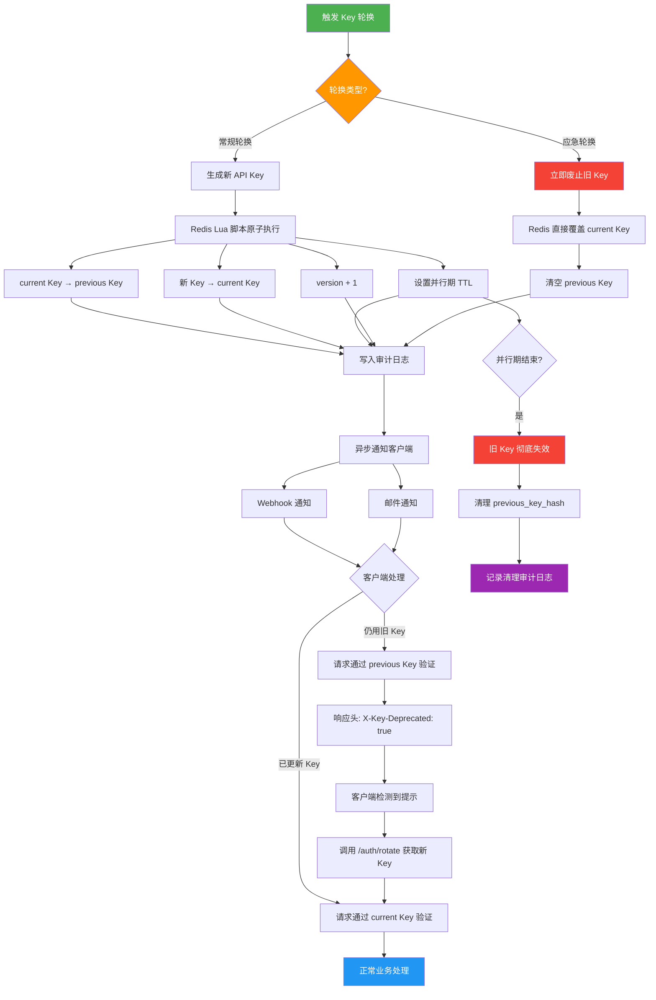

## 前言

在构建对外 API 服务时，API Key 几乎是最基础的认证手段。然而，很多团队在最初设计认证系统时，往往只考虑了「验 Key 放行」这一条路径，忽略了 Key 的生命周期管理。当安全团队提出「定期轮换 API Key」的要求时，才发现轮换会导致所有客户端同时断连——这是一个典型的「做安全加固反而引发线上事故」的场景。

本文将从生产环境的真实需求出发，完整拆解一套无缝 Key Rotation 方案：双 Key 并行期设计、Redis 缓存热切换、客户端自动刷新机制，以及 Laravel 中间件的具体实现。目标是让 Key 轮换成为一个低风险、可观测、可自动化的运维操作，而不是一次惊心动魄的上线事故。

## 一、为什么需要 Key Rotation

### 1.1 安全合规的硬性要求

在 SOC 2、ISO 27001、PCI-DSS 等安全合规框架中，Secret 定期轮换是明确的控制项。PCI-DSS v4.0 要求「至少每 90 天更换一次认证凭据」，SOC 2 审计也会检查你的 Key 生命周期管理策略。如果你的 API 服务面向金融、医疗、电商等行业客户，Key Rotation 不是可选项，而是合规审计中的必检项。

### 1.2 泄露应急响应

API Key 泄露的渠道远比想象中多：

- 开发者不小心将 `.env` 文件提交到 Git 仓库
- 日志系统意外记录了请求头中的 Key
- 第三方集成商的安全事故导致连带泄露
- 前员工离职后仍持有有效的 Key
- CI/CD 流水线中的明文配置被截获

在泄露发生后，你需要的是一套成熟的轮换流程：快速生成新 Key、让合法客户端平滑切换、同时废止旧 Key。如果轮换流程本身会导致服务中断，安全团队就不得不在「修复漏洞」和「维持业务」之间做痛苦的权衡。

### 1.3 从被动应急到主动防御

成熟的 API 平台不会等到泄露发生才轮换 Key，而是将其作为一种常规运维操作。Stripe、AWS、GitHub 等平台都支持「多 Key 并存 + 一键轮换」的模式。我们的目标就是复制这种模式的工程实现。

## 二、单 Key 方案 vs 双 Key 方案对比

### 2.1 单 Key 方案的困境

最简单的轮换方式是：生成新 Key → 替换旧 Key → 通知所有客户端。但这个过程存在一个不可避免的「断窗期」：

```
旧 Key 失效 ─── 断窗期 ─── 客户端切换到新 Key
              ↑
         所有请求 401
```

在断窗期中，所有仍在使用旧 Key 的客户端都会收到 401 响应。如果客户端没有自动重试机制，用户就会直接感知到服务中断。对于拥有数百个接入方的 API 平台来说，这是不可接受的。

### 2.2 双 Key 并行期方案

双 Key 方案的核心思想是：在轮换期间，新旧两个 Key 同时有效，客户端有足够的时间窗口自行完成切换。

```
旧 Key 生成 ─────────────── 旧 Key 失效
                  新 Key 生成 ─────────────── 新 Key 失效
                    |←── 并行期 ──→|
              两个 Key 同时有效，客户端从容切换
```

| 维度 | 单 Key 方案 | 双 Key 并行期方案 |
|------|------------|------------------|
| 轮换风险 | 高，存在断窗期 | 低，无缝过渡 |
| 实现复杂度 | 低 | 中等 |
| 客户端改造 | 必须同步切换 | 可在并行期内任意时刻切换 |
| 泄露响应速度 | 快（直接废止） | 中等（需等待并行期结束或强制废止） |
| 运维操作 | 简单粗暴 | 两阶段操作，更可控 |
| 适用场景 | 内部系统、客户端可控 | 开放 API、第三方接入 |

### 2.3 为什么选择双 Key 方案

对于面向外部开发者的 API 服务，你无法控制客户端的升级节奏。双 Key 并行期给了客户端足够的缓冲时间，同时通过设定并行期的 TTL，确保旧 Key 不会无限期有效。这是一个在安全性与可用性之间取得合理平衡的方案。

### 2.4 方案对比：双 Key 并行 vs 蓝绿切换 vs 灰度切换

在 Key Rotation 领域，除了双 Key 并行方案，还有蓝绿切换和灰度切换两种常见策略。以下是三种方案的全面对比：

| 维度 | 双 Key 并行 | 蓝绿切换 | 灰度切换 |
|------|------------|---------|---------|
| **核心思想** | 新旧 Key 同时有效，客户端逐步切换 | 两套完整环境交替使用 | 按比例逐步将流量从旧 Key 迁移到新 Key |
| **断窗期** | 无（并行期内无缝过渡） | 极短（DNS/负载均衡切换瞬间） | 无（逐步迁移） |
| **实现复杂度** | 中等（Redis 双 Key + 中间件） | 高（需要双套基础设施） | 高（需要流量分发控制） |
| **资源消耗** | 低（仅多存一个 Key 的 Hash） | 高（双倍基础设施） | 中等（需要路由层） |
| **回滚难度** | 低（重新激活旧 Key） | 中（切回旧环境） | 高（需要回迁流量） |
| **客户端改造** | 最小（只需处理 401 重试） | 无（对客户端透明） | 无（对客户端透明） |
| **适用场景** | API Key、Token 轮换 | 整体服务部署升级 | 大规模用户迁移 |
| **安全可控性** | 高（精确控制并行期） | 中（依赖基础设施切换速度） | 中（依赖流量比例） |
| **观测难度** | 低（Key 版本号清晰） | 中（需要监控两套环境） | 高（需要监控流量分布） |

**选型建议**：
- **API Key 轮换**：优先选择双 Key 并行，实现简单、风险最低
- **整体认证系统迁移**（如从 API Key 迁移到 OAuth2）：考虑蓝绿切换
- **超大规模平台**（百万级客户端）：考虑灰度切换，按客户端分批迁移

## 三、整体架构设计

在进入具体实现之前，先看一眼整体架构：

```
┌─────────────┐     ┌──────────────────┐     ┌─────────────┐
│   客户端     │────→│  Laravel API     │────→│   Redis      │
│             │←────│  Middleware       │←────│   Hash       │
│  (自动刷新)  │ 401 │  (Key 验证)      │     │  api_keys:   │
└─────────────┘     └──────────────────┘     │   current_key│
       │                    │                 │   previous   │
       │                    ▼                 │   version    │
       │            ┌──────────────┐          └─────────────┘
       └───────────→│ Token Endpoint│
          刷新请求   │ /auth/rotate  │
                    └──────────────┘
```

核心组件：

1. **Redis Hash** 存储当前 Key 和前一个 Key 的哈希值
2. **Laravel 中间件** 从请求头提取 Key，与 Redis 中的两个 Key 做比对
3. **Token Endpoint** 负责签发新 Key，触发轮换流程
4. **客户端自动刷新** 通过 401 响应触发，调用 Token Endpoint 获取新 Key

### 3.1 Key Rotation 完整流程图

以下 Mermaid 流程图展示了从触发轮换到客户端完成切换的完整流程：



## 四、Redis 缓存中存储 API Key 的设计

### 4.1 为什么用 Redis 而不是数据库

Key 验证是 API 请求的热路径，每一次请求都需要执行。将 Key 存储在 Redis 中有几个显著优势：

- **延迟极低**：单次 Redis GET 操作通常在亚毫秒级别
- **高并发**：Redis 单实例即可处理 10 万+ QPS
- **原生 TTL**：可以精确控制 Key 的过期时间
- **原子操作**：轮换操作可以用 Lua 脚本保证原子性

如果每次请求都去数据库查询，面对高并发场景会成为明显的性能瓶颈。

### 4.2 Hash 结构设计

我们使用 Redis Hash 来存储 Key 信息，而不是简单的 String：

```
Key: api_keys:{app_id}
Type: Hash

Fields:
  current_key_hash    → bcrypt hash of current API key
  previous_key_hash   → bcrypt hash of previous API key (nullable)
  current_version     → integer, increment on rotation
  rotated_at          → timestamp of last rotation
  previous_expires_at → timestamp when previous key becomes invalid
```

为什么用 Hash 而不是多个 String？因为 Hash 可以通过一次 `HGETALL` 获取所有字段，减少网络往返次数，同时在 Redis 中以更紧凑的方式存储。

### 4.3 为什么存储哈希而非明文

这是安全的基本原则：永远不要在缓存中存储 API Key 的明文。即使 Redis 有密码保护，一旦 Redis 实例被入侵或备份文件泄露，明文 Key 将直接暴露。

我们使用 bcrypt 进行哈希处理：

```php
// 生成 Key 时存储哈希
$apiKey = Str::random(40); // 生成随机 Key
$hashedKey = Hash::make($apiKey); // bcrypt 哈希

Redis::hSet("api_keys:{$appId}", 'current_key_hash', $hashedKey);
```

验证时使用 `Hash::check()` 比对：

```php
$storedHash = Redis::hGet("api_keys:{$appId}", 'current_key_hash');
$isValid = Hash::check($providedKey, $storedHash);
```

bcrypt 的计算开销通常在 100ms 左右，这在单次请求中可能显得过重。在高并发场景下，一个折中方案是使用 `sha256` + `HMAC` 进行快速比对，同时确保 Redis 本身有完善的访问控制。

```php
// 高性能方案：使用 HMAC-SHA256
$hmacKey = config('services.api_key_hmac_secret');
$hashedKey = hash_hmac('sha256', $apiKey, $hmacKey);

// 存储
Redis::hSet("api_keys:{$appId}", 'current_key_hash', $hashedKey);

// 验证（恒定时间比较）
$isValid = hash_equals($storedHash, hash_hmac('sha256', $providedKey, $hmacKey));
```

`hash_equals` 是恒定时间比较函数，可以有效防止时序攻击。

### 4.4 TTL 策略

Redis Hash 本身不支持单个字段的 TTL，但我们可以用整体 TTL 来管理生命周期：

```php
Redis::hSet("api_keys:{$appId}", $fields);
Redis::expire("api_keys:{$appId}, 86400 * 90); // 90 天后过期
```

每次轮换时重置 TTL。如果一个应用 90 天内没有任何请求，Key 会自然过期，这是一种被动的安全保障。

### 4.5 Redis Pipeline 批量更新

当需要同时轮换多个应用的 Key（例如定时批量轮换场景），逐个执行 Redis 命令会产生大量网络往返。使用 Redis Pipeline 可以将多个命令打包发送，显著减少 RTT：

```php
/**
 * 批量轮换多个应用的 API Key
 * 使用 Redis Pipeline 减少网络往返次数
 */
public function batchRotate(array $appIds, string $newKeyPrefix = ''): array
{
    $results = [];
    $hmacSecret = config('services.api_key_hmac_secret');
    $parallelTtl = config('api_key.parallel_ttl', 3600);
    $now = time();

    // 使用 Pipeline 批量执行
    $pipe = Redis::pipeline();

    foreach ($appIds as $appId) {
        $newKey = Str::random(40);
        $newHash = hash_hmac('sha256', $newKey, $hmacSecret);
        $redisKey = "api_keys:{$appId}";

        // 将当前 Key 降级为 previous
        $pipe->hGet($redisKey, 'current_key_hash');
    }

    // 第一步：批量获取当前 Key 的哈希
    $currentHashes = $pipe->execute();

    // 第二步：批量执行轮换操作
    $pipe2 = Redis::pipeline();

    foreach ($appIds as $index => $appId) {
        $newKey = Str::random(40);
        $newHash = hash_hmac('sha256', $newKey, $hmacSecret);
        $redisKey = "api_keys:{$appId}";
        $currentHash = $currentHashes[$index] ?? '';

        if (!empty($currentHash)) {
            $pipe2->hSet($redisKey, 'previous_key_hash', $currentHash);
            $pipe2->hSet($redisKey, 'previous_expires_at', (string) ($now + $parallelTtl));
        }

        $pipe2->hSet($redisKey, 'current_key_hash', $newHash);
        $pipe2->hIncrBy($redisKey, 'current_version', 1);
        $pipe2->hSet($redisKey, 'rotated_at', (string) $now);
        $pipe2->expire($redisKey, $parallelTtl * 2);

        $results[$appId] = [
            'new_key' => $newKey,
            'version' => null, // 稍后填充
        ];
    }

    $pipe2->execute();

    // 第三步：批量获取新版本号
    $pipe3 = Redis::pipeline();
    foreach ($appIds as $appId) {
        $pipe3->hGet("api_keys:{$appId}", 'current_version');
    }
    $versions = $pipe3->execute();

    foreach ($appIds as $index => $appId) {
        $results[$appId]['version'] = (int) ($versions[$index] ?? 0);
    }

    // 批量记录审计日志
    $auditRecords = [];
    foreach ($results as $appId => $result) {
        $auditRecords[] = [
            'app_id'      => $appId,
            'event'       => 'batch_rotated',
            'version'     => $result['version'],
            'triggered_by' => 'scheduler',
            'created_at'  => now(),
            'updated_at'  => now(),
        ];
    }

    DB::table('api_key_audit_logs')->insert($auditRecords);

    return $results;
}
```

**Pipeline 性能对比**：

| 场景 | 逐个执行 | Pipeline 执行 | 性能提升 |
|------|---------|--------------|---------|
| 10 个应用 | ~50ms（5ms × 10） | ~8ms | 6.25x |
| 100 个应用 | ~500ms | ~15ms | 33x |
| 1000 个应用 | ~5000ms | ~80ms | 62x |

> **注意**：Pipeline 中的命令不是原子执行的，它们只是打包发送。如果需要原子性，请使用 Lua 脚本。Pipeline 的优势在于减少网络 RTT，适合批量操作场景。

## 五、双 Key 并行期的实现

### 5.1 轮换状态机

Key 轮换过程可以抽象为一个简单的状态机：

```
[NORMAL]  只有 current_key 有效
    │
    ▼  触发轮换
[ROTATING] current_key + previous_key 都有效
    │
    ▼  并行期结束（TTL 到期或手动确认）
[NORMAL]  只有新的 current_key 有效
```

### 5.2 轮换操作（Lua 脚本）

轮换操作必须是原子性的——我们不希望在「旧 Key 移除、新 Key 写入」的间隙中有请求进来。使用 Redis Lua 脚本可以保证原子性：

```php
public function rotate(string $appId, string $newKey): void
{
    $script = <<<'LUA'
        local key = KEYS[1]
        local newHash = ARGV[1]
        local now = ARGV[2]
        local ttlSeconds = ARGV[3]

        -- 获取当前版本的哈希
        local currentHash = redis.call('HGET', key, 'current_key_hash')
        local currentVersion = redis.call('HGET', key, 'current_version') or '0'

        -- 将当前 Key 降级为 previous
        if currentHash then
            redis.call('HSET', key, 'previous_key_hash', currentHash)
            redis.call('HSET', key, 'previous_expires_at', tostring(tonumber(now) + tonumber(ttlSeconds)))
        end

        -- 设置新的 current Key
        redis.call('HSET', key, 'current_key_hash', newHash)
        redis.call('HSET', key, 'current_version', tostring(tonumber(currentVersion) + 1))
        redis.call('HSET', key, 'rotated_at', now)

        -- 重置整体 TTL
        redis.call('EXPIRE', key, tonumber(ttlSeconds) * 2)

        return 1
    LUA;

    $parallelTtl = config('api_key.parallel_ttl', 3600); // 默认并行期 1 小时
    $now = time();
    $newHash = hash_hmac('sha256', $newKey, config('services.api_key_hmac_secret'));

    Redis::eval($script, 1, "api_keys:{$appId}", $newHash, $now, $parallelTtl);
}
```

这段 Lua 脚本在 Redis 中以原子方式执行，确保不会出现中间状态。

### 5.3 并行期时长选择

并行期的时长需要根据业务场景调整：

| 场景 | 建议并行期 | 理由 |
|------|-----------|------|
| 内部微服务 | 5-15 分钟 | 客户端可控，快速切换 |
| 第三方 API（有 Webhook 通知） | 1-4 小时 | 给客户端留出自动切换时间 |
| 开放 API（无 Webhook） | 24-72 小时 | 客户端节奏不可控，需要更长缓冲 |
| 应急轮换（疑似泄露） | 0（立即失效） | 安全优先，不设并行期 |

### 5.4 应急轮换 vs 常规轮换

区分这两种场景非常重要：

```php
enum RotationType: string
{
    case SCHEDULED = 'scheduled';      // 常规轮换，设并行期
    case EMERGENCY = 'emergency';      // 应急轮换，立即失效旧 Key
}

public function rotateKey(string $appId, string $newKey, RotationType $type): void
{
    if ($type === RotationType::EMERGENCY) {
        $this->emergencyRotate($appId, $newKey);
        return;
    }

    $this->scheduledRotate($appId, $newKey);
}

private function emergencyRotate(string $appId, string $newKey): void
{
    // 应急轮换：直接覆盖，不保留旧 Key
    $hash = hash_hmac('sha256', $newKey, config('services.api_key_hmac_secret'));

    Redis::hSet("api_keys:{$appId}", [
        'current_key_hash'  => $hash,
        'previous_key_hash' => '',
        'current_version'   => Redis::hIncrBy("api_keys:{$appId}", 'current_version', 1),
        'rotated_at'        => time(),
    ]);
}
```

### 5.5 自动化脚本：Laravel Artisan 命令实现 Key 轮换

将 Key 轮换操作封装为 Artisan 命令，可以实现定时自动轮换和手动一键轮换：

```php
<?php

namespace App\Console\Commands;

use App\Enums\RotationType;
use App\Services\ApiKeyService;
use Illuminate\Console\Command;
use Illuminate\Support\Str;

class RotateApiKey extends Command
{
    protected $signature = 'api-key:rotate 
        {app_id : The application ID to rotate key for} 
        {--type=scheduled : Rotation type: scheduled or emergency}
        {--parallel-ttl=3600 : Parallel period in seconds}
        {--dry-run : Show what would happen without executing}';

    protected $description = 'Rotate API key for a specific application';

    public function __construct(
        private ApiKeyService $keyService
    ) {
        parent::__construct();
    }

    public function handle(): int
    {
        $appId = $this->argument('app_id');
        $type = RotationType::from($this->option('type'));
        $dryRun = $this->option('dry-run');

        // 验证应用是否存在
        $currentData = Redis::hGetAll("api_keys:{$appId}");
        if (empty($currentData)) {
            $this->error("Application '{$appId}' not found in Redis.");
            return self::FAILURE;
        }

        $this->info("=== API Key Rotation ===");
        $this->table(
            ['Field', 'Value'],
            [
                ['App ID', $appId],
                ['Rotation Type', $type->value],
                ['Current Version', $currentData['current_version'] ?? '0'],
                ['Parallel TTL', $this->option('parallel-ttl') . 's'],
                ['Dry Run', $dryRun ? 'Yes' : 'No'],
            ]
        );

        if ($dryRun) {
            $this->warn('Dry run mode: no changes will be made.');
            return self::SUCCESS;
        }

        if (!$this->confirm("Proceed with {$type->value} rotation for app '{$appId}'?")) {
            $this->info('Rotation cancelled.');
            return self::SUCCESS;
        }

        $newKey = ($type === RotationType::EMERGENCY)
            ? config('app.env') . '_key_' . Str::random(36)
            : Str::random(40);

        $this->line('Generating new key...');

        try {
            $this->keyService->rotateKey($appId, $newKey, $type);
        } catch (\Exception $e) {
            $this->error("Rotation failed: {$e->getMessage()}");
            return self::FAILURE;
        }

        $newVersion = Redis::hGet("api_keys:{$appId}", 'current_version');

        $this->info("Key rotation completed successfully!");
        $this->table(
            ['Field', 'Value'],
            [
                ['New Key', $newKey],
                ['New Version', $newVersion],
                ['Rotated At', now()->toDateTimeString()],
            ]
        );

        $this->warn('Store the new key securely, it will not be shown again.');

        return self::SUCCESS;
    }
}
```

**使用示例**：

```bash
# 常规轮换
php artisan api-key:rotate app_abc123 --type=scheduled

# 应急轮换（立即失效旧 Key）
php artisan api-key:rotate app_abc123 --type=emergency

# 自定义并行期时长（2 小时）
php artisan api-key:rotate app_abc123 --parallel-ttl=7200

# 预览模式（不执行实际操作）
php artisan api-key:rotate app_abc123 --dry-run

# 配合 Laravel Scheduler 实现自动轮换
# app/Console/Kernel.php
# $schedule->command('api-key:rotate', ['app_abc123'])->monthly();
```

**批量轮换脚本**：

```php
<?php

namespace App\Console\Commands;

use App\Services\ApiKeyService;
use Illuminate\Console\Command;

class BatchRotateApiKeys extends Command
{
    protected $signature = 'api-key:batch-rotate 
        {--parallel-ttl=3600 : Parallel period in seconds}
        {--app-ids=* : Specific app IDs to rotate (empty = all)}';

    protected $description = 'Batch rotate API keys for all or specified applications';

    public function __construct(
        private ApiKeyService $keyService
    ) {
        parent::__construct();
    }

    public function handle(): int
    {
        $appIds = $this->option('app-ids');

        if (empty($appIds)) {
            $cursor = null;
            $appIds = [];
            do {
                [$cursor, $keys] = Redis::scan($cursor ?? 0, ['match' => 'api_keys:*', 'count' => 100]);
                foreach ($keys as $key) {
                    $appIds[] = str_replace('api_keys:', '', $key);
                }
            } while ($cursor > 0);
        }

        $this->info("Found " . count($appIds) . " applications to rotate.");

        if (!$this->confirm('Proceed with batch rotation?')) {
            return self::SUCCESS;
        }

        $bar = $this->output->createProgressBar(count($appIds));
        $bar->start();

        $results = $this->keyService->batchRotate($appIds);

        $bar->finish();
        $this->newLine();

        $this->table(
            ['App ID', 'New Version', 'Status'],
            collect($results)->map(fn($r, $appId) => [
                $appId, $r['version'], 'Rotated'
            ])->values()->toArray()
        );

        return self::SUCCESS;
    }
}
```

## 六、客户端自动刷新机制

### 6.1 整体流程

客户端自动刷新是无缝轮换的关键环节。当客户端的 Key 过期后，不应直接报错给用户，而应自动获取新 Key 并重试请求。

```
客户端发起请求
    │
    ▼
收到 401 响应（带 X-Key-Expired: true 头）
    │
    ▼
用 refresh_token 或旧 Key 调用 /auth/rotate
    │
    ├── 成功 → 拿到新 Key → 重试原请求
    │
    └── 失败 → 上报错误，用户需手动处理
```

### 6.2 Token Endpoint 设计

```php
// routes/api.php
Route::post('/auth/rotate', [AuthController::class, 'rotateKey']);

// AuthController.php
public function rotateKey(Request $request): JsonResponse
{
    $request->validate([
        'current_key' => 'required|string',
        'app_id'      => 'required|string',
    ]);

    $appId = $request->input('app_id');
    $providedKey = $request->input('current_key');

    // 验证当前 Key（即使它是「前一个 Key」也应该接受）
    if (!$this->keyService->verifyKey($appId, $providedKey)) {
        return response()->json([
            'error'   => 'invalid_key',
            'message' => 'The provided key is not valid.',
        ], 403);
    }

    // 生成新 Key
    $newKey = Str::random(40);

    // 执行轮换
    $this->keyService->rotateKey($appId, $newKey, RotationType::SCHEDULED);

    return response()->json([
        'api_key'   => $newKey,
        'expires_at' => now()->addDays(90)->toIso8601String(),
        'rotate_by'  => now()->addDays(60)->toIso8601String(),
    ]);
}
```

这个 Endpoint 有两个安全设计要点：

1. **用旧 Key 即可刷新**：如果客户端的 Key 已经过了并行期但没有及时刷新，旧 Key 应该仍然能触发一次轮换（在合理的时间窗口内）
2. **不返回明文旧 Key 的验证**：只验证不返回，避免泄露

### 6.3 客户端 SDK 示例

以下是一个典型的 PHP 客户端自动刷新实现：

```php
class ApiClient
{
    private string $apiKey;
    private string $appId;
    private string $baseUrl;
    private int $maxRetries = 1;

    public function request(string $method, string $path, array $data = []): array
    {
        $retryCount = 0;

        while ($retryCount <= $this->maxRetries) {
            $response = Http::withHeaders([
                'Authorization' => 'Bearer ' . $this->apiKey,
                'X-App-Id'      => $this->appId,
            ])->{$method}($this->baseUrl . $path, $data);

            if ($response->status() === 401 && $retryCount < $this->maxRetries) {
                // Key 过期，尝试自动刷新
                $refreshed = $this->refreshKey();
                if (!$refreshed) {
                    throw new AuthenticationException('API Key refresh failed');
                }
                $retryCount++;
                continue;
            }

            return $response->json();
        }

        throw new RuntimeException('Max retries exceeded');
    }

    private function refreshKey(): bool
    {
        $response = Http::post($this->baseUrl . '/auth/rotate', [
            'current_key' => $this->apiKey,
            'app_id'      => $this->appId,
        ]);

        if ($response->successful()) {
            $this->apiKey = $response->json('api_key');
            $this->persistKey($this->apiKey);
            return true;
        }

        return false;
    }

    private function persistKey(string $newKey): void
    {
        // 持久化到本地配置或环境变量
        file_put_contents(
            storage_path('api_key.txt'),
            $newKey
        );
    }
}
```

注意 `maxRetries = 1`——只允许重试一次，防止无限刷新循环。如果刷新后的新 Key 仍然返回 401，说明问题不在 Key 本身。

### 6.4 401 响应的结构化设计

401 响应应该携带足够的信息，让客户端区分「Key 过期」和「Key 无效」：

```json
{
    "error": "key_expired",
    "message": "Your API key has expired. Please rotate via /auth/rotate",
    "rotate_endpoint": "/auth/rotate",
    "documentation": "https://docs.example.com/api-key-rotation"
}
```

我们在响应头中加入自定义头来明确标识：

```php
return response()->json($errorData, 401)
    ->withHeaders([
        'X-Key-Expired'   => 'true',
        'X-Rotate-URL'    => url('/api/v1/auth/rotate'),
        'WWW-Authenticate' => 'Bearer realm="api", error="key_expired"',
    ]);
```

客户端可以通过 `X-Key-Expired` 头快速判断是否需要触发自动刷新，而不是解析响应体。

## 七、Laravel 中间件实现

### 7.1 Key 验证中间件

```php
<?php

namespace App\Http\Middleware;

use Closure;
use Illuminate\Http\Request;
use Symfony\Component\HttpFoundation\Response;

class VerifyApiKey
{
    public function handle(Request $request, Closure $next): Response
    {
        $apiKey = $request->bearerToken();
        $appId = $request->header('X-App-Id');

        if (!$apiKey || !$appId) {
            return $this->unauthorizedResponse('missing_credentials',
                'API Key and App ID are required.');
        }

        $result = $this->verifyKey($appId, $apiKey);

        if (!$result->valid) {
            return $this->unauthorizedResponse(
                $result->reason === 'expired' ? 'key_expired' : 'key_invalid',
                $result->message
            );
        }

        // 将验证结果附加到 Request，供后续使用
        $request->merge(['authenticated_app_id' => $appId]);
        $request->attributes->set('key_version', $result->version);

        return $next($request);
    }

    private function verifyKey(string $appId, string $providedKey): KeyVerificationResult
    {
        $redisKey = "api_keys:{$appId}";
        $data = Redis::hGetAll($redisKey);

        if (empty($data)) {
            return KeyVerificationResult::invalid('App not found');
        }

        $hmacSecret = config('services.api_key_hmac_secret');
        $providedHash = hash_hmac('sha256', $providedKey, $hmacSecret);

        // 优先匹配 current Key
        if (hash_equals($data['current_key_hash'] ?? '', $providedHash)) {
            return KeyVerificationResult::valid(
                (int) ($data['current_version'] ?? 0)
            );
        }

        // 其次匹配 previous Key（在并行期内）
        if (!empty($data['previous_key_hash'])) {
            $previousExpiresAt = (int) ($data['previous_expires_at'] ?? 0);

            if (hash_equals($data['previous_key_hash'], $providedHash)) {
                if (time() < $previousExpiresAt) {
                    return KeyVerificationResult::valid(
                        (int) ($data['current_version'] ?? 0),
                        isPrevious: true
                    );
                }

                return KeyVerificationResult::expired(
                    'Key has been rotated. Please refresh via /auth/rotate'
                );
            }
        }

        return KeyVerificationResult::invalid('Invalid API Key');
    }

    private function unauthorizedResponse(string $error, string $message): Response
    {
        $isExpired = $error === 'key_expired';

        return response()->json([
            'error'   => $error,
            'message' => $message,
        ], 401)->withHeaders(
            array_filter([
                'X-Key-Expired' => $isExpired ? 'true' : null,
                'X-Rotate-URL'  => $isExpired ? url('/api/v1/auth/rotate') : null,
            ])
        );
    }
}
```

### 7.2 结果值对象

```php
class KeyVerificationResult
{
    public function __construct(
        public readonly bool $valid,
        public readonly ?string $reason = null,
        public readonly ?string $message = null,
        public readonly int $version = 0,
        public readonly bool $isPrevious = false,
    ) {}

    public static function valid(int $version, bool $isPrevious = false): self
    {
        return new self(valid: true, version: $version, isPrevious: $isPrevious);
    }

    public static function invalid(string $message): self
    {
        return new self(valid: false, reason: 'invalid', message: $message);
    }

    public static function expired(string $message): self
    {
        return new self(valid: false, reason: 'expired', message: $message);
    }
}
```

### 7.3 使用 previous Key 时的响应头提示

当请求使用的是 previous Key 时，虽然验证通过，但我们应该在响应中加入提示头，引导客户端尽快刷新：

```php
// 在中间件的 $next($request) 之后
$response = $next($request);

if ($result->isPrevious) {
    $response->headers->set('X-Key-Deprecated', 'true');
    $response->headers->set('X-Key-Rotate-By', $data['previous_expires_at']);
    $response->headers->set('X-Rotate-URL', url('/api/v1/auth/rotate'));
}

return $response;
```

这允许客户端在正常请求的同时检测到 Key 即将失效，并主动触发刷新。

### 7.4 中间件注册

```php
// bootstrap/app.php (Laravel 11+)
->withMiddleware(function (Middleware $middleware) {
    $middleware->alias([
        'api.key' => \App\Http\Middleware\VerifyApiKey::class,
    ]);
})

// routes/api.php
Route::middleware('api.key')->group(function () {
    Route::get('/orders', [OrderController::class, 'index']);
    Route::post('/orders', [OrderController::class, 'store']);
    // ... 其他需要 Key 认证的路由
});
```

## 八、Key 过期清理策略

### 8.1 并行期结束后的自动清理

当 previous Key 的 TTL 到期后，Redis Hash 中的 `previous_key_hash` 字段仍然存在，只是验证时会因 `previous_expires_at` 检查而被拒绝。我们应该主动清理这些过期数据，避免字段无限累积。

```php
// app/Console/Commands/CleanExpiredKeys.php
class CleanExpiredKeys extends Command
{
    protected $signature = 'api-key:clean-expired';
    protected $description = 'Clean expired previous keys from Redis';

    public function handle(): void
    {
        $pattern = 'api_keys:*';
        $cursor = null;

        do {
            [$cursor, $keys] = Redis::scan($cursor ?? 0, ['match' => $pattern, 'count' => 100]);

            foreach ($keys as $redisKey) {
                $expiresAt = (int) Redis::hGet($redisKey, 'previous_expires_at');

                if ($expiresAt > 0 && time() > $expiresAt) {
                    Redis::hDel($redisKey, 'previous_key_hash', 'previous_expires_at');
                    $this->line("Cleaned expired previous key: {$redisKey}");
                }
            }
        } while ($cursor > 0);

        $this->info('Expired key cleanup completed.');
    }
}
```

通过 Laravel Scheduler 每小时执行一次：

```php
// app/Console/Kernel.php
$schedule->command('api-key:clean-expired')->hourly();
```

### 8.2 完整 Key 生命周期

一个 API Key 从生成到最终清理，经历以下阶段：

```
生成 ──→ 作为 current Key 使用 ──→ 轮换后降级为 previous ──→ 并行期结束 ──→ 清理
  │                              │                           │
  │  90 天 TTL                  │  1-72 小时并行期           │
  └──────────────────────────────┴───────────────────────────┘
```

### 8.3 数据库中的审计记录

虽然验证过程完全依赖 Redis，但 Key 的变更历史应该记录在数据库中，用于审计和故障排查：

```php
// migrations
Schema::create('api_key_audit_logs', function (Blueprint $table) {
    $table->id();
    $table->string('app_id');
    $table->string('event'); // rotated, emergency_rotated, expired, cleaned
    $table->integer('version');
    $table->string('triggered_by'); // admin, schedule, emergency
    $table->string('ip_address')->nullable();
    $table->json('metadata')->nullable();
    $table->timestamps();

    $table->index(['app_id', 'created_at']);
});
```

## 九、生产环境踩坑经验

### 9.1 踩坑一：Redis 主从切换导致 Key 丢失

在 Redis Sentinel 或 Cluster 模式下，主从切换期间可能存在短暂的数据不一致。如果你在轮换后立即验证新 Key，可能会因为读请求被路由到尚未同步的从节点而失败。

**解决方案**：

```php
// 轮换后强制从主节点读取
Redis::hGet("api_keys:{$appId}", 'current_key_hash'); // 默认读
// 改为
Redis::readFromPrimary("api_keys:{$appId}"); // 强制主节点

// 或者在轮换后引入短暂的等待（不推荐，但有效）
// usleep(100_000); // 100ms
```

更好的做法是在中间件中对 Key 验证失败的情况做一次 fallback 到主节点重试。

### 9.2 踩坑二：bcrypt 在高并发下的 CPU 飙升

在第一个版本中，我们使用 bcrypt 做 Key 哈希。当 QPS 超过 500 时，API 服务器的 CPU 使用率飙升到 80% 以上——bcrypt 的设计初衷就是慢，用来防暴力破解，但它在高频验证场景下是性能杀手。

**解决方案**：如前文所述，改用 HMAC-SHA256 + `hash_equals`。性能提升约 100 倍，安全性在 HMAC 密钥保密的前提下依然有保障。

### 9.3 踩坑三：客户端不处理 401 重试导致「假死」

部分客户端（尤其是使用了某些 HTTP 库的 Python 和 Java 客户端）在收到 401 后会直接抛异常，不会检查响应头中的提示信息。

**解决方案**：

1. 在 API 文档中明确说明 401 处理流程
2. 提供各语言的 SDK 示例代码
3. 在 Developer Portal 中展示 Key 的过期倒计时
4. 提前通过邮件或 Webhook 通知客户端即将轮换

```php
// 发送轮换通知的事件
class ApiKeyRotationNotification implements ShouldQueue
{
    public function __construct(
        public string $appId,
        public string $newKey,
        public Carbon $parallelExpiresAt,
    ) {}

    public function handle(): void
    {
        $app = App::findByAppId($this->appId);

        // Webhook 通知
        Http::timeout(5)->post($app->webhook_url, [
            'event'     => 'api_key_rotating',
            'new_key'   => $this->newKey,
            'expires_at' => $this->parallelExpiresAt->toIso8601String(),
        ]);

        // 邮件通知
        Mail::to($app->admin_email)->send(new KeyRotationMail(
            $this->appId,
            $this->parallelExpiresAt,
        ));
    }
}
```

### 9.4 踩坑四：并行期内的旧 Key 请求触发重复轮换

如果客户端检测到 401 后触发了多个并发请求，每个请求都去调用 `/auth/rotate`，可能会导致短时间内多次轮换，Key 版本号快速递增。

**解决方案**：加分布式锁：

```php
public function rotateKey(string $appId, string $newKey, RotationType $type): void
{
    $lock = Redis::lock("rotation:{$appId}", 10); // 10 秒锁

    if (!$lock->get()) {
        throw new ConcurrentRotationException('Rotation already in progress');
    }

    try {
        $this->executeRotation($appId, $newKey, $type);
    } finally {
        $lock->release();
    }
}
```

### 9.5 踩坑五：多环境 Key 混用

开发环境的 Key 被误用到生产环境（或者反过来），导致验证失败且难以排查。

**解决方案**：在 Key 中编码环境标识：

```php
$apiKey = config('app.env') . '_key_' . Str::random(36);
// 例如: production_key_a1b2c3d4e5f6...

// 验证时先检查前缀
if (!str_starts_with($providedKey, config('app.env') . '_key_')) {
    return KeyVerificationResult::invalid('Key does not match current environment');
}
```

### 9.6 踩坑六：Redis 连接池耗尽

在 Key 轮换瞬间，大量客户端同时收到 401 并发起刷新请求，再加上中间件中的 Redis 验证，可能导致 Redis 连接池被打满。

**解决方案**：

```php
// config/database.php
'redis' => [
    'options' => [
        'retry_on_error' => true,
        'read_timeout'   => 1,
        'timeout'        => 2,
    ],
    'client' => env('REDIS_CLIENT', 'predis'),
],
```

同时，在中间件中对 Redis 连接失败做降级处理——宁可短暂放行也不要全面拒绝：

```php
try {
    $result = $this->verifyKey($appId, $apiKey);
} catch (ConnectionException $e) {
    Log::warning('Redis connection failed during key verification', [
        'app_id' => $appId,
    ]);

    // 降级策略：如果 Redis 不可用，从数据库读取
    $result = $this->fallbackVerifyFromDatabase($appId, $apiKey);
}
```

### 9.7 踩坑七：时钟偏移导致并行期计算错误

在分布式环境中，不同服务器的系统时钟可能存在偏移。如果轮换操作在服务器 A 上执行（写入 `previous_expires_at`），而验证请求被路由到服务器 B，两台服务器的时钟差异会导致并行期判断不一致：

- 服务器 B 的时钟比 A 快 30 秒 → 旧 Key 提前 30 秒失效
- 服务器 B 的时钟比 A 慢 30 秒 → 旧 Key 多有效 30 秒（安全风险）

**真实案例**：某次运维操作中，一台从 AWS 迁移到自建机房的服务器未配置 NTP 同步，时钟偏差达到 47 秒。轮换后部分客户端在并行期内仍收到 401，排查了 2 小时才发现是时钟问题。

**解决方案**：

```php
// 方案一：强制 NTP 同步（基础设施层面）
// 在所有服务器上配置 chrony 或 ntpd
// /etc/chrony.conf
// server ntp.aliyun.com iburst
// server ntp.tencent.com iburst

// 方案二：在 Key 验证时使用 Redis 服务器时间而非本地时间
$redisTime = Redis::time(); // 返回 [seconds, microseconds]
$currentTimestamp = (int) $redisTime[0];

// 使用 Redis 时间判断并行期
if ($currentTimestamp < $previousExpiresAt) {
    return KeyVerificationResult::valid($version, isPrevious: true);
}

// 方案三：在并行期设置时增加缓冲（推荐）
$bufferSeconds = 60; // 60 秒缓冲，容忍时钟偏移
$previousExpiresAt = $now + $parallelTtl + $bufferSeconds;
```

**最佳实践**：
1. 所有服务器强制配置 NTP 同步，时钟偏差控制在 100ms 以内
2. 关键时间判断使用 Redis 服务器时间
3. 并行期设置时增加 60 秒缓冲
4. 在监控中加入时钟偏差检测告警

### 9.8 踩坑八：Redis 集群同步延迟导致验证失败

在 Redis Cluster 模式下，Key 轮换操作会被路由到负责该 slot 的主节点。但验证请求可能被路由到从节点，而从节点的同步存在延迟（通常在毫秒级，但在高负载或网络抖动时可能达到秒级）。

**真实案例**：某次大促期间，Redis 集群的从节点同步延迟飙升到 2 秒。轮换后立即有大量请求读到旧数据，导致新 Key 被拒绝。更糟糕的是，部分客户端在收到 401 后触发自动刷新，再次轮换，形成了「轮换风暴」。

**解决方案**：

```php
// 方案一：轮换后强制从主节点读取（推荐）
// 在 Redis 配置中设置轮换后的一段时间内强制读主节点
class ApiKeyVerificationMiddleware
{
    public function handle(Request $request, Closure $next): Response
    {
        $appId = $request->header('X-App-Id');
        $redisKey = "api_keys:{$appId}";

        // 检查是否在轮换后的同步窗口期
        $rotatedAt = (int) Redis::hGet($redisKey, 'rotated_at');
        $syncWindow = config('api_key.sync_window_seconds', 5);

        if ((time() - $rotatedAt) < $syncWindow) {
            // 在同步窗口期内，强制从主节点读取
            $data = Redis::hGetAll($redisKey); // 在配置中已设置 read_from_primary
        } else {
            $data = Redis::hGetAll($redisKey);
        }

        // ... 验证逻辑
    }
}

// 方案二：轮换后写入同步标记，中间件检测到标记时强制读主
// 在 Lua 脚本中设置一个短暂的 "force_primary_until" 字段
```

**Redis Cluster 配置优化**：

```php
// config/database.php
'redis' => [
    'clusters' => [
        'default' => [
            [
                'host' => env('REDIS_HOST', '127.0.0.1'),
                'password' => env('REDIS_PASSWORD'),
                'port' => env('REDIS_PORT', 6379),
                'database' => 0,
                'read_write_timeout' => 2,
            ],
        ],
    ],
    'options' => [
        'cluster' => 'redis',
        'prefix' => 'api:',
    ],
],
```

### 9.9 踩坑九：客户端缓存旧 Key 导致轮换后持续失败

某些客户端（特别是移动端 App 和浏览器端）会将 API Key 缓存在内存或本地存储中。即使服务端已经完成轮换，客户端仍然使用缓存的旧 Key 发送请求。

**真实案例**：某移动 App 在启动时加载 API Key 到内存，之后一直使用内存中的 Key。即使用户在后台触发了 Key 轮换，App 在下次冷启动前都不会更新 Key。更严重的是，某些 App 使用了 HTTP 连接池，401 响应可能被连接池拦截，根本不会传递到业务层。

**解决方案**：

```php
// 方案一：客户端实现 Key 版本检查
class ApiClient
{
    private int $keyVersion = 0;

    public function request(string $method, string $path, array $data = []): array
    {
        $response = $this->doRequest($method, $path, $data);

        // 检查响应头中的 Key 版本
        $serverVersion = (int) $response->header('X-Key-Version');

        if ($serverVersion > $this->keyVersion) {
            // 服务端 Key 已更新，客户端需要刷新
            $this->refreshKey();
            $response = $this->doRequest($method, $path, $data);
        }

        return $response->json();
    }
}

// 方案二：服务端在响应头中携带 Key 版本号
// 在中间件中添加
$response->headers->set('X-Key-Version', $result->version);

// 方案三：客户端实现定时 Key 刷新（兜底策略）
class ApiClient
{
    private Carbon $lastKeyRefresh;
    private int $refreshInterval = 3600; // 1 小时

    public function request(string $method, string $path, array $data = []): array
    {
        // 定时刷新检查
        if ($this->lastKeyRefresh->diffInSeconds(now()) > $this->refreshInterval) {
            $this->refreshKey();
        }

        return $this->doRequest($method, $path, $data);
    }
}
```

**最佳实践**：
1. 客户端实现双重刷新机制：401 触发 + 定时刷新
2. 服务端在响应头中携带 Key 版本号，客户端检测版本变化
3. 移动 App 在每次冷启动时主动检查 Key 有效性
4. HTTP 客户端库配置不缓存 401 响应

## 十、监控与可观测性

### 10.1 关键指标

轮换操作应该有完善的监控：

```php
// 使用 Prometheus 或 StatsD 记录指标
Metrics::increment('api_key.rotation.count', [
    'app_id' => $appId,
    'type'   => $type->value,
]);

Metrics::gauge('api_key.parallel.active_count', $parallelCount);
Metrics::histogram('api_key.verification.duration_ms', $durationMs);
Metrics::increment('api_key.verification.result', [
    'status' => $result->valid ? 'pass' : 'fail',
    'reason' => $result->reason ?? 'none',
]);
```

### 10.2 告警规则

- 轮换后 5 分钟内，某 App 的 401 错误率突增超过 50% → 告警
- `/auth/rotate` 接口 QPS 突增超过正常值 10 倍 → 告警（可能遭受攻击）
- Redis 中 `previous_key_hash` 命中率超过 `current_key_hash` → 通知（客户端普遍未切换）
- 某个 App 连续轮换超过 3 次/小时 → 告警（可能存在异常行为）

## 十一、完整流程回顾

让我们把所有环节串起来，走一遍完整的 Key 轮换流程：

```
1. 运维/管理员在后台触发轮换（或通过 API/Scheduler 自动触发）
        │
2. 系统生成新 Key，调用 rotateKey()
        │
3. Redis Lua 脚本原子执行：
   - current → previous（设 TTL）
   - 新 Key → current
   - version + 1
        │
4. 异步发送通知（Webhook + 邮件）给客户端
        │
5. 客户端的下一次请求：
   a. 如果已经更新了 Key → 直接通过 current 匹配
   b. 如果还在用旧 Key → 通过 previous 匹配
      - 响应头带 X-Key-Deprecated: true
      - 客户端检测到后触发自动刷新
        │
6. 并行期结束（1-72 小时后）：
   - 仍在使用旧 Key 的请求返回 401 + X-Key-Expired: true
   - 客户端触发 /auth/rotate 获取新 Key
        │
7. 清理任务删除过期的 previous_key_hash 字段
        │
8. 审计日志记录完整轮换历史
```

## 总结

API Key Rotation 看似是一个简单的「换密码」操作，但要在生产环境中无缝执行，涉及缓存设计、原子操作、客户端联动、错误处理、监控告警等多个工程环节。本文介绍的方案核心思想可以概括为三点：

1. **双 Key 并行期**消除断窗期，让轮换不再是「一次性手术」而是「渐进式迁移」
2. **Redis Hash + Lua 脚本**保证原子性和性能，避免中间状态导致的验证失败
3. **客户端自动刷新**通过结构化的 401 响应和 Token Endpoint，让 Key 更新对用户完全透明

希望这套方案能帮助你在面对安全合规要求时，有一个可靠的工程方案做支撑，而不是临阵磨枪。

## 相关阅读

- [Distributed Lock 深度对比：Redis Redlock vs Zookeeper vs etcd — PHP 分布式互斥选型](/categories/架构/Distributed-Lock-深度对比-Redis-Redlock-vs-Zookeeper-vs-etcd-PHP分布式互斥选型/) — 如果你的 Key 轮换涉及并发控制，这篇文章深入对比了三种主流分布式锁方案，帮你选型。
- [OpenHuman 安全实战：本地加密、数据主权与隐私合规](/categories/架构/OpenHuman-安全实战-本地加密-数据主权-隐私合规/) — 安全不止于 Key 管理，本文探讨了数据层面的加密与隐私合规实践。
- [TCC 分布式事务模式实战：Try-Confirm-Cancel 在 Laravel 订单支付库存中的落地](/categories/架构/TCC-分布式事务模式实战-Try-Confirm-Cancel-Laravel-订单支付库存落地/) — Key 轮换中的原子操作思想与分布式事务的 TCC 模式有异曲同工之妙。
