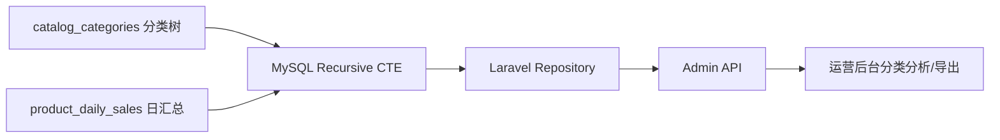

## 前言：为什么我会把树形遍历从 PHP 挪回 SQL

后台最容易被低估的一类需求，不是下单，不是支付，而是“分类树、渠道树、组织树”这类层级数据。早期我们常见写法是：先把整张表查出来，再在 Laravel Collection 里递归组装、过滤、统计。数据量小时没问题，一旦运营开始要“某个根节点下所有子分类 GMV、深度、完整路径、是否叶子节点”，PHP 端递归就会出现三个问题：查太多、算太慢、口径不一致。

我后来把这类逻辑统一收回 MySQL 8 的 `WITH RECURSIVE`。原因很现实：**树的展开、层级深度、路径拼接、本级与子级汇总，本来就是 SQL 更擅长的集合运算。** PHP 适合做展示整形，不适合做全量树遍历。

---

## 一、场景建模：分类表 + 商品汇总表

先看一个线上常见结构，`catalog_categories` 维护树，`product_daily_sales` 存聚合销量：

```sql
CREATE TABLE catalog_categories (
    id BIGINT UNSIGNED PRIMARY KEY AUTO_INCREMENT,
    parent_id BIGINT UNSIGNED NULL,
    name VARCHAR(100) NOT NULL,
    sort INT NOT NULL DEFAULT 0,
    is_enabled TINYINT(1) NOT NULL DEFAULT 1,
    KEY idx_parent_sort (parent_id, sort, id),
    KEY idx_enabled_parent (is_enabled, parent_id)
);

CREATE TABLE product_daily_sales (
    stat_date DATE NOT NULL,
    category_id BIGINT UNSIGNED NOT NULL,
    paid_orders INT UNSIGNED NOT NULL DEFAULT 0,
    paid_amount DECIMAL(12,2) NOT NULL DEFAULT 0,
    PRIMARY KEY (stat_date, category_id),
    KEY idx_category_date (category_id, stat_date)
);
```

我们的目标不是只拿一层 children，而是：**给定根分类，递归展开整棵子树，并按节点汇总近 30 天销售额。**

### 架构图



这个结构的重点是：递归只负责“找出子树节点集合”，销售表仍然走预聚合，不直接扫订单明细。否则 CTE 写得再漂亮，也只是把慢查询换一种姿势再慢一次。

---

## 二、核心 SQL：展开子树、生成路径、计算深度

先用递归 CTE 从根节点往下找：

```sql
WITH RECURSIVE category_tree AS (
    SELECT
        id,
        parent_id,
        name,
        sort,
        0 AS depth,
        CAST(id AS CHAR(200)) AS path_ids,
        CAST(name AS CHAR(500)) AS path_names
    FROM catalog_categories
    WHERE id = 1001 AND is_enabled = 1

    UNION ALL

    SELECT
        c.id,
        c.parent_id,
        c.name,
        c.sort,
        ct.depth + 1 AS depth,
        CONCAT(ct.path_ids, '/', c.id) AS path_ids,
        CONCAT(ct.path_names, ' > ', c.name) AS path_names
    FROM catalog_categories c
    INNER JOIN category_tree ct ON c.parent_id = ct.id
    WHERE c.is_enabled = 1
      AND FIND_IN_SET(c.id, REPLACE(ct.path_ids, '/', ',')) = 0
)
SELECT *
FROM category_tree
ORDER BY path_ids;
```

这段 SQL 在后台非常实用：

- `depth` 可直接给前端做缩进
- `path_names` 可直接做面包屑导出
- `path_ids` 能辅助排查串层级问题
- `FIND_IN_SET` 是最低成本的防环保护，避免脏数据把递归跑爆

很多人只写到“查出所有后代”就停了，但生产上真正有价值的是**把路径和深度一起算出来**，这样接口就不用在 PHP 再做第二次递归。

---

## 三、把递归结果接到报表：子树 GMV 汇总

查出节点集合后，再关联销售聚合表：

```sql
WITH RECURSIVE category_tree AS (
    SELECT id, parent_id, name, 0 AS depth
    FROM catalog_categories
    WHERE id = ? AND is_enabled = 1

    UNION ALL

    SELECT c.id, c.parent_id, c.name, ct.depth + 1
    FROM catalog_categories c
    INNER JOIN category_tree ct ON c.parent_id = ct.id
    WHERE c.is_enabled = 1
), sales_30d AS (
    SELECT
        category_id,
        SUM(paid_orders) AS total_orders,
        SUM(paid_amount) AS total_amount
    FROM product_daily_sales
    WHERE stat_date BETWEEN ? AND ?
    GROUP BY category_id
)
SELECT
    ct.id,
    ct.parent_id,
    ct.name,
    ct.depth,
    COALESCE(s.total_orders, 0) AS total_orders,
    COALESCE(s.total_amount, 0) AS total_amount
FROM category_tree ct
LEFT JOIN sales_30d s ON s.category_id = ct.id
ORDER BY ct.depth ASC, ct.id ASC;
```

如果还要“每个父节点包含全部后代的总和”，我不会在 PHP for-loop 累加，而是再包一层 descendants 映射：

```sql
WITH RECURSIVE descendants AS (
    SELECT id AS root_id, id AS node_id
    FROM catalog_categories
    WHERE id = ?

    UNION ALL

    SELECT d.root_id, c.id AS node_id
    FROM descendants d
    INNER JOIN catalog_categories c ON c.parent_id = d.node_id
)
SELECT
    d.root_id,
    SUM(s.paid_amount) AS subtree_amount
FROM descendants d
INNER JOIN product_daily_sales s ON s.category_id = d.node_id
WHERE s.stat_date BETWEEN ? AND ?
GROUP BY d.root_id;
```

这类写法在“频道页/类目页业绩归因”里特别稳，因为数据库天然知道怎么做集合聚合，代码口径也统一。

---

## 四、Laravel 落地：Repository 不要把树遍历写回 PHP

我在 Laravel 里通常直接保留原生 SQL，因为 Query Builder 对递归 CTE 可读性一般：

```php
<?php

namespace App\Repositories;

use Illuminate\Support\Facades\DB;

class CategoryReportRepository
{
    public function getTreeReport(int $rootId, string $startDate, string $endDate): array
    {
        $sql = <<<'SQL'
WITH RECURSIVE category_tree AS (
    SELECT id, parent_id, name, 0 AS depth
    FROM catalog_categories
    WHERE id = ? AND is_enabled = 1

    UNION ALL

    SELECT c.id, c.parent_id, c.name, ct.depth + 1
    FROM catalog_categories c
    INNER JOIN category_tree ct ON c.parent_id = ct.id
    WHERE c.is_enabled = 1
), sales_30d AS (
    SELECT category_id, SUM(paid_orders) AS total_orders, SUM(paid_amount) AS total_amount
    FROM product_daily_sales
    WHERE stat_date BETWEEN ? AND ?
    GROUP BY category_id
)
SELECT ct.id, ct.parent_id, ct.name, ct.depth,
       COALESCE(s.total_orders, 0) AS total_orders,
       COALESCE(s.total_amount, 0) AS total_amount
FROM category_tree ct
LEFT JOIN sales_30d s ON s.category_id = ct.id
ORDER BY ct.depth, ct.id
SQL;

        return DB::select($sql, [$rootId, $startDate, $endDate]);
    }
}
```

这里我坚持两件事：第一，**绑定参数，不拼接 SQL**；第二，**递归结果集直接返回 DTO/Resource**，不要又塞回 Collection 重新建树，不然你只是把数据库递归换成 PHP 递归，白折腾一圈。

---

## 五、真实踩坑记录

### 坑 1：没做防环，脏数据直接把查询跑满

曾经有人手工修数据，把 A 的父节点指到 B，B 又指回 A。结果 CTE 一跑，直到命中 `cte_max_recursion_depth` 才报错。后来我固定做两层防护：

1. 应用层禁止形成环
2. SQL 层用 `path_ids` 做 visited 集合兜底

### 坑 2：路径字段长度不够，被 MySQL 静默截断

一开始 `CAST(name AS CHAR(100))`，分类层级深一点、名称长一点，导出路径直接被截断，后续 `ORDER BY path_names` 也全乱。路径字段一定要按最坏情况留足空间，宁愿 500/1000，也别抠那点字符数。

### 坑 3：递归结果很小，关联表却扫很大

很多慢 SQL 不在 CTE 本身，而在后面的 JOIN。比如 `product_daily_sales` 没有 `(category_id, stat_date)` 索引，CTE 找出了 80 个节点，后面依然可能扫整个月报表表。**递归负责找集合，索引负责把集合查快**，这两个问题不能混为一谈。

### 坑 4：按路径排序看起来正确，实际兄弟节点顺序错乱

`ORDER BY path_ids` 在 `1/10` 和 `1/2` 这种场景会出现字典序问题。后来我的做法是前端主要按 `depth + sort` 展示，导出若必须稳定路径顺序，就在路径里对 `sort` 或 `id` 做定宽补零，例如 `LPAD(id, 10, '0')`。

---

## 六、什么时候该用递归 CTE，什么时候别用

适合：分类树、代理链、组织架构、菜单权限、评论楼层、区域树。  
不适合：超深层图遍历、频繁跨层复杂统计、强依赖遍历顺序控制的图算法。

如果你的需求已经接近“图数据库查询”，或者递归深度常常几十上百层，MySQL Recursive CTE 能做，但未必是最优解。对大多数后台树形场景，它已经够强；但别把它当图引擎来滥用。

---

## 结语

MySQL 8 的 `WITH RECURSIVE` 对 Laravel 项目最大的价值，不是语法新，而是**把原本散落在 Controller、Service、Collection 里的树形逻辑收回数据库**：节点展开、层级深度、完整路径、子树汇总一次完成。这样接口更稳定，导出口径更统一，性能问题也更容易定位。

我自己的经验是：**先把树查对，再把索引补对，最后再考虑结果整形。** 很多所谓“递归查询慢”，本质上不是 CTE 慢，而是后面的 JOIN、聚合和排序没有设计好。
