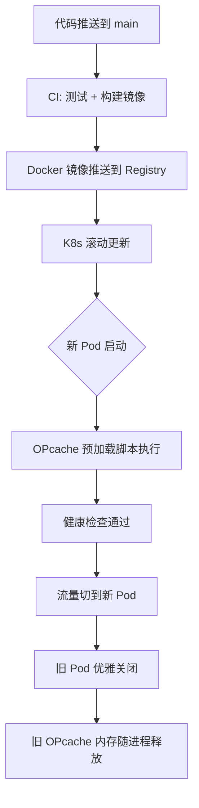

## 一、为什么 OPcache 是 PHP 性能的「第一优先级」

在 Laravel B2C API 项目里，你可能花了很多精力优化 MySQL 查询、Redis 缓存、队列异步化。但有一个优化，投入产出比远超以上所有——**OPcache**。

它的原理极其简单：PHP 是解释型语言，每次请求都要经历「词法分析 → 语法分析 → 生成 opcode → 执行」。OPcache 把生成的 opcode 缓存在共享内存里，后续请求直接跳过前三个步骤。

**实测数据（KKday B2C API，PHP 8.0 + Laravel 9）：**

| 指标 | 未开启 OPcache | 开启 OPcache |
|------|---------------|-------------|
| 单请求平均耗时 | 45ms | 18ms |
| QPS（压测） | 850 | 2,200 |
| CPU 使用率（同等 QPS） | 78% | 32% |

这些数字不是理论值，是生产环境真实跑出来的。**OPcache 让同样的机器吞吐量提升了 2.5 倍**，而你只需要改几个配置参数。

## 二、OPcache 编译流程：理解原理才能调好参数

```
┌─────────────────────────────────────────────────────┐
│                   PHP 请求生命周期                     │
├─────────────────────────────────────────────────────┤
│                                                      │
│  .php 源码                                           │
│     │                                                │
│     ▼                                                │
│  ┌──────────────┐                                    │
│  │ 词法分析      │  ← OPcache 跳过这整段              │
│  │ (Lexer)      │                                    │
│  └──────┬───────┘                                    │
│         ▼                                            │
│  ┌──────────────┐                                    │
│  │ 语法分析      │  ← OPcache 跳过这整段              │
│  │ (Parser)     │                                    │
│  └──────┬───────┘                                    │
│         ▼                                            │
│  ┌──────────────┐                                    │
│  │ 生成 Opcode   │  ← OPcache 跳过这整段              │
│  │ (Compiler)   │                                    │
│  └──────┬───────┘                                    │
│         ▼                                            │
│  ┌──────────────────────┐                            │
│  │ 共享内存中的 Opcode   │  ← 命中缓存，直接到这里      │
│  │ (OPcache SHM)        │                            │
│  └──────┬───────────────┘                            │
│         ▼                                            │
│  ┌──────────────┐                                    │
│  │ 执行引擎      │  ← 这一步无法省略                  │
│  │ (VM)         │                                    │
│  └──────────────┘                                    │
│                                                      │
└─────────────────────────────────────────────────────┘
```

关键理解：**OPcache 优化的是「编译」而不是「执行」**。如果你的慢查询 SQL 执行要 200ms，OPcache 帮不了你。但对于那种「一个请求触发几十个类文件加载」的 Laravel 应用，效果立竿见影。

## 三、生产环境推荐配置（逐行详解）

以下是我在 KKday B2C API 生产环境实际使用的配置，已针对 Laravel 项目优化：

```ini
; /etc/php/8.0/fpm/conf.d/10-opcache.ini

; ===== 基础开关 =====
opcache.enable = 1
; CLI 模式默认关闭，但 Laravel Artisan 需要时单独开
opcache.enable_cli = 0

; ===== 内存配置（最关键的一组） =====
opcache.memory_consumption = 256
; 共享内存大小，单位 MB。Laravel 项目 128 起步，大型项目 256+
; 不够时日志会出现 "Not enough free shared memory"

opcache.interned_strings_buffer = 32
; 内置字符串缓存，PHP 会把类名、方法名等重复字符串去重
; Laravel 类名极多，建议 32MB

opcache.max_accelerated_files = 40000
; 缓存的 PHP 文件数量上限
; 用 `find . -name "*.php" | wc -l` 看你的项目有多少 PHP 文件
; Laravel + Composer 依赖轻松超过 10000 个，设 40000 留余量

; ===== 缓存验证（生产环境核心） =====
opcache.validate_timestamps = 0
; 生产环境设为 0！关闭文件修改时间检查
; 设为 1 的话每次请求都会 stat() 所有文件，性能损失 5-10%

opcache.revalidate_freq = 0
; validate_timestamps=0 时此值无意义，但显式设 0 更清晰

; ===== JIT 编译（PHP 8.0+） =====
opcache.jit = 1255
; JIT 模式：1255 = function-level tracing + register allocation
; 详细解释见下文

opcache.jit_buffer_size = 64M
; JIT 编译结果的缓存大小
; 不设此值 JIT 不生效！

; ===== 其他优化 =====
opcache.save_comments = 1
; Laravel 依赖注解（如 Route 注解、Doctrine 注解），必须保留

opcache.fast_shutdown = 1
; 快速关闭，PHP 7.x 遗留选项，PHP 8.x 仍有效
```

### JIT 参数 `1255` 详解

```
opcache.jit = 1255
          ││││
          │││└─ 5: register allocation（寄存器分配策略）
          ││└── 5: SSA-based optimization（SSA 优化级别）
          │└─── 2: tracing（函数级追踪编译）
          └──── 1: enable JIT + on script load
```

JIT 对 CPU 密集型代码提升明显（比如大量数组操作、数学计算），但对 I/O 密集型的 API 项目（DB/Redis/HTTP 调用占大头）提升有限，实测约 **5-15%**。不过蚊子腿也是肉，免费的性能不要白不要。

## 四、踩坑记录（血泪总结）

### 坑 1：`validate_timestamps = 1` 在生产环境偷偷吃 CPU

**现象：** 上线后 CPU 居高不下，New Relic 显示 `stat()` 系统调用占了 8% 的 CPU 时间。

**原因：** 部署时为了方便调试，`validate_timestamps` 设成了 1，忘记改回来。每次请求 PHP 都要对每个已缓存文件调用 `stat()` 检查修改时间。Laravel + Composer 依赖约 12000 个 PHP 文件，每个请求额外 12000 次 `stat()` 系统调用。

**解决：**

```ini
; 生产环境必须
opcache.validate_timestamps = 0
```

**部署后清除缓存的方式：**

```bash
# 方案一：PHP-FPM 重启（最简单但会中断请求）
sudo systemctl restart php8.0-fpm

# 方案二：发送 USR2 信号（graceful reload，推荐）
sudo kill -USR2 $(cat /run/php/php8.0-fpm.pid)

# 方案三：调用 opcache_reset()（不推荐在多进程环境使用）
# 通过一个特殊的 PHP 脚本触发
php -r "opcache_reset();"
```

### 坑 2：CLI 环境下 OPcache 不生效

**现象：** `php artisan` 命令执行很慢，但 FPM 环境很快。

**原因：** `opcache.enable_cli = 0` 是默认值。CLI 和 FPM 是不同的 SAPI，OPcache 内存空间不共享。CLI 每次启动都是新的进程，缓存无法复用，所以默认关闭。

**解决：**

```bash
# Artisan 命令不需要 OPcache（进程用完就销毁）
# 但如果你跑大量 Artisan 命令（如数据迁移），可以临时开启
php -d opcache.enable_cli=1 artisan migrate
```

**坑中坑：** 不要全局开启 `opcache.enable_cli = 1`，因为 CLI 进程的 OPcache 不会和 FPM 共享，白占内存。

### 坑 3：Docker + OPcache 的「幽灵缓存」

**现象：** Docker 镜像构建时 COPY 了源码，OPcache 在构建时就缓存了。部署后发现线上跑的还是旧代码。

**原因：** 如果你的 Dockerfile 里 `RUN php ...` 触发了 OPcache 缓存，这些缓存会被「烘焙」进镜像层。新容器启动后直接使用旧缓存。

**解决：**

```dockerfile
# Dockerfile - 在构建阶段禁用 OPcache
FROM php:8.0-fpm

# 构建时禁用
RUN echo "opcache.enable=0" > /usr/local/etc/php/conf.d/opcache-build.ini

# ... 安装依赖、COPY 源码 ...

# 最后一步：删除构建时的配置，让运行时配置生效
RUN rm /usr/local/etc/php/conf.d/opcache-build.ini

# 运行时配置通过 volume mount 或环境变量注入
COPY docker/opcache.ini /usr/local/etc/php/conf.d/10-opcache.ini
```

### 坑 4：K8s 滚动更新时的缓存「冷启动」

**现象：** K8s 滚动更新后，新 Pod 启动后的前几秒延迟飙升。

**原因：** 每个新 Pod 的 OPcache 是空的，第一次请求触发全量编译。在 `max_accelerated_files = 40000` 的情况下，首次加载 12000 个文件可能需要 2-3 秒。

**解决：使用 OPcache 预加载**

```ini
; /usr/local/etc/php/conf.d/opcache-preload.ini
opcache.preload = /var/www/html/preload.php
opcache.preload_user = www-data
```

```php
<?php
// /var/www/html/preload.php
// 预加载核心框架文件，减少首次请求的编译时间

$basePath = __DIR__ . '/vendor';

// Laravel 核心
$preloadPaths = [
    $basePath . '/laravel/framework/src/Illuminate/Foundation',
    $basePath . '/laravel/framework/src/Illuminate/Container',
    $basePath . '/laravel/framework/src/Illuminate/Database',
    $basePath . '/laravel/framework/src/Illuminate/Cache',
    $basePath . '/laravel/framework/src/Illuminate/Redis',
    $basePath . '/laravel/framework/src/Illuminate/Queue',
];

// 你的业务核心代码
$appPaths = [
    __DIR__ . '/app/Services',
    __DIR__ . '/app/Repositories',
];

foreach (array_merge($preloadPaths, $appPaths) as $path) {
    if (!is_dir($path)) {
        continue;
    }
    $iterator = new RecursiveIteratorIterator(
        new RecursiveDirectoryIterator($path, RecursiveDirectoryIterator::SKIP_DOTS)
    );
    foreach ($iterator as $file) {
        if ($file->isFile() && $file->getExtension() === 'php') {
            try {
                opcache_compile_file($file->getRealPath());
            } catch (\Throwable $e) {
                // 某些文件可能有依赖未加载，忽略即可
            }
        }
    }
}
```

**踩坑提醒：** 预加载的文件会直接进入 OPcache 共享内存，**256MB 的 `memory_consumption` 可能不够**。我曾经预加载过多文件导致 `Not enough free shared memory` 报错，被迫调到 512MB。

### 坑 5：内存碎片导致「越跑越慢」

**现象：** FPM 跑了几天后，响应时间逐渐升高，重启后恢复正常。

**原因：** OPcache 的共享内存不是无限可分配的。当缓存文件频繁更新（开发环境）或预加载文件过多时，内存会碎片化。即使总剩余空间够，也可能因为找不到连续的内存块而分配失败。

**诊断：**

```php
<?php
// 通过一个受保护的 API 端点暴露 OPcache 状态
// 注意：生产环境必须加鉴权！
Route::middleware('auth:sanctum', 'can:debug')->get('/debug/opcache', function () {
    $status = opcache_get_status();
    $config = opcache_get_configuration();

    return response()->json([
        'memory' => [
            'used' => $status['memory_usage']['used_memory'],
            'free' => $status['memory_usage']['free_memory'],
            'wasted' => $status['memory_usage']['wasted_memory'],
            'wasted_percent' => $status['memory_usage']['current_wasted_percentage'],
        ],
        'statistics' => [
            'hits' => $status['opcache_statistics']['hits'],
            'misses' => $status['opcache_statistics']['misses'],
            'hit_rate' => $status['opcache_statistics']['opcache_hit_rate'],
            'cached_scripts' => $status['opcache_statistics']['num_cached_scripts'],
            'max_files' => $config['directives']['opcache.max_accelerated_files'],
        ],
        'jit' => [
            'enabled' => $status['jit']['enabled'] ?? false,
            'buffer_size' => $status['jit']['buffer_size'] ?? 0,
            'buffer_free' => $status['jit']['buffer_free'] ?? 0,
        ],
    ]);
});
```

**正常指标参考：**

| 指标 | 健康值 | 警告值 |
|------|--------|--------|
| hit_rate | > 99% | < 95% |
| wasted_percentage | < 5% | > 10% |
| cached_scripts / max_files | < 80% | > 90% |

## 五、部署工作流：OPcache + Laravel 的正确姿势



关键原则：**OPcache 生命周期和 PHP-FPM 进程绑定**。你不需要手动「清除缓存」，只需要确保新代码启动新进程，旧进程被回收。

```bash
# 如果不是 K8s 环境，用这个部署脚本
#!/bin/bash
set -euo pipefail

echo "=== 部署开始 ==="

# 1. 拉取代码
cd /var/www/html
git pull origin main

# 2. 安装依赖
composer install --no-dev --optimize-autoloader

# 3. 优化 Laravel（生成路由缓存、配置缓存等）
php artisan config:cache
php artisan route:cache
php artisan view:cache
php artisan event:cache

# 4. 数据库迁移
php artisan migrate --force

# 5. PHP-FPM graceful reload（不中断请求）
echo "发送 USR2 信号给 PHP-FPM..."
sudo kill -USR2 $(cat /run/php/php8.0-fpm.pid)

# 6. 等待新进程启动
sleep 2

# 7. 验证 OPcache 生效
php -r "
\$status = opcache_get_status();
echo 'Cached scripts: ' . \$status['opcache_statistics']['num_cached_scripts'] . PHP_EOL;
echo 'Hit rate: ' . \$status['opcache_statistics']['opcache_hit_rate'] . '%' . PHP_EOL;
"

echo "=== 部署完成 ==="
```

## 六、OPcache 与 Laravel 缓存的协作

很多人把 OPcache 和 Laravel 的 `config:cache`、`route:cache` 搞混。它们是不同层次的缓存：

```
┌──────────────────────────────────────────────────┐
│                   HTTP 请求                       │
│                      │                           │
│                      ▼                           │
│  ┌──────────────────────────────────────────┐    │
│  │         Nginx / FastCGI Cache            │  ← 可选：全页缓存
│  └──────────────┬───────────────────────────┘    │
│                 │ 未命中                          │
│                 ▼                                │
│  ┌──────────────────────────────────────────┐    │
│  │            PHP-FPM 进程                   │    │
│  │  ┌────────────────────────────────────┐  │    │
│  │  │          OPcache 共享内存           │  │  ← 字节码缓存
│  │  │  opcode: Route::get → 编译结果     │  │    │
│  │  └────────────────────────────────────┘  │    │
│  │                  │                       │    │
│  │                  ▼                       │    │
│  │  ┌────────────────────────────────────┐  │    │
│  │  │       Laravel Bootstrap            │  │    │
│  │  │  config:cache → 读 bootstrap/cache │  │  ← 配置缓存
│  │  │  route:cache   → 读 bootstrap/cache │  │  ← 路由缓存
│  │  └────────────────────────────────────┘  │    │
│  │                  │                       │    │
│  │                  ▼                       │    │
│  │  ┌────────────────────────────────────┐  │    │
│  │  │       业务逻辑执行                  │  │    │
│  │  │  Redis / MySQL / HTTP 调用         │  │  ← 数据缓存
│  │  └────────────────────────────────────┘  │    │
│  └──────────────────────────────────────────┘    │
└──────────────────────────────────────────────────┘
```

**最佳实践组合：**

```bash
# 生产环境部署时，这些命令全部执行
php artisan config:cache    # 把 config/*.php 合并成一个缓存文件
php artisan route:cache     # 把路由注册结果缓存
php artisan view:cache      # 预编译 Blade 模板
php artisan event:cache     # 缓存事件注册

# 以上生成的缓存文件会被 OPcache 再次缓存（双重加速）
```

## 七、不同环境的配置策略

```ini
; ===== 开发环境 (local/docker) =====
opcache.enable = 1
opcache.validate_timestamps = 1    ; 必须开！改代码后需要立即生效
opcache.revalidate_freq = 0        ; 每次请求都检查文件修改
opcache.memory_consumption = 128   ; 开发环境够用
opcache.enable_cli = 1             ; 方便 artisan 使用

; ===== 测试环境 (staging) =====
opcache.enable = 1
opcache.validate_timestamps = 1    ; 需要快速部署验证
opcache.revalidate_freq = 5        ; 每 5 秒检查一次，平衡性能和更新
opcache.memory_consumption = 256

; ===== 生产环境 (production) =====
opcache.enable = 1
opcache.validate_timestamps = 0    ; 关闭！部署时通过进程重启清除
opcache.memory_consumption = 256   ; 或 512
opcache.jit = 1255                 ; 开启 JIT
opcache.jit_buffer_size = 64M
opcache.preload = /var/www/html/preload.php
```

## 八、常见误区澄清

| 误区 | 真相 |
|------|------|
| OPcache 会让修改的代码不生效 | 正确配置 `validate_timestamps=0` 时，需要重启 FPM 才生效，但这是生产环境的正确做法 |
| OPcache 能缓存变量/数据 | 不能，OPcache 只缓存编译后的 opcode。数据缓存用 Redis/Memcached |
| 内存越大越好 | 超过需求的内存是浪费，且可能增加碎片化。先用 `opcache_get_status()` 看实际使用量 |
| JIT 会让 PHP 和 Go 一样快 | JIT 对 CPU 密集型任务有提升，但 I/O 密集型 API 提升有限（5-15%） |
| OPcache 在 CLI 下无效 | 默认关闭，但可以通过 `-d opcache.enable_cli=1` 开启 |

## 九、总结

OPcache 是 PHP 性能优化中投入产出比最高的手段，没有之一。但它的配置有「环境敏感性」——开发环境需要 `validate_timestamps=1`，生产环境必须 `validate_timestamps=0`；Docker 构建要注意缓存「烘焙」问题；K8s 环境要考虑冷启动预加载。

正确配置 OPcache 后，你可能发现之前花大力气做的代码优化、查询优化，都不如这一个配置项带来的提升大。这也是为什么我把 OPcache 放在「性能优化第一优先级」的原因。
