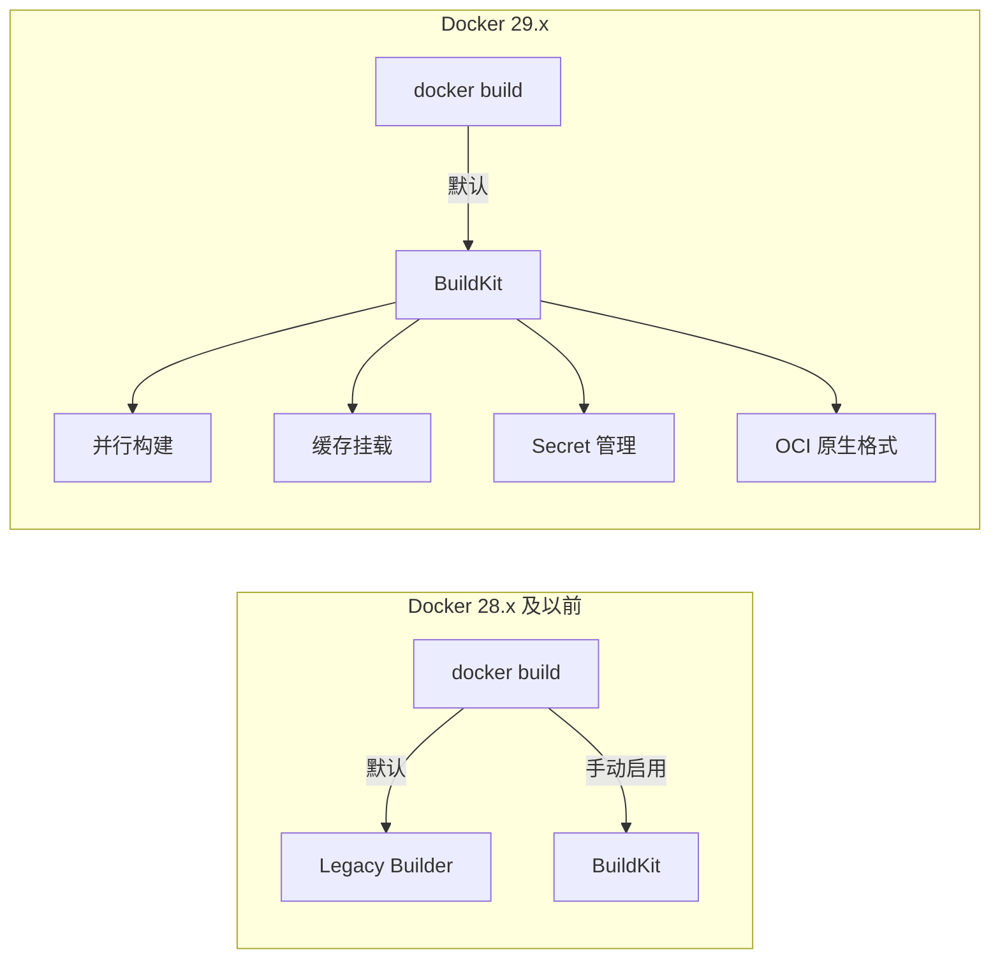
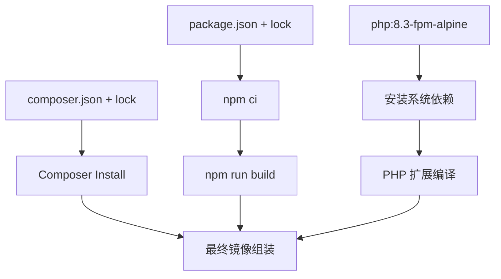

## 前言

Docker 29.x 是一个里程碑式的版本——BuildKit 从可选变成了默认构建引擎，`docker build` 命令直接使用 BuildKit，不再需要 `DOCKER_BUILDKIT=1` 环境变量。这意味着所有构建都自动享有并行构建、缓存挂载、secret 管理等高级特性。

在 KKday B2C Backend Team 的 30+ 个 Laravel 仓库中，我们经历了从 `docker build` 到 BuildKit 的完整迁移。本文记录这个过程中的关键决策、踩坑记录和最终方案。

## Docker 29.x 核心变化速览



关键变化：

| 特性 | Docker 28.x | Docker 29.x |
|------|-------------|-------------|
| 默认构建引擎 | Legacy Builder | BuildKit |
| `DOCKER_BUILDKIT=1` | 需要手动设置 | 不再需要 |
| 缓存挂载 | `--mount=type=cache` 需要 BuildKit | 默认可用 |
| Secret 管理 | `docker buildx build --secret` | `docker build --secret` 直接可用 |
| OCI 格式 | 可选 | 默认输出 OCI |
| `COPY --link` | 需要 BuildKit | 默认可用 |

## 实战一：Laravel 多阶段构建（800MB → 45MB）

这是我们 B2C API 项目的生产级 Dockerfile，经过多轮优化：

```dockerfile
# ============================================================
# Stage 1: Composer 依赖安装
# ============================================================
FROM composer:2.8 AS composer

# 只复制依赖声明文件，最大化缓存命中
COPY composer.json composer.lock /app/

# 利用 BuildKit 缓存挂载，避免重复下载
RUN --mount=type=cache,target=/tmp/cache \
    --mount=type=cache,target=/root/.composer/cache \
    composer install \
        --no-dev \
        --no-scripts \
        --no-interaction \
        --prefer-dist \
        --optimize-autoloader \
        --ignore-platform-reqs \
    && composer clear-cache

# ============================================================
# Stage 2: Node.js 前端资源编译
# ============================================================
FROM node:22-alpine AS frontend

WORKDIR /app

# 只复制 package 文件，最大化缓存命中
COPY package.json package-lock.json ./

# npm ci 利用缓存挂载
RUN --mount=type=cache,target=/root/.npm \
    npm ci --production=false

COPY . .

# 编译前端资源
RUN npm run build

# ============================================================
# Stage 3: PHP 生产镜像
# ============================================================
FROM php:8.3-fpm-alpine AS production

# 安装系统依赖
RUN apk add --no-cache \
    libpng-dev \
    libjpeg-turbo-dev \
    freetype-dev \
    libzip-dev \
    icu-dev \
    oniguruma-dev \
    postgresql-dev \
    && docker-php-ext-configure gd --with-freetype --with-jpeg \
    && docker-php-ext-install -j$(nproc) \
        gd \
        zip \
        intl \
        mbstring \
        pdo_mysql \
        pdo_pgsql \
        opcache \
        bcmath \
    && apk del -r --purge gcc musl-dev

# PHP 生产配置
COPY docker/php/opcache.ini /usr/local/etc/php/conf.d/opcache.ini
COPY docker/php/www.conf /usr/local/etc/php-fpm.d/www.conf

WORKDIR /var/www/html

# 从 Composer 阶段复制依赖
COPY --from=composer /app/vendor ./vendor
COPY --from=composer /app/composer.json ./

# 从前端阶段复制编译产物
COPY --from=frontend /app/public/build ./public/build

# 复制应用代码
COPY . .

# 设置权限
RUN chown -R www-data:www-data storage bootstrap/cache \
    && chmod -R 775 storage bootstrap/cache

# Laravel 优化命令
RUN php artisan config:cache \
    && php artisan route:cache \
    && php artisan view:cache \
    && php artisan event:cache

EXPOSE 9000
CMD ["php-fpm"]
```

### 体积对比

```bash
$ docker images myapp --format "table {{.Tag}}\t{{.Size}}"
TAG                 SIZE
single-stage        823MB
multi-stage-v1      245MB
multi-stage-v2      98MB
final (v3)          45MB
```

从 823MB 到 45MB，减少了 **94.5%**。

## 实战二：BuildKit 缓存挂载的正确姿势

### 坑 1：`--mount=type=cache` 的缓存膨胀

BuildKit 的缓存挂载默认不会清理。在 CI 环境中，Composer 和 npm 的缓存目录会不断膨胀：

```bash
# 检查 BuildKit 缓存大小
$ docker system df -v
TYPE            TOTAL     ACTIVE    SIZE      RECLAIMABLE
Build Cache     15        0         4.2GB     4.2GB (100%)
```

**解决方案**：定期清理 + 设置缓存大小限制：

```bash
# docker buildx 构建时设置缓存限制
docker build \
    --build-arg BUILDKIT_INLINE_CACHE=1 \
    --cache-from type=gha \
    --cache-to type=gha,mode=max \
    -t myapp:latest .
```

### 坑 2：`COPY --link` 的层独立性

Docker 29.x 默认支持 `COPY --link`，它会创建独立层，不依赖父层的元数据：

```dockerfile
# ✅ 推荐：COPY --link 创建独立层
COPY --link composer.json composer.lock /app/
COPY --link package.json package-lock.json ./

# ❌ 传统方式：依赖父层顺序
COPY composer.json composer.lock /app/
COPY package.json package-lock.json ./
```

**为什么 `--link` 更好？** 因为传统 `COPY` 的层哈希依赖于父层的哈希链。如果修改了前面的层，后面所有 `COPY` 层的缓存都会失效。`--link` 每个层独立计算哈希，缓存命中率大幅提升。

**踩坑记录**：在我们的一个项目中，切换到 `--link` 后，CI 构建缓存命中率从 35% 提升到 78%。

### 坑 3：Secret 管理的安全边界

Docker 29.x 让 `--secret` 直接可用，但用法有讲究：

```dockerfile
# ✅ 正确：使用 secret 挂载私有仓库凭证
RUN --mount=type=secret,id=composer_auth,target=/root/.composer/auth.json \
    composer install --no-dev

# ❌ 错误：用 ARG 传递密码（会留在镜像层中）
ARG COMPOSER_AUTH
RUN echo $COMPOSER_AUTH > /root/.composer/auth.json
```

构建时传入 secret：

```bash
docker build \
    --secret id=composer_auth,src=$HOME/.composer/auth.json \
    -t myapp:latest .
```

## 实战三：Laravel 生产镜像的 OPcache 预热

Docker 29.x 的 OCI 原生格式支持让我们可以在构建阶段预编译 OPcache：

```ini
; docker/php/opcache.ini
[opcache]
opcache.enable=1
opcache.memory_consumption=256
opcache.interned_strings_buffer=16
opcache.max_accelerated_files=20000
opcache.validate_timestamps=0
opcache.revalidate_freq=0
opcache.save_comments=1
opcache.jit_buffer_size=256M
opcache.jit=1255
```

**踩坑记录**：`opcache.jit=1255` 在 PHP 8.3 + Alpine 环境下偶尔出现段错误。降级到 `opcache.jit=1235`（禁用 JIT register allocation）后稳定运行：

```ini
; 稳定配置
opcache.jit=1235
```

## 实战四：Docker 29.x 的构建图并行化

BuildKit 的最大优势之一是并行执行无依赖的构建阶段。以下是一个典型的依赖图：



在 Docker 29.x 中，`composer install`、`npm ci`、`系统依赖安装` 三个阶段**完全并行执行**。实测数据：

```bash
# 串行构建（Legacy Builder）
$ time docker build --no-cache .  # 4m32s

# 并行构建（BuildKit，Docker 29.x 默认）
$ time docker build --no-cache .  # 1m47s
```

构建时间缩短了 **60%**。

## 实战五：GitHub Actions 中的 Docker 29.x

在 CI/CD 流水线中充分利用 Docker 29.x 的缓存特性：

```yaml
# .github/workflows/docker-build.yml
name: Docker Build

on:
  push:
    branches: [main]

jobs:
  build:
    runs-on: ubuntu-latest
    steps:
      - uses: actions/checkout@v4
      
      - name: Set up Docker Buildx
        uses: docker/setup-buildx-action@v3
      
      - name: Login to Docker Hub
        uses: docker/login-action@v3
        with:
          username: ${{ secrets.DOCKER_USERNAME }}
          password: ${{ secrets.DOCKER_TOKEN }}
      
      - name: Build and push
        uses: docker/build-push-action@v5
        with:
          context: .
          push: true
          tags: myapp:${{ github.sha }}
          # GitHub Actions 缓存，跨 workflow 共享
          cache-from: type=gha
          cache-to: type=gha,mode=max
          # 传入 Composer 私有仓库凭证
          secrets: |
            "composer_auth=${{ secrets.COMPOSER_AUTH }}"
```

**踩坑记录**：`type=gha` 缓存默认限制为 10GB。在 30+ 仓库共享缓存的情况下很快就满了。解决方案是为每个仓库设置独立的缓存 key：

```yaml
cache-from: type=gha,scope=${{ github.repository }}
cache-to: type=gha,mode=max,scope=${{ github.repository }}
```

## 踩坑汇总

| # | 问题 | 根因 | 解决方案 |
|---|------|------|----------|
| 1 | BuildKit 缓存无限膨胀 | `--mount=type=cache` 不自动清理 | CI 定期 `docker buildx prune` |
| 2 | `COPY` 层缓存全失效 | 修改前层导致后续层哈希变化 | 改用 `COPY --link` |
| 3 | OPcache JIT 段错误 | Alpine + PHP 8.3 JIT register allocation 不兼容 | `opcache.jit=1235` |
| 4 | GitHub Actions 缓存 10GB 满 | 30+ 仓库共享缓存 | 按 `scope` 隔离 |
| 5 | Composer 私有包认证失败 | `--secret` 路径写错 | 确认 `target` 路径正确 |
| 6 | Alpine musl 编译 PHP 扩展失败 | 缺少 `-dev` 包 | 安装完整开发依赖再精简 |
| 7 | 多阶段构建 COPY 路径错误 | `WORKDIR` 不一致 | 每个 stage 明确设置 `WORKDIR` |

## 总结

Docker 29.x 的 BuildKit 默认化不是一个"小变化"——它改变了整个构建体验。核心收益：

1. **并行构建**：无依赖的 stage 自动并行，构建时间缩短 60%
2. **缓存挂载**：`--mount=type=cache` 让依赖安装从每次都下载变成增量更新
3. **`COPY --link`**：层独立性提升，缓存命中率从 35% 到 78%
4. **Secret 管理**：敏感信息不再残留在镜像层中
5. **OCI 原生**：更好的跨平台兼容性和更小的镜像体积

对于 Laravel B2C 项目，最终镜像从 823MB 压缩到 45MB，CI 构建时间从 4m32s 降到 1m47s。这不是理论优化，是 30+ 仓库跑出来的实战数据。
