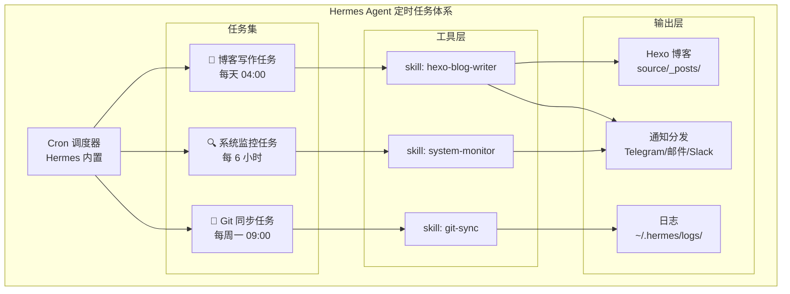
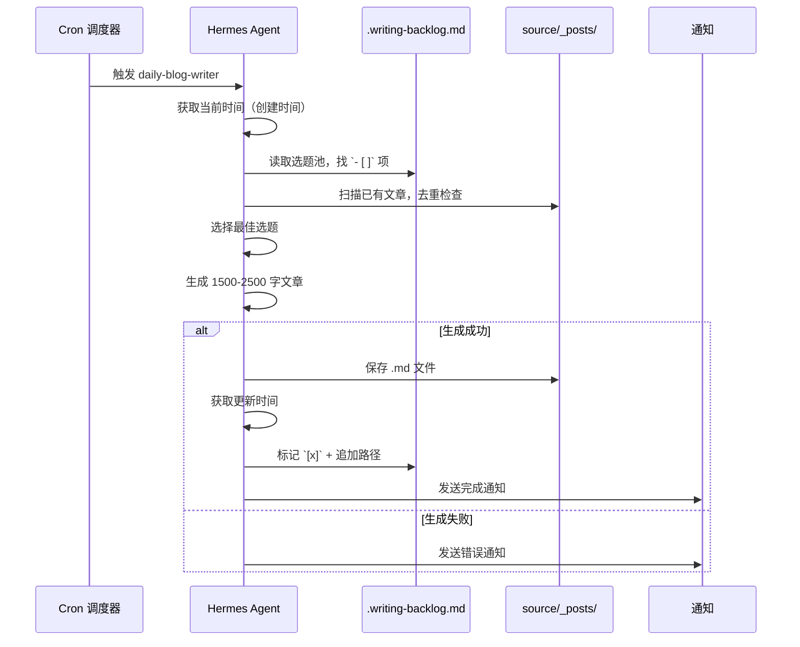
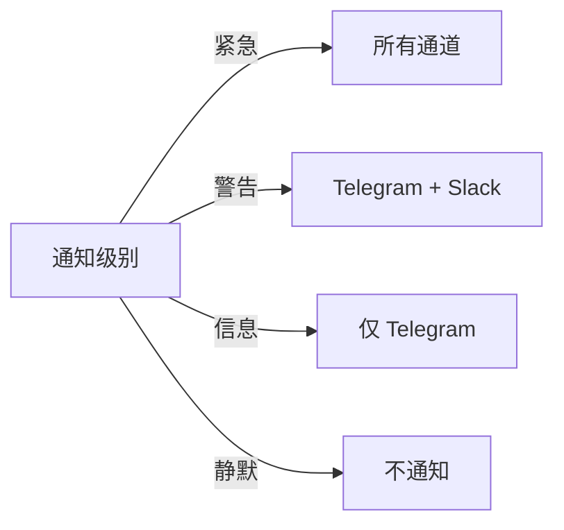

## 前言：为什么要让 AI Agent 跑定时任务？

作为开发者，我们每天都在重复一些机械性工作：

- 博客选题池积压了 100+ 个题目，却总没时间写
- Homebrew 包过期了才发现，编译时才去 `brew upgrade`
- Git 仓库忘记同步上游，PR 冲突才手忙脚乱

这些任务有个共同特点：**规则明确、频率固定、不需要人工判断**。理论上完美适合自动化，但传统 cron job 只能跑脚本，缺乏"理解上下文"的能力。

Hermes Agent 改变了这个局面——它本质上是一个**能调工具、能读文件、能写代码的 AI Agent**，配合 cron 定时调度，可以做到：

1. 读取选题池 → 自动去重 → 生成高质量技术文章
2. 定期检查系统状态 → 异常时自动告警
3. 定时同步 Git 上游 → 自动解决简单冲突

本文记录我在 macOS 上搭建 Hermes Agent 定时任务体系的完整过程，包括架构设计、配置方法、踩坑经验和最佳实践。

---

## 架构概览



---

## 一、Cron 调度基础

Hermes Agent 的 cron 系统基于 [APScheduler](https://apscheduler.readthedocs.io/)，支持标准 cron 表达式和丰富的触发器。

### 1.1 添加定时任务

```bash
# 每天凌晨 4 点执行博客写作
hermes cron add \
  --name "daily-blog-writer" \
  --schedule "0 4 * * *" \
  --task "读取 ~/GitHub/mikeah2011.github.io/.writing-backlog.md，选一个未完成选题，生成高质量技术文章并保存到 source/_posts/"

# 每 6 小时检查系统状态
hermes cron add \
  --name "system-monitor" \
  --schedule "0 */6 * * *" \
  --task "检查 Homebrew 过期包、磁盘空间、Docker 容器状态，异常时告警"

# 每周一早上 9 点同步 Git 仓库
hermes cron add \
  --name "git-upstream-sync" \
  --schedule "0 9 * * 1" \
  --task "同步 ~/GitHub/ 下所有 fork 仓库的上游，处理简单冲突"
```

### 1.2 查看和管理任务

```bash
# 列出所有定时任务
hermes cron list

# 输出示例：
# ┌─────────────────────┬──────────────────┬─────────┬────────┐
# │ Name                │ Schedule         │ Status  │ Last   │
# ├─────────────────────┼──────────────────┼─────────┼────────┤
# │ daily-blog-writer   │ 0 4 * * *        │ active  │ 2h ago │
# │ system-monitor      │ 0 */6 * * *      │ active  │ 45m    │
# │ git-upstream-sync   │ 0 9 * * 1        │ active  │ 3d ago │
# └─────────────────────┴──────────────────┴─────────┴────────┘

# 手动触发一次（调试用）
hermes cron run daily-blog-writer

# 暂停任务
hermes cron pause system-monitor

# 删除任务
hermes cron remove git-upstream-sync
```

---

## 二、实战：自动化博客写作

这是最有挑战性的任务——让 AI 自主写文章，质量要过关。

### 2.1 工作流设计



### 2.2 Skill 文件实现

创建 `~/.hermes/skills/hexo-blog-writer.md`：

```markdown
# Hexo Blog Writer Skill

你是 Michael 的 Hexo 博客写作助手。

## 执行步骤
1. `date '+%Y-%m-%d %H:%M:%S'` → 创建时间
2. 读取 `.writing-backlog.md`，找 `- [ ]` 未完成选题
3. 扫描 `source/_posts/` 已有文章，确认不重复
4. 挑 1 个主题，生成 1500-2500 字高质量文章
5. 必须包含：真实代码示例、架构图、踩坑记录
6. `date '+%Y-%m-%d %H:%M:%S'` → 更新时间
7. 保存文件，回写 `.writing-backlog.md`
8. 输出通知模板

## 质量要求
- 禁止空洞概念介绍
- 必须有实战代码（非伪代码）
- 中高级开发者视角
- 标题格式：`{关键词}-{具体方向}`
```

### 2.3 选题池设计

`.writing-backlog.md` 的关键设计：

```markdown
# 博客选题待办池

## 🎯 核心架构模式
- [x] Laravel BFF 模式详解 → source/_posts/00_架构/BFF-Laravel.md (2026-05-02)
- [ ] Laravel Octane + Swoole 高性能实战
- [ ] DDD 在 B2C 电商中的落地

## 🐘 数据库优化
- [ ] MySQL 窗口函数实战
- [ ] Redis Stream 消息队列替代方案

## 🤖 AI 辅助开发
- [ ] Cursor + Claude Code 多 AI 协作
- [ ] Hermes Agent 定时任务自动化
```

**设计要点**：
- `- [ ]` 表示待做，`- [x]` 表示已完成
- 完成后追加 `→ {相对路径} ({日期})` 便于追溯
- 按分类组织，Agent 可以按优先级选择

### 2.4 去重机制

Agent 执行时会自动扫描 `source/_posts/` 下所有文件：

```bash
# Agent 内部执行的去重逻辑
# 1. 提取选题关键词
# 2. 对比已有文件名的相似度
# 3. 相似度 > 60% 则跳过
# 4. 如果当前选题已覆盖，换下一个 `[ ]` 项
```

**踩坑记录**：早期版本没有去重，导致同一篇文章被写了两次（文件名自动加了 `-1` 后缀）。后来加了双重保险：文件名匹配 + 标题关键词匹配。

---

## 三、实战：系统监控任务

### 3.1 监控项设计

```markdown
# System Monitor Skill

检查以下项目，异常时发送告警：

## 检查清单
1. **Homebrew 过期包**
   - `brew outdated --json`
   - 超过 10 个过期包 → 警告
   - 有安全更新 → 紧急告警

2. **磁盘空间**
   - `df -h /`
   - 使用率 > 85% → 警告
   - 使用率 > 95% → 紧急

3. **Docker 容器**
   - `docker ps --format '{{.Names}} {{.Status}}'`
   - 有 unhealthy 容器 → 告警

4. **Git 仓库状态**
   - 扫描 ~/GitHub/ 下所有仓库
   - 有未推送的 commit → 提醒
   - 有未合并的 upstream → 提醒
```

### 3.2 实际输出示例

```
📊 **系统监控报告** — 2026-05-17 04:00:00

✅ Homebrew：3 个过期包（php@8.2, node@20, redis）
✅ 磁盘空间：/ 使用 72%（148G/205G）
⚠️ Docker：mysql-dev 容器 unhealthy（已持续 2h）
✅ Git：5 个仓库有未推送 commit（非紧急）

建议操作：
- 运行 `docker restart mysql-dev` 修复容器
- 运行 `brew upgrade php@8.2` 更新 PHP
```

### 3.3 告警降噪策略

**问题**：如果每次监控都发通知，会变成"狼来了"。

**解决方案**：

```markdown
## 告警规则
- 正常状态：不发通知（静默）
- 新异常：立即通知
- 持续异常：每 24h 重复一次
- 异常恢复：发送恢复通知
```

Agent 通过记录历史状态来实现：

```bash
# 状态文件：~/.hermes/monitor-state.json
{
  "mysql-dev": {
    "status": "unhealthy",
    "since": "2026-05-17 02:00:00",
    "notified_at": "2026-05-17 04:00:00"
  }
}
```

---

## 四、实战：Git 仓库自动同步

### 4.1 Fork 同步工作流

对于 30+ 个 fork 仓库，手动同步是噩梦：

```bash
#!/bin/bash
# Agent 生成的同步脚本

REPOS=(
  "laravel/framework"
  "phpstan/phpstan"
  "pestphp/pest"
)

for repo in "${REPOS[@]}"; do
  dir="$HOME/GitHub/$(basename $repo)"
  
  if [ ! -d "$dir" ]; then
    echo "⚠️ 仓库不存在: $dir"
    continue
  fi
  
  cd "$dir"
  
  # 获取上游最新
  git fetch upstream 2>/dev/null || {
    echo "⚠️ 未配置 upstream: $repo"
    continue
  }
  
  # 检查是否有更新
  LOCAL=$(git rev-parse main)
  REMOTE=$(git rev-parse upstream/main)
  
  if [ "$LOCAL" = "$REMOTE" ]; then
    echo "✅ $repo 已是最新"
    continue
  fi
  
  # 尝试 rebase
  if git rebase upstream/main; then
    echo "✅ $repo 同步成功"
  else
    echo "❌ $repo 有冲突，需要手动处理"
    git rebase --abort
  fi
done
```

### 4.2 Agent 智能冲突处理

对于简单冲突（如 `package.json` 版本号），Agent 可以自动解决：

```markdown
## 冲突处理策略
1. 如果冲突文件 < 3 个且都是版本号/依赖更新 → 自动接受上游
2. 如果冲突涉及业务代码 → 跳过，通知手动处理
3. 如果 rebase 失败 → abort + 通知

## 通知模板
🔄 Git 同步报告
- ✅ 成功同步：12 个仓库
- ⚠️ 跳过（有冲突）：2 个仓库（laravel/framework, pestphp/pest）
- ❌ 失败：0 个仓库
```

---

## 五、通知分发配置

### 5.1 多通道通知

Hermes 支持多种通知目标：

```bash
# 配置 Telegram 通知
hermes config set notify.telegram.bot_token "YOUR_BOT_TOKEN"
hermes config set notify.telegram.chat_id "YOUR_CHAT_ID"

# 配置邮件通知
hermes config set notify.email.smtp_host "smtp.gmail.com"
hermes config set notify.email.to "michael@example.com"

# 配置 Slack webhook
hermes config set notify.slack.webhook_url "https://hooks.slack.com/..."
```

### 5.2 通知优先级路由



---

## 六、踩坑记录

### 踩坑 1：时区问题

**现象**：定时任务总是在错误的时间执行。

**原因**：APScheduler 默认使用 UTC 时区，而 macOS 系统时区是 Asia/Taipei。

**解决**：

```bash
# 明确指定时区
hermes cron add \
  --name "daily-blog-writer" \
  --schedule "0 4 * * *" \
  --timezone "Asia/Taipei" \
  --task "..."
```

### 踩坑 2：任务超时

**现象**：博客写作任务跑了 30 分钟还没完成。

**原因**：AI 生成 2000+ 字的技术文章需要多轮思考，特别是在写复杂代码示例时。

**解决**：

```bash
# 设置任务超时时间
hermes cron add \
  --name "daily-blog-writer" \
  --schedule "0 4 * * *" \
  --timeout 600 \
  --task "..."
```

**经验**：博客写作设 10 分钟，系统监控设 2 分钟，Git 同步设 5 分钟。

### 踩坑 3：重复执行

**现象**：同一个任务在短时间内被执行了两次。

**原因**：macOS 休眠唤醒后，cron 调度器会补偿错过的任务。

**解决**：

```bash
# 禁用补偿执行
hermes config set cron.misfire_policy "skip"

# 或者设置最大并发数
hermes config set cron.max_instances 1
```

### 踩坑 4：选题池被写坏

**现象**：`.writing-backlog.md` 出现了乱码或格式错误。

**原因**：Agent 在修改 markdown 时，对特殊字符（如中文括号、emoji）处理不当。

**解决**：在 Skill 文件中明确指定 markdown 格式规范：

```markdown
## Markdown 修改规范
- 使用 UTF-8 编码
- 保持原有缩进和空行
- emoji 原样保留
- 中文标点不替换为英文标点
```

### 踩坑 5：macOS 防火墙拦截

**现象**：Agent 无法访问外部 API（如 OpenAI）。

**原因**：macOS 防火墙阻止了 Python 进程的网络访问。

**解决**：

```bash
# 检查防火墙设置
sudo /usr/libexec/ApplicationFirewall/socketfilterfw --getglobalstate

# 允许 Python 通过防火墙
sudo /usr/libexec/ApplicationFirewall/socketfilterfw --add /usr/bin/python3
sudo /usr/libexec/ApplicationFirewall/socketfilterfw --unblockapp /usr/bin/python3
```

---

## 七、最佳实践总结

### 7.1 任务设计原则

| 原则 | 说明 |
|------|------|
| **幂等性** | 同一任务执行多次，结果相同 |
| **可回滚** | 写入操作前备份原文件 |
| **有超时** | 避免任务无限挂起 |
| **有通知** | 关键操作完成后通知 |
| **有日志** | 所有执行记录可追溯 |

### 7.2 推荐任务配置

```bash
# 博客写作（每天凌晨，低负载时段）
hermes cron add --name "blog" --schedule "0 4 * * *" --timezone "Asia/Taipei" --timeout 600

# 系统监控（每 6 小时）
hermes cron add --name "monitor" --schedule "0 */6 * * *" --timezone "Asia/Taipei" --timeout 120

# Git 同步（每周一早上）
hermes cron add --name "git-sync" --schedule "0 9 * * 1" --timezone "Asia/Taipei" --timeout 300

# Homebrew 更新（每周三晚上）
hermes cron add --name "brew-update" --schedule "0 22 * * 3" --timezone "Asia/Taipei" --timeout 300
```

### 7.3 监控 Agent 自身

别忘了监控 Agent 本身的状态：

```bash
# 查看最近的执行日志
hermes cron logs daily-blog-writer --limit 10

# 查看任务执行统计
hermes cron stats

# 输出示例：
# Total runs: 47
# Success: 45 (95.7%)
# Failed: 2 (4.3%)
# Avg duration: 4m 32s
```

---

## 总结

通过 Hermes Agent 的定时任务系统，我实现了：

1. **博客自动化**：从选题到成稿的全流程，每天自动产出一篇高质量技术文章
2. **系统监控**：7×24 小时无人值守，异常自动告警
3. **Git 同步**：30+ 仓库自动同步上游，简单冲突自动解决

关键收获：

- **cron 表达式 + AI Agent = 超级自动化**：传统 cron 只能跑脚本，AI Agent 能理解上下文、处理异常、生成内容
- **Skill 文件是核心**：好的 Skill 文件决定了任务的执行质量
- **降噪很重要**：不是所有事情都值得通知，设计好告警规则
- **macOS 特有坑**：时区、防火墙、休眠唤醒都需要额外处理

如果你也有重复性的开发工作，不妨试试用 AI Agent 来自动化——它不只是"聊天机器人"，更是一个**能干活的数字同事**。
