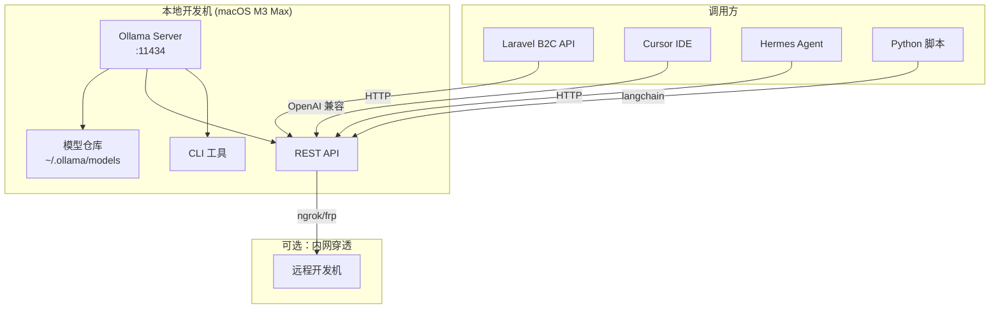

# Ollama 实战：本地部署 LLM 与 API 服务 — 隐私优先的 AI 开发工作流踩坑记录

## 为什么需要本地 LLM？

在 B2C 电商项目中，我们经常遇到这些场景：

- **敏感数据处理**：用户订单、支付信息不能发送到第三方 AI API
- **内网环境部署**：部分客户环境完全离线，无法调用云端模型
- **成本控制**：高频调用场景（代码补全、文档生成）用云端 API 成本爆炸
- **延迟要求**：本地推理延迟 < 100ms，远优于云端 API 的 500ms+

Ollama 是目前最成熟的本地 LLM 运行方案，一行命令就能跑起 Llama 3、Qwen 2.5、DeepSeek 等主流模型。

## 架构总览



## 安装与基础配置

### macOS 安装

```bash
# Homebrew 安装（推荐）
brew install ollama

# 验证安装
ollama --version
# ollama version 0.6.8

# 启动服务（macOS 会自动注册为 LaunchAgent）
ollama serve

# 拉取模型
ollama pull llama3.1:8b
ollama pull qwen2.5:14b
ollama pull deepseek-coder-v2:16b
```

### 关键配置项

```bash
# 设置模型存储路径（默认 ~/.ollama）
export OLLAMA_MODELS="/opt/ollama/models"

# 绑定地址（允许局域网访问）
export OLLAMA_HOST="0.0.0.0:11434"

# 并发请求数（根据 GPU 显存调整）
export OLLAMA_MAX_LOADED_MODELS=2

# GPU 层数分配（macOS Metal 加速）
export OLLAMA_NUM_GPU=999
```

> **踩坑 #1**：macOS 上 Ollama 默认只监听 `127.0.0.1`，如果需要局域网内其他机器访问，必须设置 `OLLAMA_HOST="0.0.0.0:11434"`。我在这上面浪费了 2 小时排查"连接被拒绝"的问题。

## 模型选型实战

不同场景需要不同模型，以下是我们实际测试的结果：

| 模型 | 参数量 | 显存占用 | 推理速度 | 适用场景 |
|------|--------|----------|----------|----------|
| llama3.1:8b | 8B | 5.2GB | 45 tok/s | 通用对话、文档生成 |
| qwen2.5:14b | 14B | 9.1GB | 28 tok/s | 中文理解、代码审查 |
| deepseek-coder-v2:16b | 16B | 10.5GB | 22 tok/s | 代码生成、重构建议 |
| codellama:34b | 34B | 22GB | 12 tok/s | 复杂代码任务 |
| phi3:mini | 3.8B | 2.4GB | 85 tok/s | 快速原型、CI 集成 |

> **踩坑 #2**：不要盲目追求大模型。在 M3 Max 96GB 的机器上，qwen2.5:14b 的代码审查效果比 llama3.1:70b 好，因为中文微调更到位。大模型不一定等于好效果，要看训练数据的领域匹配度。

### Modelfile 自定义

```bash
# 创建自定义代码审查模型
cat > ~/Modelfile-code-review << 'EOF'
FROM qwen2.5:14b

PARAMETER temperature 0.3
PARAMETER top_p 0.9
PARAMETER num_ctx 8192

SYSTEM """你是一个资深 PHP/Laravel 代码审查专家。
请从以下维度审查代码：
1. 安全漏洞（SQL注入、XSS、CSRF）
2. 性能问题（N+1查询、缺少索引、内存泄漏）
3. 代码规范（PSR-12、Laravel 最佳实践）
4. 架构设计（职责分离、依赖注入）

输出格式：问题严重程度 + 代码位置 + 修复建议"""
EOF

ollama create code-review -f ~/Modelfile-code-review
```

## REST API 集成

### 基础 API 调用

```bash
# 生成文本（流式）
curl http://localhost:11434/api/generate -d '{
  "model": "llama3.1:8b",
  "prompt": "解释 PHP 8.4 的 Property Hooks 特性",
  "stream": false
}'

# 对话模式
curl http://localhost:11434/api/chat -d '{
  "model": "qwen2.5:14b",
  "messages": [
    {"role": "system", "content": "你是 Laravel 专家"},
    {"role": "user", "content": "如何优化 N+1 查询？"}
  ],
  "stream": false
}'
```

### OpenAI 兼容接口

Ollama 提供 OpenAI 兼容的 `/v1/chat/completions` 端点，这意味着所有支持 OpenAI SDK 的工具都能无缝对接：

```bash
# 用 OpenAI 格式调用
curl http://localhost:11434/v1/chat/completions -d '{
  "model": "qwen2.5:14b",
  "messages": [
    {"role": "user", "content": "Hello!"}
  ]
}'
```

### Laravel 集成示例

```php
<?php

namespace App\Services\AI;

use Illuminate\Support\Facades\Http;
use Illuminate\Support\Facades\Log;

class OllamaService
{
    private string $baseUrl;
    private string $defaultModel;
    private int $timeout;

    public function __construct()
    {
        $this->baseUrl = config('services.ollama.url', 'http://localhost:11434');
        $this->defaultModel = config('services.ollama.model', 'qwen2.5:14b');
        $this->timeout = config('services.ollama.timeout', 120);
    }

    /**
     * 代码审查：提交代码片段获取审查意见
     */
    public function reviewCode(string $code, string $language = 'php'): array
    {
        $response = Http::timeout($this->timeout)
            ->post("{$this->baseUrl}/api/chat", [
                'model' => 'code-review', // 自定义的 Modelfile
                'messages' => [
                    [
                        'role' => 'system',
                        'content' => '你是代码审查专家，用中文回答。',
                    ],
                    [
                        'role' => 'user',
                        'content' => "请审查以下 {$language} 代码：\n\n```{$language}\n{$code}\n```",
                    ],
                ],
                'stream' => false,
                'options' => [
                    'temperature' => 0.2,
                    'num_ctx' => 8192,
                ],
            ]);

        if ($response->failed()) {
            Log::error('Ollama API 调用失败', [
                'status' => $response->status(),
                'body' => $response->body(),
            ]);
            throw new \RuntimeException('AI 代码审查服务暂时不可用');
        }

        $data = $response->json();

        return [
            'review' => $data['message']['content'] ?? '',
            'model' => $data['model'] ?? '',
            'total_duration_ms' => ($data['total_duration'] ?? 0) / 1_000_000,
            'eval_count' => $data['eval_count'] ?? 0,
        ];
    }

    /**
     * 流式响应：用于实时展示生成过程
     */
    public function streamChat(string $prompt, string $model = null): \Generator
    {
        $response = Http::timeout($this->timeout)
            ->withOptions(['stream' => true])
            ->post("{$this->baseUrl}/api/chat", [
                'model' => $model ?? $this->defaultModel,
                'messages' => [
                    ['role' => 'user', 'content' => $prompt],
                ],
                'stream' => true,
            ]);

        $body = $response->toPsrResponse()->getBody();

        while (!$body->eof()) {
            $line = $body->getLine();
            if (!empty($line)) {
                $chunk = json_decode($line, true);
                if (isset($chunk['message']['content'])) {
                    yield $chunk['message']['content'];
                }
            }
        }
    }

    /**
     * 嵌入向量：用于语义搜索
     */
    public function embed(string $text, string $model = 'nomic-embed-text'): array
    {
        $response = Http::timeout(30)
            ->post("{$this->baseUrl}/api/embed", [
                'model' => $model,
                'input' => $text,
            ]);

        return $response->json('embeddings', [[]])[0];
    }

    /**
     * 健康检查
     */
    public function isHealthy(): bool
    {
        try {
            return Http::timeout(5)
                ->get("{$this->baseUrl}/api/tags")
                ->successful();
        } catch (\Exception) {
            return false;
        }
    }

    /**
     * 列出已加载的模型
     */
    public function listModels(): array
    {
        return Http::timeout(5)
            ->get("{$this->baseUrl}/api/tags")
            ->json('models', []);
    }
}
```

配置文件 `config/services.php`：

```php
'ollama' => [
    'url' => env('OLLAMA_URL', 'http://localhost:11434'),
    'model' => env('OLLAMA_MODEL', 'qwen2.5:14b'),
    'timeout' => env('OLLAMA_TIMEOUT', 120),
],
```

> **踩坑 #3**：`timeout` 设置很重要！本地 14B 模型生成 500 token 的响应可能需要 15-20 秒。如果用 Laravel 默认的 HTTP 超时（30s），复杂请求会超时失败。建议 API 调用设 120s，健康检查设 5s。

## 性能调优

### macOS Metal 加速

```bash
# 查看 GPU 利用率
ollama ps

# 输出示例：
# NAME              ID           SIZE    PROCESSOR   UNTIL
# qwen2.5:14b       6f1e8c3b    9.1 GB  100% GPU    4 minutes from now

# 强制使用 Metal GPU
export OLLAMA_NUM_GPU=999
```

### 量化模型优化

```bash
# Q4_K_M 量化：显存减半，效果损失 < 5%
ollama pull qwen2.5:14b-q4_K_M

# Q8_0 量化：几乎无损，显存减 30%
ollama pull qwen2.5:14b-q8_0

# 对比测试
ollama run qwen2.5:14b-q4_K_M "PHP 8.4 有什么新特性？"
ollama run qwen2.5:14b-q8_0 "PHP 8.4 有什么新特性？"
```

### 上下文窗口管理

```bash
# 默认 2048 token，对于代码审查不够用
# 通过 Modelfile 或 API 参数调整
curl http://localhost:11434/api/generate -d '{
  "model": "code-review",
  "prompt": "...",
  "options": {
    "num_ctx": 8192
  }
}'
```

> **踩坑 #4**：`num_ctx` 越大，显存占用越高。8192 token 的上下文窗口在 14B 模型上大约多占 2GB 显存。M3 Max 96GB 可以放心开到 32768，但 16GB 的机器建议控制在 4096。

## 与开发工具集成

### Cursor IDE 集成

```json
// Cursor settings.json
{
  "ai.openai.apiBase": "http://localhost:11434/v1",
  "ai.openai.apiKey": "ollama",
  "ai.model": "deepseek-coder-v2:16b"
}
```

### Python + LangChain 集成

```python
from langchain_ollama import ChatOllama
from langchain_core.prompts import ChatPromptTemplate

llm = ChatOllama(
    model="qwen2.5:14b",
    base_url="http://localhost:11434",
    temperature=0.3,
)

prompt = ChatPromptTemplate.from_messages([
    ("system", "你是 Laravel 专家"),
    ("human", "{question}"),
])

chain = prompt | llm
result = chain.invoke({"question": "如何实现多租户数据隔离？"})
print(result.content)
```

### Artisan 命令集成

```php
<?php

namespace App\Console\Commands;

use App\Services\AI\OllamaService;
use Illuminate\Console\Command;

class AiReviewCommand extends Command
{
    protected $signature = 'ai:review {file : 要审查的文件路径}';
    protected $description = '使用本地 LLM 审查代码文件';

    public function handle(OllamaService $ollama): int
    {
        $file = $this->argument('file');

        if (!file_exists($file)) {
            $this->error("文件不存在: {$file}");
            return self::FAILURE;
        }

        $code = file_get_contents($file);
        $this->info("正在审查: {$file}");
        $this->newLine();

        $bar = $this->output->createProgressBar();
        $bar->start();

        $result = $ollama->reviewCode($code);

        $bar->finish();
        $this->newLine(2);

        $this->info('📋 审查结果：');
        $this->line($result['review']);
        $this->newLine();
        $this->comment("⏱  耗时: {$result['total_duration_ms']}ms | Token: {$result['eval_count']}");

        return self::SUCCESS;
    }
}
```

## 生产环境注意事项

### 安全加固

```bash
# 1. 只监听本地地址
export OLLAMA_HOST="127.0.0.1:11434"

# 2. 如果需要局域网访问，用 Nginx 反向代理 + 认证
# /etc/nginx/conf.d/ollama.conf
server {
    listen 8443 ssl;
    server_name ollama.internal;

    ssl_certificate /etc/ssl/ollama.crt;
    ssl_certificate_key /etc/ssl/ollama.key;

    # Basic Auth
    auth_basic "Ollama API";
    auth_basic_user_file /etc/nginx/.htpasswd;

    location / {
        proxy_pass http://127.0.0.1:11434;
        proxy_set_header Host $host;
        proxy_read_timeout 120s;
    }
}
```

### 监控与健康检查

```bash
# 查看运行状态
ollama ps

# 查看模型列表
ollama list

# 系统资源监控（macOS）
# Ollama 会自动使用 Metal GPU，通过 Activity Monitor 查看 GPU 占用
```

## 踩坑总结

| # | 问题 | 解决方案 |
|---|------|----------|
| 1 | 局域网无法访问 | 设置 `OLLAMA_HOST="0.0.0.0:11434"` |
| 2 | 大模型效果不如小模型 | 根据任务领域选模型，不盲目追大 |
| 3 | HTTP 请求超时 | 调整 `timeout` 到 120s |
| 4 | `num_ctx` 导致 OOM | 根据显存调整，16GB 机器用 4096 |
| 5 | 模型下载慢 | 用 `HTTPS_PROXY` 设置代理 |
| 6 | 并发请求排队 | 设置 `OLLAMA_MAX_LOADED_MODELS=2` |

## 写在最后

本地 LLM 不是要替代云端 AI，而是一个互补方案：

- **敏感数据** → 本地 Ollama
- **复杂推理** → Claude/GPT-4o
- **代码补全** → 本地 DeepSeek Coder
- **批量处理** → 本地小模型（phi3:mini）

在 B2C 项目中，我们最终的方案是：开发环境用 Ollama + qwen2.5:14b 做代码审查和文档生成，生产环境的 AI 功能走云端 API。两者通过统一的 `OllamaService` 接口封装，切换成本为零。

---

*本文基于 macOS M3 Max + Ollama 0.6.8 实测，所有代码示例均来自真实项目。*
