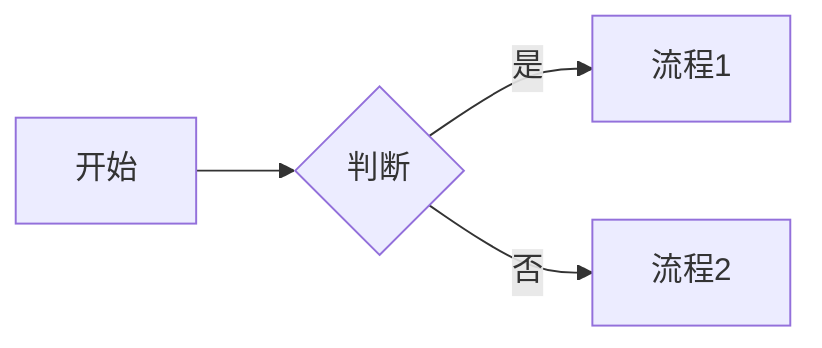

## 一、Markdown 是什么

**Markdown = 纯文本 + 极少的标记语法**，可以一键转成 HTML。

它解决的问题：用 Word 写技术文档要切到鼠标改格式，写代码块还要变字体；用 HTML 又啰嗦不好读。Markdown 让你**专心写内容**，格式靠几个符号搞定。

主要使用场景：

- GitHub README、Issue、PR 描述
- 静态博客（Hexo、Hugo、Jekyll、VitePress）
- 技术文档（GitBook、MkDocs、Docusaurus）
- 笔记软件（Obsidian、Typora、Notion 部分支持）
- 即时通讯（Slack、Discord、Telegram、微信公众号编辑器）

---

## 二、基础语法

### 标题

```markdown
# 一级标题
## 二级标题
### 三级标题
```

### 强调

```markdown
*斜体* 或 _斜体_
**粗体** 或 __粗体__
~~删除线~~
==高亮==（部分实现支持）
```

### 列表

```markdown
- 无序
- 项目
  - 嵌套（4 空格或 1 Tab）

1. 有序
2. 列表

- [ ] 任务（未完成）
- [x] 任务（已完成）
```

### 链接 + 图片

```markdown
[文字链接](https://example.com)
[带 title](https://example.com "鼠标悬停文字")


<https://auto-link.com>
```

### 代码

```markdown
行内 `code`

```js
function hello() {
  console.log('hi');
}
\`\`\`
```

> 三个反引号 + 语言名，语法高亮取决于渲染器。

### 引用 + 分割线

```markdown
> 引用块
> 多行
>> 嵌套引用

---  （三个或更多 -, * 或 _）
```

### 表格

```markdown
| 列 1 | 列 2 | 列 3 |
| ---- | :--: | ---: |
| 左对齐 | 居中 | 右对齐 |
| a    | b   | c    |
```

---

## 三、扩展语法（GFM = GitHub Flavored Markdown）

### Mermaid 流程图

````markdown

````

### 数学公式（KaTeX / MathJax）

```markdown
行内：$E = mc^2$

块级：
$$
\int_0^\infty e^{-x^2} dx = \frac{\sqrt{\pi}}{2}
$$
```

### 脚注

```markdown
正文内容[^1]

[^1]: 这是脚注内容。
```

### 折叠（HTML 嵌入）

```markdown
<details>
<summary>点击展开</summary>

被隐藏的内容

</details>
```

---

## 四、Front Matter（写博客必备）

文件开头的 YAML 元数据，被 Hexo / Jekyll / Hugo 等静态站点生成器解析：

```markdown
---
title: 我的文章
date: 2024-01-01
tags: [工程管理]
categories: 教程
description: 文章简介，给 SEO 用
---

正文从这里开始...
```

---

## 五、推荐编辑器

| 编辑器 | 平台 | 特点 |
|--------|------|------|
| **Typora** | 全平台（收费） | 所见即所得，体验最好 |
| **Obsidian** | 全平台（免费） | 双链笔记 + 插件生态 |
| **VSCode + Markdown All in One** | 全平台 | 程序员主力 |
| **MarkText** | 全平台（开源） | 免费版 Typora |
| **iA Writer** | macOS/iOS | 极简专注写作 |
| **Mark Text Web 版** | 浏览器 | StackEdit、Dillinger |

---

## 六、踩坑笔记

| 坑 | 现象 | 解法 |
|----|------|------|
| **方言不一致** | 在 GitHub 渲染好好的，到掘金/公众号乱了 | 写之前确认目标平台支持哪些扩展（CommonMark / GFM / MultiMarkdown） |
| **代码块 4 空格** | 被识别成代码块 | 用三反引号 `` ``` `` 标准写法 |
| **HTML 里写 Markdown 不渲染** | 大多数实现把 HTML 块当透明 | 在 HTML 里写正常 HTML，或用空行分隔回归 Markdown |
| **图片路径** | 本地预览 OK，部署后 404 | 用相对路径或 CDN；Hexo 用 `post_asset_folder` |
| **表格中的 `\|`** | 列错位 | 转义：`\|` |
| **行内代码含反引号** | 显示残缺 | 用更多反引号包：``` ``code with `backtick` `` ``` |

---

## 七、规范与最佳实践

- **CommonMark** —— 最严格的 Markdown 标准，跨实现兼容
- **GFM** —— GitHub 扩展，加了表格、任务列表、删除线、URL 自动链接、围栏代码块
- **MDX** —— Markdown + JSX，可以在文章里写 React 组件（Docusaurus 用）

写文档的建议：

1. 优先用 **GFM 子集**，兼容性最好
2. 标题层级别跳，从 `##` 开始（`#` 留给文章 title）
3. 代码块**永远写语言名**，方便高亮
4. 列表 **统一 -** 不要混 `*` `+`
5. 用 **prettier / markdownlint** 自动格式化

---

## 参考

- CommonMark 规范：<https://commonmark.org>
- GitHub Markdown：<https://docs.github.com/zh/get-started/writing-on-github>
- Markdown 教程（菜鸟）：<https://www.runoob.com/markdown/md-tutorial.html>
