> 画图这件事，我以前用 draw.io、ProcessOn、甚至 PPT。直到开始用 Mermaid，才发现"代码即图"才是后端工程师的最佳拍档——版本可控、Review 友好、不用切窗口。

## 为什么选 Mermaid？

在 KKday B2C Backend Team，我们的 SA/SD 文档都写在 Confluence 上。以前画架构图得切到 draw.io，画完导出 PNG 再贴回来，改一次需求就得重新画。后来发现 Mermaid 可以直接在 Confluence 里渲染，改动只改几行代码，从此告别"截图地狱"。

**Mermaid 的核心优势**：

| 特性 | draw.io / ProcessOn | Mermaid |
|------|---------------------|---------|
| 版本控制 | ❌ 二进制 diff 不可读 | ✅ 纯文本 Git 友好 |
| Code Review | ❌ 看不到变更 | ✅ 直接 diff |
| 学习成本 | 低（拖拽） | 中（需学语法） |
| 复杂布局 | ✅ 自由拖拽 | ⚠️ 自动布局有时不理想 |
| 集成能力 | 弱 | ✅ GitHub/Confluence/Hexo/Notion |

## 一、流程图（Flowchart）：订单状态机

B2C 电商最经典的图就是订单状态流转。用 Mermaid 画出来，代码即文档：

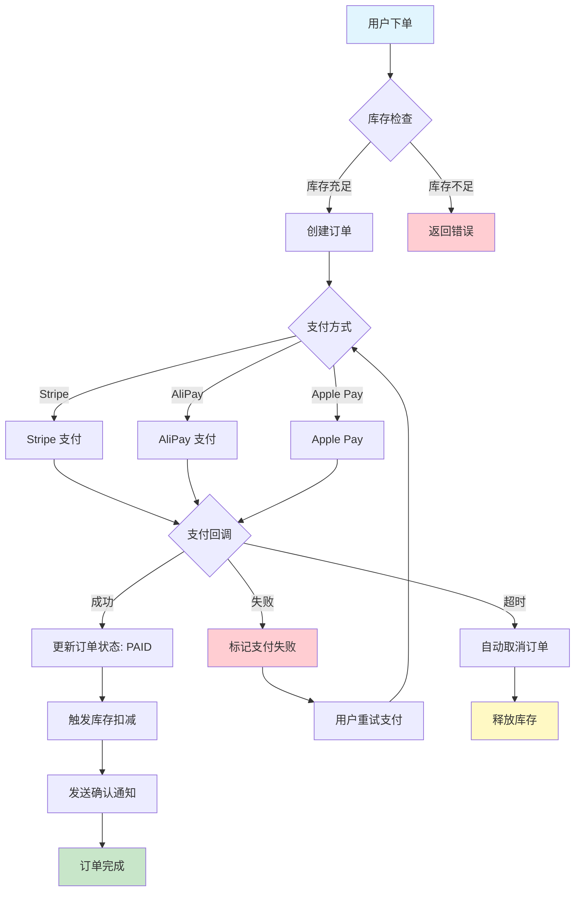

**踩坑 1：中文节点要用引号包裹**

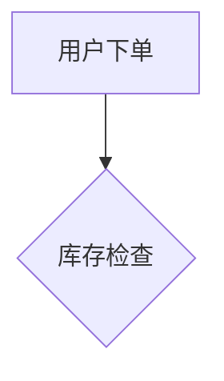

不加引号的话，遇到特殊字符（括号、冒号）会直接报 parse error。我有次在 Confluence 里画了半小时，结果发现是中文冒号 `：` 惹的祸。

**踩坑 2：`graph` vs `flowchart` 关键字**


`graph` 是旧语法，`flowchart` 是新语法，支持更多特性（如 `subgraph`、条件分支 `{|}`）。建议统一用 `flowchart`。

## 二、时序图（Sequence Diagram）：API 请求链路

画 API 请求的完整链路，时序图是最佳选择。以下是 B2C 下单接口的完整链路：

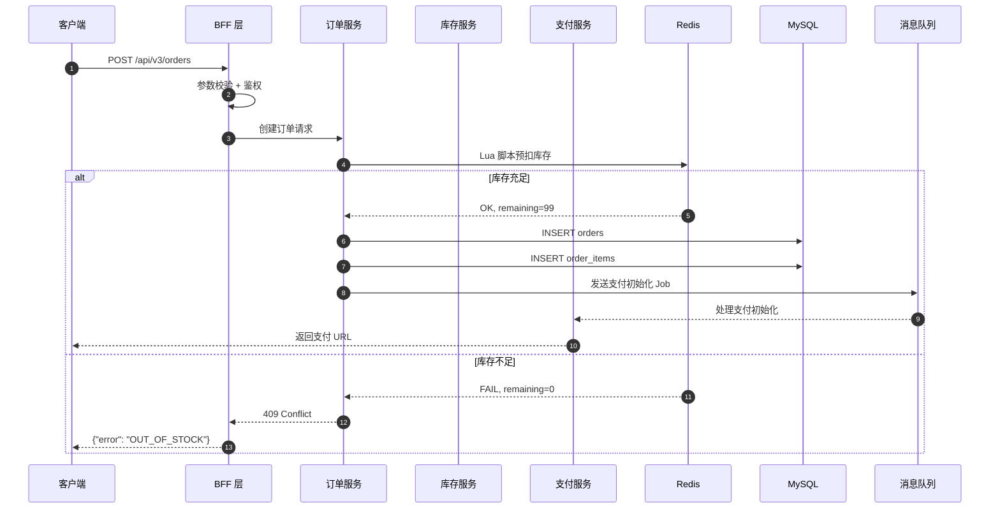

**踩坑 3：`autonumber` 让时序图自动编号**

加了 `autonumber` 之后，每个消息自动带序号，在讨论接口流程时特别方便："你看第 5 步，这里用 Lua 脚本预扣库存……"

**踩坑 4：`alt/else` 条件分支的缩进**

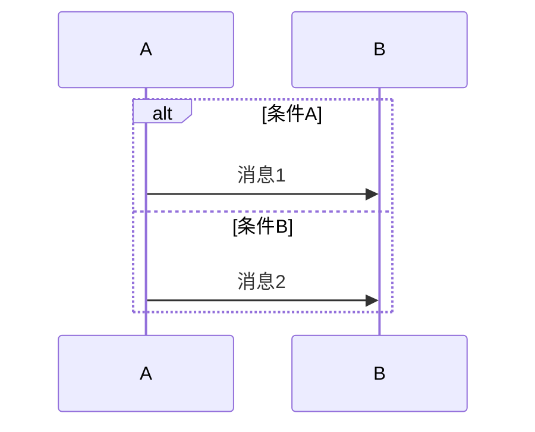

`else` 和 `end` 必须和 `alt` 同级缩进，否则渲染会乱。这个坑我在 Confluence 里踩了无数次。

## 三、ER 图（Entity Relationship）：数据库设计

写 SA/SD 文档时，ER 图是标配。Mermaid 的 ER 图语法简洁明了：

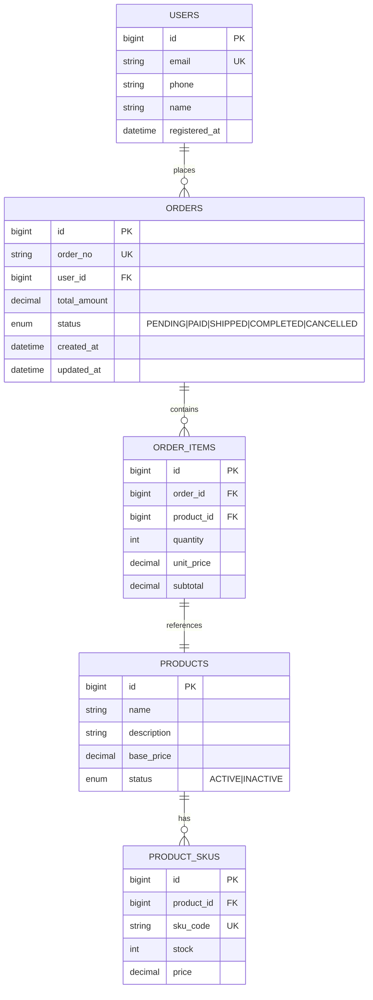

**踩坑 5：关系基数的表示**

Mermaid ER 图用这些符号表示基数：

| 符号 | 含义 |
|------|------|
| `\|\|` | 恰好一个（mandatory） |
| `o\|` | 零或一个（optional） |
| `\|\|` 到 `o{` | 一对多 |
| `o\|` 到 `o\|` | 零或一对一 |

我一开始把 `||--o{` 写成 `||--{`，结果渲染出来全是"一对一"，和实际数据库设计完全对不上。记住：`o` 表示"零"，不加 `o` 表示"至少一个"。

## 四、类图（Class Diagram）：Service Layer 架构

画 Laravel 项目的 Service Layer 架构时，类图非常直观：

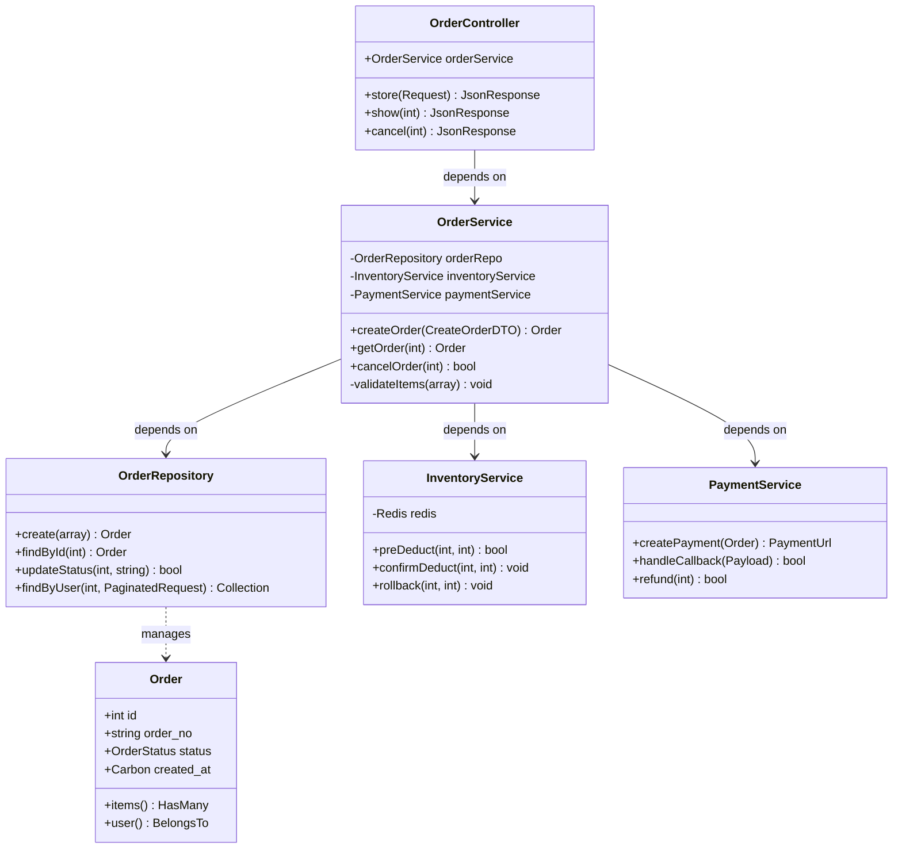

**踩坑 6：Laravel 的 HasMany/BelongsTo 关系**

Mermaid 类图的 `-->` 表示依赖，`..>` 表示关联。在画 Eloquent Model 之间的关系时，我习惯用 `..>` 表示 ORM 关系，`-->` 表示 Service 层的依赖注入。

## 五、状态图（State Diagram）：订单生命周期

比流程图更适合表达状态机：

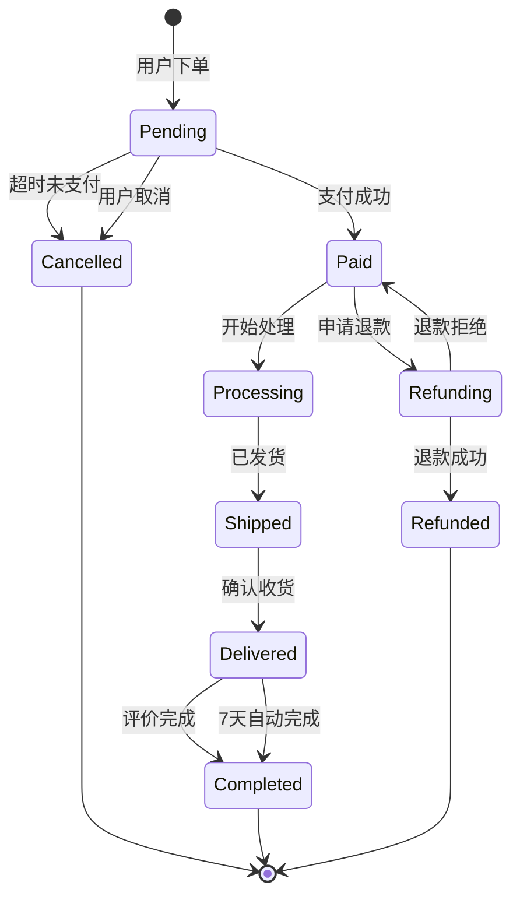

**踩坑 7：`stateDiagram-v2` 必须加 `-v2`**

不加 `-v2` 会用旧版渲染器，不支持很多语法特性（如 `[*]` 表示起止状态）。这和 `flowchart` vs `graph` 的坑类似。

## 六、甘特图（Gantt）：项目排期

写 SA/SD 文档时，经常需要附带项目排期：

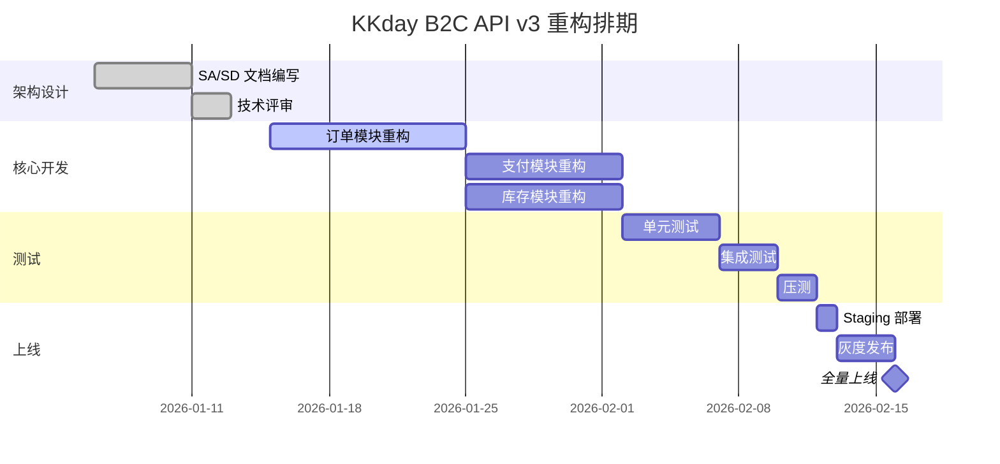

**踩坑 8：`active` 状态高亮当前任务**

在甘特图里，给当前正在进行的任务加 `:active,` 前缀，渲染出来会高亮显示，在周会汇报时一目了然。

## 七、Confluence 集成实战

在 Confluence 里使用 Mermaid，需要安装 **Mermaid Diagrams for Confluence** 插件（Marketplace 搜索即可）。安装后直接在页面里插入 Mermaid Block：

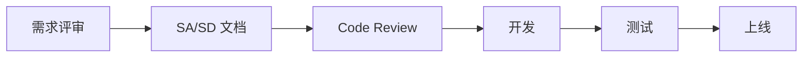

**踩坑 9：Confluence 渲染与 GitHub 渲染的差异**

同一个 Mermaid 代码，在 Confluence 和 GitHub 上渲染效果可能不同：
- Confluence 的 Mermaid 插件版本可能落后于最新版
- 某些语法（如 `flowchart` 的 `{|}` 条件分支）在旧版插件不支持
- 建议：先在 [Mermaid Live Editor](https://mermaid.live) 验证，再贴到 Confluence

## 八、Hexo 博客集成

如果你的博客也是 Hexo，可以用 `hexo-filter-mermaid-diagrams` 插件：

```bash
npm install hexo-filter-mermaid-diagrams --save
```

在文章里直接用 ```` ```mermaid ```` 代码块即可，Hexo 生成时会自动注入 Mermaid JS 并渲染。

**踩坑 10：Mermaid JS 版本冲突**

如果主题自带了 Mermaid JS，和插件的版本可能冲突，导致渲染白屏。解决方法：在 `_config.yml` 里禁用主题的 Mermaid，只用插件的。

## 九、实用技巧与最佳实践

### 9.1 用 `subgraph` 分组复杂架构

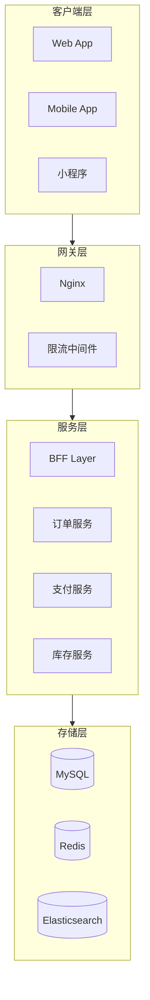

### 9.2 用 `click` 添加链接

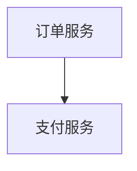

这在写技术文档时特别有用，点击图上的节点直接跳转到对应仓库。

### 9.3 用 `direction` 控制子图布局

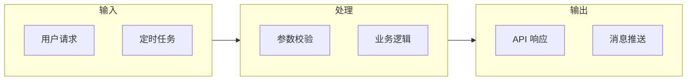

## 十、常见问题排查

| 问题 | 原因 | 解决方案 |
|------|------|----------|
| 渲染白屏 | 语法错误 | 先在 mermaid.live 验证 |
| 中文乱码 | 编码问题 | 确保文件是 UTF-8 |
| 布局混乱 | 节点太多 | 用 `subgraph` 分组 |
| 箭头方向不对 | 默认布局方向 | 用 `TD`/`LR` 显式指定 |
| Confluence 不渲染 | 插件版本旧 | 升级插件或用兼容语法 |
| GitHub 不渲染 | 缺少 mermaid 代码块标记 | 确保用 ````mermaid` |

## 总结

Mermaid 不是银弹——复杂的 UI 原型图、自由布局的架构图，还是得用 draw.io。但对于**流程图、时序图、ER 图、状态图**这些"有明确规则"的图，Mermaid 的效率是拖拽工具的 10 倍。

我的使用原则：
1. **API 接口文档** → 时序图（sequenceDiagram）
2. **数据库设计** → ER 图（erDiagram）
3. **业务流程** → 流程图（flowchart）
4. **状态机** → 状态图（stateDiagram-v2）
5. **项目排期** → 甘特图（gantt）
6. **Service 架构** → 类图（classDiagram）

一句话：**代码即文档，版本可控，Review 友好**。这就是 Mermaid 的核心价值。
