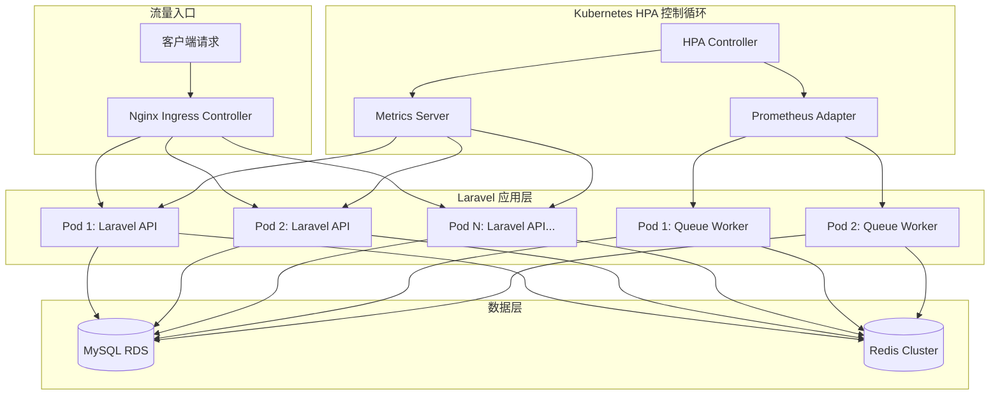
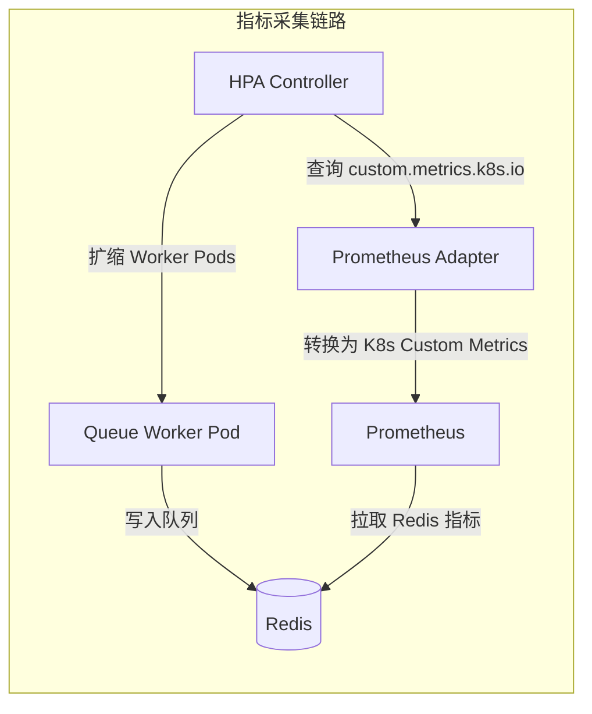

# Kubernetes HPA 实战：Laravel 应用自动扩缩容策略与踩坑记录

## 为什么需要 HPA？

在 KKday B2C Backend Team 的日常运维中，我经历过最痛的一次事故：2025 年黑五大促，流量在 10 分钟内从 200 QPS 飙到 3000 QPS，3 台 Pod 的 Laravel API 直接被打挂，等运维同事 SSH 上去手动扩容到 12 台时，已经过了 15 分钟，损失了大量订单。

从那以后，我们引入了 **Kubernetes HPA（Horizontal Pod Autoscaler）**——让 K8s 根据实时指标自动增减 Pod 数量，真正做到"流量来了就扩、流量走了就缩"。

## 架构总览



HPA 的核心是一个**控制循环**：每隔 15 秒（默认）检查一次指标，计算当前值与目标值的比值，然后决定扩容还是缩容。

## 一、Metrics Server 安装：最容易被忽略的第一步

HPA 依赖 Metrics Server 提供 CPU/Memory 指标。很多教程只说"安装 Metrics Server"，但实际部署中踩坑无数。

### 安装

```bash
# 安装 Metrics Server
kubectl apply -f https://github.com/kubernetes-sigs/metrics-server/releases/latest/download/components.yaml

# 验证安装
kubectl get deployment metrics-server -n kube-system
kubectl top nodes
```

### 踩坑 1：内网集群无法下载镜像

如果你的 K8s 集群在内网（比如我们用阿里云 ACK），直接 `kubectl apply` 会因为拉不到 `registry.k8s.io` 的镜像而失败。

```bash
# 解决方案：提前拉取镜像并推送到私有仓库
docker pull registry.k8s.io/metrics-server/metrics-server:v0.7.1
docker tag registry.k8s.io/metrics-server/metrics-server:v0.7.1 \
  registry.cn-hangzhou.aliyuncs.com/your-namespace/metrics-server:v0.7.1
docker push registry.cn-hangzhou.aliyuncs.com/your-namespace/metrics-server:v0.7.1

# 然后修改 components.yaml 中的 image 字段
```

### 踩坑 2：kubelet 使用自签名证书

在自建集群中，kubelet 默认使用自签名证书，Metrics Server 无法采集指标。需要添加 `--kubelet-insecure-tls` 参数：

```yaml
# components.yaml 中修改 args
containers:
  - name: metrics-server
    args:
      - --cert-dir=/tmp
      - --secure-port=10250
      - --kubelet-preferred-address-types=InternalIP,ExternalIP,Hostname
      - --kubelet-use-node-status-port
      - --metric-resolution=15s
      - --kubelet-insecure-tls  # ← 关键：自签名证书必须加
```

验证安装成功：

```bash
$ kubectl top nodes
NAME                    CPU(cores)   CPU%   MEMORY(bytes)   MEMORY%
node-1                  250m         12%    1024Mi          25%
node-2                  180m         9%     876Mi           21%

$ kubectl top pods -n production
NAME                        CPU(cores)   MEMORY(bytes)
laravel-api-7d4b8c6f-x2k9  45m          128Mi
laravel-api-7d4b8c6f-z8p1  38m          112Mi
```

## 二、基础 HPA 配置：基于 CPU 的自动扩缩

### Deployment 配置

首先，Laravel API 的 Deployment 必须设置 `resources.requests`——HPA 用它来计算 CPU 使用率百分比：

```yaml
# laravel-api-deployment.yaml
apiVersion: apps/v1
kind: Deployment
metadata:
  name: laravel-api
  namespace: production
spec:
  replicas: 3
  selector:
    matchLabels:
      app: laravel-api
  template:
    metadata:
      labels:
        app: laravel-api
    spec:
      containers:
        - name: laravel-api
          image: registry.cn-hangzhou.aliyuncs.com/kkday/laravel-api:v1.2.3
          ports:
            - containerPort: 9000
          resources:
            requests:
              cpu: 250m      # ← HPA 用这个计算百分比
              memory: 256Mi
            limits:
              cpu: 1000m
              memory: 512Mi
          livenessProbe:
            httpGet:
              path: /health
              port: 9000
            initialDelaySeconds: 30
            periodSeconds: 10
          readinessProbe:
            httpGet:
              path: /ready
              port: 9000
            initialDelaySeconds: 10
            periodSeconds: 5
```

### HPA 配置

```yaml
# hpa-laravel-api.yaml
apiVersion: autoscaling/v2
kind: HorizontalPodAutoscaler
metadata:
  name: laravel-api-hpa
  namespace: production
spec:
  scaleTargetRef:
    apiVersion: apps/v1
    kind: Deployment
    name: laravel-api
  minReplicas: 3        # 最小副本数：不能低于 3（保证高可用）
  maxReplicas: 20       # 最大副本数：根据预算和集群容量设定
  metrics:
    - type: Resource
      resource:
        name: cpu
        target:
          type: Utilization
          averageUtilization: 70  # CPU 使用率超过 70% 就扩容
  behavior:
    scaleUp:
      stabilizationWindowSeconds: 30   # 扩容稳定窗口：30 秒内不重复评估
      policies:
        - type: Pods
          value: 4                     # 每次最多扩 4 个 Pod
          periodSeconds: 60
        - type: Percent
          value: 100                   # 或者翻倍（取较大值）
          periodSeconds: 60
      selectPolicy: Max
    scaleDown:
      stabilizationWindowSeconds: 300  # 缩容稳定窗口：5 分钟（避免抖动）
      policies:
        - type: Pods
          value: 2                     # 每次最多缩 2 个 Pod
          periodSeconds: 120
```

### 踩坑 3：扩容快、缩容慢是正确策略

`behavior` 字段是 v2 API 的精华。很多新手把 `scaleDown` 的策略设得和 `scaleUp` 一样激进，结果在流量波动时出现"扩了又缩、缩了又扩"的抖动，用户体验极差。

**黄金法则**：扩容要快（30秒稳定窗口），缩容要慢（5分钟稳定窗口）。

### 踩坑 4：没有设置 requests 导致 HPA 无效

如果你的 Deployment 没有设置 `resources.requests.cpu`，HPA 会显示 `<unknown>` 状态：

```bash
$ kubectl get hpa -n production
NAME               REFERENCE                 TARGETS        MINPODS   MAXPODS   REPLICAS   AGE
laravel-api-hpa    Deployment/laravel-api    <unknown>/70%  3         20        3          5m
```

解决方法：确保 Deployment 的 `resources.requests.cpu` 已设置。

## 三、自定义指标扩缩：基于 Laravel Queue 队列深度

对于 Laravel 的 Queue Worker，CPU 使用率不是好的扩缩指标。真正有意义的是**队列中待处理的任务数**——如果队列积压了 5000 个任务，说明需要更多 Worker。

### 架构图



### 第一步：用 Prometheus 采集 Redis 队列深度

安装 `redis_exporter`，让它采集 Redis 的 `LLEN` 值：

```yaml
# redis-exporter-deployment.yaml
apiVersion: apps/v1
kind: Deployment
metadata:
  name: redis-exporter
  namespace: production
spec:
  replicas: 1
  selector:
    matchLabels:
      app: redis-exporter
  template:
    metadata:
      labels:
        app: redis-exporter
    spec:
      containers:
        - name: redis-exporter
          image: oliver006/redis_exporter:v1.58.0
          ports:
            - containerPort: 9121
          env:
            - name: REDIS_ADDR
              value: "redis://redis-cluster:6379"
            - name: REDIS_PASSWORD
              valueFrom:
                secretKeyRef:
                  name: redis-secret
                  key: password
```

然后在 Prometheus 的 `scrape_configs` 中添加：

```yaml
# prometheus-values.yaml（Helm Chart values）
scrape_configs:
  - job_name: 'redis-exporter'
    static_configs:
      - targets: ['redis-exporter:9121']
    metrics_path: /metrics
```

### 第二步：安装 Prometheus Adapter

```bash
helm repo add prometheus-community https://prometheus-community.github.io/helm-charts
helm install prometheus-adapter prometheus-community/prometheus-adapter \
  --namespace monitoring \
  --set prometheus.url=http://prometheus-server \
  --set prometheus.port=9090
```

配置自定义指标规则：

```yaml
# prometheus-adapter-values.yaml
rules:
  custom:
    - seriesQuery: 'redis_key_length{key=~"queues:default"}'
      resources:
        overrides:
          namespace: {resource: "namespace"}
      name:
        matches: "redis_key_length"
        as: "laravel_queue_depth"
      metricsQuery: 'redis_key_length{key="queues:default"}'
```

### 第三步：配置基于队列深度的 HPA

```yaml
# hpa-queue-worker.yaml
apiVersion: autoscaling/v2
kind: HorizontalPodAutoscaler
metadata:
  name: queue-worker-hpa
  namespace: production
spec:
  scaleTargetRef:
    apiVersion: apps/v1
    kind: Deployment
    name: laravel-queue-worker
  minReplicas: 2
  maxReplicas: 15
  metrics:
    - type: Pods
      pods:
        metric:
          name: laravel_queue_depth
        target:
          type: AverageValue
          averageValue: "500"  # 每个 Worker 平均处理 500 个待处理任务
  behavior:
    scaleUp:
      stabilizationWindowSeconds: 60
      policies:
        - type: Pods
          value: 3
          periodSeconds: 60
    scaleDown:
      stabilizationWindowSeconds: 600  # 队列消费完后等 10 分钟再缩容
      policies:
        - type: Pods
          value: 1
          periodSeconds: 120
```

### 踩坑 5：Queue Worker 缩容时正在执行的任务被中断

这是最痛的坑。当 HPA 缩容时，Kubernetes 会直接发送 `SIGTERM` 给被删除的 Pod。如果你的 Laravel Queue Worker 正在执行一个耗时 5 分钟的支付回调处理，任务会被中断。

解决方案：配置 `terminationGracePeriodSeconds` 和 Laravel 的信号处理：

```yaml
# Deployment 中的 Pod spec
spec:
  terminationGracePeriodSeconds: 300  # 给 5 分钟优雅终止时间
  containers:
    - name: queue-worker
      command: ["php", "artisan", "queue:work", "redis", "--tries=3", "--timeout=280"]
      lifecycle:
        preStop:
          exec:
            command: ["php", "artisan", "queue:restart"]
```

同时在 `app/Console/Kernel.php` 中注册信号处理：

```php
// app/Console/Kernel.php
protected function schedule(Schedule $schedule)
{
    // ...
}

protected function signals()
{
    $this->trap(SIGTERM, function () {
        Log::info('Queue Worker received SIGTERM, waiting for current job to finish...');
        // queue:work 已内置 SIGTERM 处理，会等当前任务完成后再退出
    });
}
```

### 踩坑 6：多队列时指标不准确

如果你有多个队列（`default`、`payments`、`notifications`），需要分别监控：

```yaml
# 分别为不同队列配置 HPA
# payments 队列：权重最高，优先扩容
metrics:
  - type: Pods
    pods:
      metric:
        name: laravel_queue_depth
        selector:
          matchLabels:
            queue: payments
      target:
        type: AverageValue
        averageValue: "200"  # 支付队列阈值更低，更敏感
```

## 四、多指标组合扩缩：CPU + 内存 + 队列深度

生产环境中，单一指标往往不够。我们最终采用的是**多指标组合**策略：

```yaml
# 最终生产版 HPA 配置
apiVersion: autoscaling/v2
kind: HorizontalPodAutoscaler
metadata:
  name: laravel-api-hpa
  namespace: production
spec:
  scaleTargetRef:
    apiVersion: apps/v1
    kind: Deployment
    name: laravel-api
  minReplicas: 3
  maxReplicas: 20
  metrics:
    # 指标 1：CPU 使用率
    - type: Resource
      resource:
        name: cpu
        target:
          type: Utilization
          averageUtilization: 70
    # 指标 2：内存使用率
    - type: Resource
      resource:
        name: memory
        target:
          type: Utilization
          averageUtilization: 80
    # 指标 3：自定义指标（每秒请求数）
    - type: Pods
      pods:
        metric:
          name: http_requests_per_second
        target:
          type: AverageValue
          averageValue: "100"
  behavior:
    scaleUp:
      stabilizationWindowSeconds: 30
      policies:
        - type: Percent
          value: 100
          periodSeconds: 60
      selectPolicy: Max
    scaleDown:
      stabilizationWindowSeconds: 300
      policies:
        - type: Pods
          value: 2
          periodSeconds: 120
```

**关键逻辑**：当存在多个指标时，HPA 会分别计算每个指标需要的副本数，然后取**最大值**。这意味着只要任一指标触发阈值，就会扩容。

## 五、踩坑记录汇总

### 坑 7：Pod 启动太慢，扩容来不及

Laravel 应用冷启动需要加载 Composer autoload、配置缓存、路由缓存等，首次请求可能需要 3-5 秒。在流量洪峰时，HPA 虽然触发了扩容，但新 Pod 的 `readinessProbe` 还没通过，流量全打到老 Pod 上，老 Pod 被打挂。

**解决方案**：

```yaml
# 1. 启用配置缓存（Dockerfile 中）
RUN php artisan config:cache && \
    php artisan route:cache && \
    php artisan view:cache && \
    php artisan event:cache

# 2. 设置合理的探针参数
readinessProbe:
  httpGet:
    path: /ready
    port: 9000
  initialDelaySeconds: 5      # 缩短初始延迟
  periodSeconds: 3             # 缩短检查间隔
  failureThreshold: 2          # 减少失败次数

# 3. 使用 preStop hook 做预热
lifecycle:
  postStart:
    exec:
      command: ["php", "artisan", "opcache:compile"]
```

### 坑 8：集群节点不够，HPA 扩了 Pod 但 Pending

HPA 扩容 Pod 是第一步，但如果集群节点资源不足，Pod 会处于 `Pending` 状态。

```bash
$ kubectl get pods -n production | grep Pending
laravel-api-7d4b8c6f-abc12   0/1     Pending   0          2m

$ kubectl describe pod laravel-api-7d4b8c6f-abc12 -n production
Events:
  Warning  FailedScheduling  0/3 nodes are available:
    1 Insufficient cpu, 2 Insufficient memory.
```

**解决方案**：配合 Cluster Autoscaler（节点自动扩缩容）：

```yaml
# 阿里云 ACK 的节点池配置
apiVersion: cs.aliyun.com/v1
kind: ClusterAutoscaler
metadata:
  name: cluster-autoscaler
spec:
  nodeGroups:
    - name: api-node-pool
      minSize: 3
      maxSize: 10
      instanceTypes: ["ecs.g6.xlarge"]
      labels:
        workload-type: api
```

### 坑 9：HPA 频繁抖动（flapping）

在某次生产环境中，HPA 出现了疯狂抖动：14:00 扩到 8 个 → 14:05 缩到 5 个 → 14:10 又扩到 7 个 → 14:15 缩到 4 个。

原因是 `stabilizationWindowSeconds` 设得太短（60秒），而且缩容策略太激进。

**修复**：

```yaml
behavior:
  scaleDown:
    stabilizationWindowSeconds: 600  # 从 60s 改为 600s
    policies:
      - type: Pods
        value: 1                     # 从 3 改为 1
        periodSeconds: 180           # 从 60s 改为 180s
```

### 坑 10：Laravel Session 丢失

当 HPA 缩容时，某些用户会话会丢失。原因是 Laravel 默认使用 `file` session driver，session 文件存在 Pod 本地。

**解决方案**：切换到 Redis session driver：

```php
// config/session.php
'driver' => env('SESSION_DRIVER', 'redis'),
'connection' => 'session',
'lifetime' => 120,
```

```php
// config/database.php
'redis' => [
    'session' => [
        'url' => env('REDIS_URL'),
        'host' => env('REDIS_HOST', '127.0.0.1'),
        'password' => env('REDIS_PASSWORD'),
        'port' => env('REDIS_PORT', '6379'),
        'database' => 1,
    ],
],
```

## 六、监控与告警

### 查看 HPA 状态

```bash
# 查看 HPA 详细状态
kubectl get hpa -n production -o wide

# 输出示例
NAME               REFERENCE                 TARGETS                       MINPODS   MAXPODS   REPLICAS   AGE
laravel-api-hpa    Deployment/laravel-api    65%/70%, 45%/80%, 80/100     3         20        5          7d

# 查看 HPA 事件（判断是否触发扩缩）
kubectl describe hpa laravel-api-hpa -n production

# 查看历史扩缩记录
kubectl get events -n production --field-selector reason=SuccessfulRescale | sort
```

### Grafana 告警配置

```yaml
# prometheus-rules.yaml
apiVersion: monitoring.coreos.com/v1
kind: PrometheusRule
metadata:
  name: hpa-alerts
  namespace: monitoring
spec:
  groups:
    - name: hpa-alerts
      rules:
        # 告警：HPA 已达到最大副本数
        - alert: HPAAtMaxReplicas
          expr: kube_horizontalpodautoscaler_status_current_replicas == kube_horizontalpodautoscaler_spec_max_replicas
          for: 5m
          labels:
            severity: warning
          annotations:
            summary: "HPA {{ $labels.horizontalpodautoscaler }} 已达最大副本数 {{ $value }}"
            description: "已持续 5 分钟，需要检查是否需要提升 maxReplicas 或优化应用性能"

        # 告警：HPA 扩缩频率过高
        - alert: HPAFlapping
          expr: increase(kube_horizontalpodautoscaler_status_current_replicas[1h]) > 10
          for: 0m
          labels:
            severity: warning
          annotations:
            summary: "HPA {{ $labels.horizontalpodautoscaler }} 1小时内扩缩超过 10 次"
```

## 七、完整部署清单

```bash
# 1. 安装 Metrics Server
kubectl apply -f metrics-server.yaml

# 2. 安装 Prometheus + Grafana（如果没装）
helm install prometheus prometheus-community/kube-prometheus-stack -n monitoring

# 3. 安装 Prometheus Adapter（用于自定义指标）
helm install prometheus-adapter prometheus-community/prometheus-adapter -n monitoring

# 4. 部署 Laravel API
kubectl apply -f laravel-api-deployment.yaml

# 5. 部署 HPA
kubectl apply -f hpa-laravel-api.yaml
kubectl apply -f hpa-queue-worker.yaml

# 6. 验证
kubectl get hpa -n production
kubectl top pods -n production

# 7. 模拟压力测试
kubectl run -it --rm loadtest --image=busybox -- /bin/sh
# 在容器内执行：
# while true; do wget -q -O- http://laravel-api.production.svc/api/health; done
```

## 总结

| 配置项 | API Server | Queue Worker |
|--------|-----------|--------------|
| 最小副本数 | 3 | 2 |
| 最大副本数 | 20 | 15 |
| 核心指标 | CPU 70% + Memory 80% | 队列深度 500 |
| 扩容窗口 | 30s | 60s |
| 缩容窗口 | 300s | 600s |
| 每次扩容 | 翻倍 | +3 Pod |
| 每次缩容 | -2 Pod | -1 Pod |

**最后的建议**：

1. **不要盲目追求自动扩缩**——先优化代码和 SQL，很多时候 3 台 Pod 就够了
2. **扩容快、缩容慢**——这是 HPA 的黄金法则
3. **Queue Worker 一定要处理 SIGTERM**——否则缩容时任务会丢失
4. **Session 必须外置**——file session 在 HPA 场景下是定时炸弹
5. **配合 Cluster Autoscaler**——Pod 扩了但节点不够也是白搭
6. **监控 HPA 行为**——用 Grafana 看扩缩曲线，及时发现抖动

HPA 不是银弹，但它是 Laravel 应用在 Kubernetes 上应对流量洪峰最实用的武器。从手动扩容到自动扩缩，我们节省了 15 分钟的响应时间，也避免了"人不在就挂"的尴尬局面。
