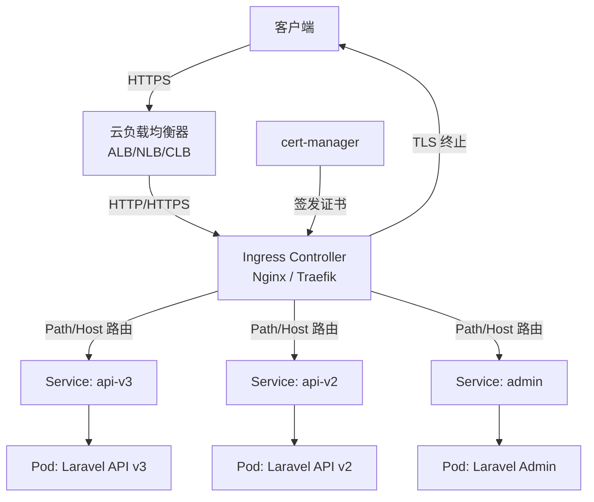
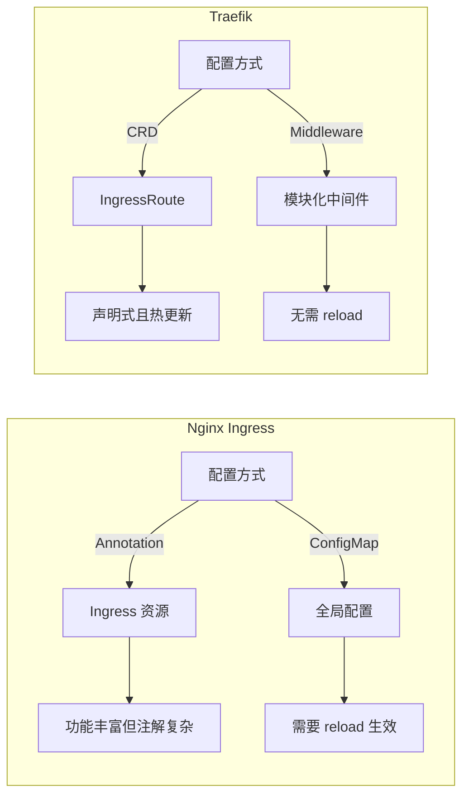

## 前言

在 Kubernetes 集群中，Ingress 是外部流量进入集群的「大门」。对于 Laravel B2C API 来说，Ingress 不仅要处理路由转发，还要搞定 TLS 终止、速率限制、安全头注入等关键功能。本文基于 KKday B2C Backend Team 的真实生产经验，对比 Nginx Ingress Controller 和 Traefik 两种方案，从配置到踩坑，一次性讲透。

<!-- more -->

## 架构总览



Ingress 的核心职责：
- **路由分发**：基于 Host 和 Path 将流量导向不同的 Service
- **TLS 终止**：在集群边缘处理 HTTPS，后端走 HTTP 明文
- **流量治理**：Rate Limiting、重试、超时、Circuit Breaker
- **安全加固**：CORS、CSP、安全头注入

## 方案一：Nginx Ingress Controller

### 安装与基础配置

```bash
# 使用 Helm 安装 Nginx Ingress Controller
helm repo add ingress-nginx https://kubernetes.github.io/ingress-nginx
helm repo update

helm install ingress-nginx ingress-nginx/ingress-nginx \
  --namespace ingress-nginx \
  --create-namespace \
  --set controller.replicaCount=2 \
  --set controller.service.type=LoadBalancer \
  --set controller.metrics.enabled=true \
  --set controller.podAnnotations."prometheus\.io/scrape"="true" \
  --set controller.podAnnotations."prometheus\.io/port"="10254"
```

### Ingress 资源定义

```yaml
# laravel-api-ingress.yaml
apiVersion: networking.k8s.io/v1
kind: Ingress
metadata:
  name: laravel-api-ingress
  namespace: production
  annotations:
    # Nginx 特有注解
    nginx.ingress.kubernetes.io/ssl-redirect: "true"
    nginx.ingress.kubernetes.io/force-ssl-redirect: "true"
    nginx.ingress.kubernetes.io/use-regex: "true"
    
    # 速率限制（每秒 100 请求，突发 200）
    nginx.ingress.kubernetes.io/limit-rps: "100"
    nginx.ingress.kubernetes.io/limit-burst-multiplier: "2"
    
    # 超时配置
    nginx.ingress.kubernetes.io/proxy-connect-timeout: "10"
    nginx.ingress.kubernetes.io/proxy-read-timeout: "60"
    nginx.ingress.kubernetes.io/proxy-send-timeout: "60"
    
    # 请求体大小限制（文件上传）
    nginx.ingress.kubernetes.io/proxy-body-size: "50m"
    
    # 安全头
    nginx.ingress.kubernetes.io/configuration-snippet: |
      more_set_headers "X-Frame-Options: DENY";
      more_set_headers "X-Content-Type-Options: nosniff";
      more_set_headers "X-XSS-Protection: 1; mode=block";
      more_set_headers "Referrer-Policy: strict-origin-when-cross-origin";
    
    # cert-manager 自动签发
    cert-manager.io/cluster-issuer: "letsencrypt-prod"
spec:
  ingressClassName: nginx
  tls:
    - hosts:
        - api.example.com
        - admin.example.com
      secretName: api-tls-secret
  rules:
    - host: api.example.com
      http:
        paths:
          # v3 API 路由
          - path: /api/v3(/|$)(.*)
            pathType: ImplementationSpecific
            backend:
              service:
                name: laravel-api-v3
                port:
                  number: 80
          # v2 API 路由（兼容）
          - path: /api/v2(/|$)(.*)
            pathType: ImplementationSpecific
            backend:
              service:
                name: laravel-api-v2
                port:
                  number: 80
    - host: admin.example.com
      http:
        paths:
          - path: /
            pathType: Prefix
            backend:
              service:
                name: laravel-admin
                port:
                  number: 80
```

### Nginx 全局配置优化

```yaml
# nginx-global-config.yaml
apiVersion: v1
kind: ConfigMap
metadata:
  name: ingress-nginx-controller
  namespace: ingress-nginx
data:
  # 连接优化
  keep-alive: "75"
  keep-alive-requests: "1000"
  upstream-keepalive-connections: "256"
  upstream-keepalive-timeout: "60"
  upstream-keepalive-requests: "10000"
  
  # 日志格式（JSON，便于 EFK 采集）
  log-format-upstream: |
    {"time":"$time_iso8601","remote_addr":"$remote_addr",
    "request_method":"$request_method","request_uri":"$request_uri",
    "status":$status,"body_bytes_sent":$body_bytes_sent,
    "request_time":$request_time,"upstream_response_time":"$upstream_response_time",
    "upstream_addr":"$upstream_addr","http_user_agent":"$http_user_agent",
    "http_x_forwarded_for":"$http_x_forwarded_for",
    "request_id":"$req_id","namespace":"$namespace","ingress_name":"$ingress_name",
    "service_name":"$service_name"}
  
  # Gzip 压缩
  use-gzip: "true"
  gzip-level: "5"
  gzip-min-length: "256"
  gzip-types: "application/json application/javascript text/css text/plain text/xml application/xml"
  
  # Worker 进程优化
  worker-processes: "auto"
  max-worker-connections: "65536"
```

## 方案二：Traefik Ingress Controller

### 安装与配置

```bash
# 使用 Helm 安装 Traefik
helm repo add traefik https://traefik.github.io/charts
helm repo update

helm install traefik traefik/traefik \
  --namespace traefik \
  --create-namespace \
  --set deployment.replicas=2 \
  --set service.type=LoadBalancer \
  --set metrics.prometheus.enabled=true \
  --set metrics.prometheus.addEntryPointsLabels=true \
  --set logs.access.enabled=true \
  --set logs.access.format=json
```

### Traefik IngressRoute（CRD 方式）

```yaml
# traefik-ingressroute.yaml
apiVersion: traefik.io/v1alpha1
kind: IngressRoute
metadata:
  name: laravel-api-ingressroute
  namespace: production
spec:
  entryPoints:
    - websecure
  routes:
    # API v3 路由
    - match: Host(`api.example.com`) && PathPrefix(`/api/v3`)
      kind: Rule
      services:
        - name: laravel-api-v3
          port: 80
          weight: 100
      middlewares:
        - name: rate-limit
        - name: security-headers
        - name: cors-preflight
    
    # API v2 路由
    - match: Host(`api.example.com`) && PathPrefix(`/api/v2`)
      kind: Rule
      services:
        - name: laravel-api-v2
          port: 80
          weight: 100
      middlewares:
        - name: rate-limit
        - name: security-headers
    
    # Admin 后台
    - match: Host(`admin.example.com`)
      kind: Rule
      services:
        - name: laravel-admin
          port: 80
          weight: 100
      middlewares:
        - name: admin-ip-whitelist
        - name: security-headers
  tls:
    secretName: api-tls-secret
    certResolver: letsencrypt
```

### Traefik Middleware 配置

```yaml
# rate-limit-middleware.yaml
apiVersion: traefik.io/v1alpha1
kind: Middleware
metadata:
  name: rate-limit
  namespace: production
spec:
  rateLimit:
    average: 100      # 每秒平均请求数
    burst: 200         # 突发请求数
    period: 1s
    sourceCriterion:
      ipStrategy:
        depth: 1       # 信任的代理层数
        excludedIPs:
          - "10.0.0.0/8"  # 内部 IP 不限流
```

```yaml
# security-headers-middleware.yaml
apiVersion: traefik.io/v1alpha1
kind: Middleware
metadata:
  name: security-headers
  namespace: production
spec:
  headers:
    stsSeconds: 31536000
    stsIncludeSubdomains: true
    stsPreload: true
    forceSTSHeader: true
    frameDeny: true
    contentTypeNosniff: true
    browserXssFilter: true
    referrerPolicy: "strict-origin-when-cross-origin"
    customResponseHeaders:
      X-Powered-By: ""  # 移除 Laravel 默认头
```

```yaml
# cors-preflight-middleware.yaml
apiVersion: traefik.io/v1alpha1
kind: Middleware
metadata:
  name: cors-preflight
  namespace: production
spec:
  headers:
    accessControlAllowMethods:
      - GET
      - POST
      - PUT
      - PATCH
      - DELETE
      - OPTIONS
    accessControlAllowHeaders:
      - Content-Type
      - Authorization
      - X-Requested-With
      - X-Request-ID
    accessControlAllowOriginList:
      - "https://www.example.com"
      - "https://admin.example.com"
    accessControlMaxAge: 86400
    addVaryHeader: true
```

```yaml
# admin-ip-whitelist-middleware.yaml
apiVersion: traefik.io/v1alpha1
kind: Middleware
metadata:
  name: admin-ip-whitelist
  namespace: production
spec:
  ipWhiteList:
    sourceRange:
      - "203.0.113.0/24"  # 办公网络
      - "198.51.100.0/24"  # VPN 网络
    ipStrategy:
      depth: 1
```

## Nginx vs Traefik 对比



| 维度 | Nginx Ingress | Traefik |
|------|---------------|---------|
| 配置方式 | Annotation + ConfigMap | CRD (IngressRoute) + Middleware |
| 热更新 | 需要 reload（有短暂中断） | 无需 reload，零中断 |
| Dashboard | 无内置（需额外部署） | 内置 Dashboard |
| 学习曲线 | 低（Annotation 直观） | 中（CRD 概念） |
| 性能 | 高（Nginx 底层） | 高（Go 实现） |
| 社区生态 | 极其丰富 | 快速增长 |
| 适用场景 | 传统 Web、API 网关 | 微服务、动态路由 |

**我们的选择**：KKday B2C 项目最终选了 Nginx Ingress，原因：
1. 团队对 Nginx 配置更熟悉
2. Annotation 生态成熟，Stack Overflow 答案多
3. 与现有 Nginx 配置迁移成本低
4. Traefik 的 CRD 学习成本对小团队偏高

## TLS 证书管理：cert-manager

### 安装 cert-manager

```bash
# 安装 cert-manager
helm repo add jetstack https://charts.jetstack.io
helm repo update

helm install cert-manager jetstack/cert-manager \
  --namespace cert-manager \
  --create-namespace \
  --set installCRDs=true \
  --set prometheus.enabled=true
```

### ClusterIssuer 配置

```yaml
# cluster-issuer.yaml
apiVersion: cert-manager.io/v1
kind: ClusterIssuer
metadata:
  name: letsencrypt-prod
spec:
  acme:
    server: https://acme-v02.api.letsencrypt.org/directory
    email: ops@example.com
    privateKeySecretRef:
      name: letsencrypt-prod-key
    solvers:
      # HTTP-01 验证（最简单）
      - http01:
          ingress:
            class: nginx
      # DNS-01 验证（支持通配符证书）
      # - dns01:
      #     cloudflare:
      #       apiTokenSecretRef:
      #         name: cloudflare-api-token
      #         key: api-token
```

```yaml
# wildcard-certificate.yaml
apiVersion: cert-manager.io/v1
kind: Certificate
metadata:
  name: wildcard-example-com
  namespace: production
spec:
  secretName: wildcard-tls-secret
  issuerRef:
    name: letsencrypt-prod
    kind: ClusterIssuer
  dnsNames:
    - "*.example.com"
    - "example.com"
```

### 证书自动续期监控

```yaml
# cert-monitor-cronjob.yaml
apiVersion: batch/v1
kind: CronJob
metadata:
  name: cert-expiry-check
  namespace: monitoring
spec:
  schedule: "0 9 * * 1"  # 每周一早上 9 点
  jobTemplate:
    spec:
      template:
        spec:
          containers:
            - name: cert-check
              image: bitnami/kubectl:latest
              command:
                - /bin/sh
                - -c
                - |
                  EXPIRY=$(kubectl get certificates -A -o json | \
                    jq -r '.items[] | 
                    select(.status.notAfter != null) | 
                    "\(.metadata.namespace)/\(.metadata.name): \(.status.notAfter)"')
                  
                  for line in $EXPIRY; do
                    DATE=$(echo $line | cut -d: -f2 | xargs)
                    DAYS_LEFT=$(( ($(date -d "$DATE" +%s) - $(date +%s)) / 86400 ))
                    if [ $DAYS_LEFT -lt 14 ]; then
                      echo "⚠️ 证书即将过期: $line (剩余 ${DAYS_LEFT} 天)"
                      # 发送 Slack 通知
                      curl -X POST "$SLACK_WEBHOOK" \
                        -H 'Content-Type: application/json' \
                        -d "{\"text\":\"⚠️ TLS 证书即将过期: $line (剩余 ${DAYS_LEFT} 天)\"}"
                    fi
                  done
              env:
                - name: SLACK_WEBHOOK
                  valueFrom:
                    secretKeyRef:
                      name: slack-webhook
                      key: url
          restartPolicy: OnFailure
```

## 生产环境踩坑记录

### 踩坑 1：Nginx Ingress 的 502 Bad Gateway

**现象**：高峰期频繁出现 502，但 Pod 健康检查正常。

**根因**：Nginx 默认的 `upstream-keepalive-connections` 是 320，但 Laravel Pod 重启时连接断开，Nginx 来不及更新 upstream 列表。

```yaml
# 解决方案：增加 keepalive 和连接检测
apiVersion: v1
kind: ConfigMap
metadata:
  name: ingress-nginx-controller
data:
  upstream-keepalive-connections: "512"
  upstream-keepalive-timeout: "60"
  # 关键：启用连接检测
  upstream-keepalive-requests: "10000"
  # 启用被动健康检查
  proxy-next-upstream: "error timeout http_502 http_503"
  proxy-next-upstream-tries: "3"
  proxy-next-upstream-timeout: "10"
```

**踩坑教训**：Nginx Ingress 的 upstream 管理是异步的，Pod 终止时要设置足够的 `terminationGracePeriodSeconds`（建议 60s），让 Nginx 有时间摘除节点。

### 踩坑 2：Traefik 的 PathPrefix 匹配陷阱

**现象**：`PathPrefix(/api/v3)` 匹配了 `/api/v3xxx`，导致路由混乱。

```yaml
# ❌ 错误写法
- match: Host(`api.example.com`) && PathPrefix(`/api/v3`)
  # 这会匹配 /api/v3、/api/v3xxx、/api/v3/anything

# ✅ 正确写法
- match: Host(`api.example.com`) && PathPrefix(`/api/v3/`)
  # 只匹配 /api/v3/ 及其子路径
  # 还需要单独处理 /api/v3 精确匹配
- match: Host(`api.example.com`) && Path(`/api/v3`)
  kind: Rule
  services:
    - name: laravel-api-v3
      port: 80
```

**踩坑教训**：Traefik 的 `PathPrefix` 是前缀匹配，不像 Nginx 的正则那么精确。建议用 `PathPrefix(/api/v3/)` + `Path(/api/v3)` 双规则覆盖。

### 踩坑 3：cert-manager 证书签发失败

**现象**：证书一直 Pending，cert-manager 日志报 `Waiting for HTTP-01 challenge`。

**根因**：Ingress Controller 的 Service 类型是 `ClusterIP`，ACME 验证请求无法到达。

```bash
# 检查证书状态
kubectl describe certificate wildcard-example-com -n production
kubectl describe challenges -n production

# 常见原因：
# 1. DNS 未指向 Ingress Controller 的外部 IP
# 2. Ingress Controller 的 Service 不是 LoadBalancer/NodePort
# 3. 防火墙阻止了 80 端口
# 4. ACME solver 的 Ingress class 不匹配
```

**解决方案**：

```yaml
# 确保 solver 的 ingress class 匹配
spec:
  acme:
    solvers:
      - http01:
          ingress:
            class: nginx  # 必须与 IngressClass 名称一致
            podTemplate:
              spec:
                nodeSelector:
                  kubernetes.io/os: linux
```

### 踩坑 4：CORS 预检请求被 Ingress 吞掉

**现象**：前端跨域请求 OPTIONS 返回 405，但后端 Laravel 已配置 CORS。

**根因**：Nginx Ingress 默认会拦截 OPTIONS 请求，不会转发到后端。

```yaml
# 解决方案 1：Nginx Annotation 方式
annotations:
  nginx.ingress.kubernetes.io/enable-cors: "true"
  nginx.ingress.kubernetes.io/cors-allow-origin: "https://www.example.com"
  nginx.ingress.kubernetes.io/cors-allow-methods: "GET, POST, PUT, PATCH, DELETE, OPTIONS"
  nginx.ingress.kubernetes.io/cors-allow-headers: "Content-Type, Authorization, X-Requested-With"
  nginx.ingress.kubernetes.io/cors-max-age: "86400"
  nginx.ingress.kubernetes.io/cors-allow-credentials: "true"
```

```yaml
# 解决方案 2：让 Laravel 处理 CORS（推荐）
# 移除 Ingress 的 CORS 配置，使用 Laravel 的 HandleCors 中间件
# config/cors.php
return [
    'paths' => ['api/*'],
    'allowed_methods' => ['*'],
    'allowed_origins' => ['https://www.example.com'],
    'allowed_origins_patterns' => [],
    'allowed_headers' => ['*'],
    'exposed_headers' => [],
    'max_age' => 86400,
    'supports_credentials' => true,
];
```

**踩坑教训**：CORS 不要在 Ingress 和 Laravel 两层都配置，会冲突。推荐在 Laravel 层处理，Ingress 只负责转发。

### 踩坑 5：大文件上传被截断

**现象**：上传 10MB+ 的文件时报 413 Request Entity Too Large。

```yaml
# Nginx Ingress 解决方案
annotations:
  nginx.ingress.kubernetes.io/proxy-body-size: "50m"
  nginx.ingress.kubernetes.io/proxy-buffering: "off"  # 大文件关闭缓冲
  nginx.ingress.kubernetes.io/proxy-request-buffering: "off"
```

```yaml
# Traefik 解决方案
apiVersion: traefik.io/v1alpha1
kind: Middleware
metadata:
  name: upload-size
spec:
  buffering:
    maxRequestBodyBytes: 52428800  # 50MB
    memRequestBodyBytes: 1048576   # 1MB 以下缓存在内存
```

### 踩坑 6：Ingress Controller 自身的资源瓶颈

**现象**：API 响应时间从 50ms 飙升到 500ms，但 Pod 资源充足。

**根因**：Ingress Controller Pod 的 CPU 被限流（Throttling）。

```yaml
# 解决方案：合理设置资源限制
controller:
  resources:
    requests:
      cpu: "500m"
      memory: "512Mi"
    limits:
      cpu: "2000m"
      memory: "1Gi"
  # HPA 自动扩缩
  autoscaling:
    enabled: true
    minReplicas: 2
    maxReplicas: 10
    targetCPUUtilizationPercentage: 70
    targetMemoryUtilizationPercentage: 80
```

**踩坑教训**：Ingress Controller 是流量入口，资源限制要留足余量。建议 CPU limit 至少 2 核，配合 HPA 自动扩缩。

## 监控与告警

### Prometheus 指标

```yaml
# ingress-monitor.yaml
apiVersion: monitoring.coreos.com/v1
kind: PrometheusRule
metadata:
  name: ingress-alerts
  namespace: monitoring
spec:
  groups:
    - name: ingress.rules
      rules:
        # 高错误率告警
        - alert: IngressHighErrorRate
          expr: |
            sum(rate(nginx_ingress_controller_requests{status=~"5.."}[5m])) by (ingress)
            /
            sum(rate(nginx_ingress_controller_requests[5m])) by (ingress)
            > 0.05
          for: 5m
          labels:
            severity: critical
          annotations:
            summary: "Ingress {{ $labels.ingress }} 5xx 错误率超过 5%"
        
        # 高延迟告警
        - alert: IngressHighLatency
          expr: |
            histogram_quantile(0.95,
              sum(rate(nginx_ingress_controller_request_duration_seconds_bucket[5m])) by (le, ingress)
            ) > 2
          for: 5m
          labels:
            severity: warning
          annotations:
            summary: "Ingress {{ $labels.ingress }} P95 延迟超过 2s"
```

## 总结

| 场景 | 推荐方案 |
|------|----------|
| 团队熟悉 Nginx、传统 Web 应用 | Nginx Ingress Controller |
| 微服务架构、需要动态路由 | Traefik |
| 需要通配符证书 | cert-manager + DNS-01 验证 |
| 高并发 API | Nginx + HPA + 充足资源限制 |
| 需要 Dashboard 可视化 | Traefik（内置 Dashboard） |

Ingress 是 Kubernetes 集群的门面，配置不当会成为性能瓶颈和安全隐患。建议：
1. **先用 Nginx Ingress**，生态成熟、踩坑少
2. **cert-manager 管理证书**，自动化签发和续期
3. **CORS 在应用层处理**，不要在 Ingress 和应用两层都配
4. **监控 Ingress Controller 本身**，它是单点风险
5. **预留足够资源**，Ingress Controller 是流量入口，不能被限流
