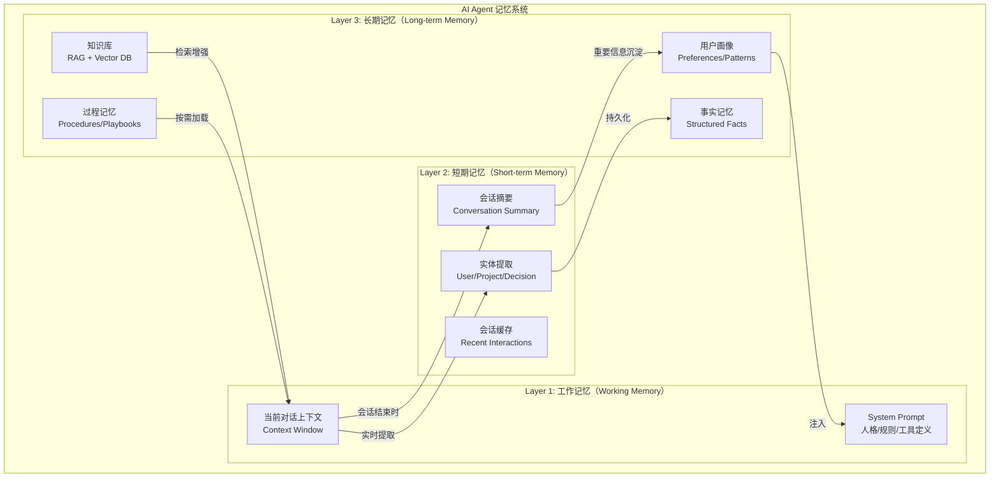
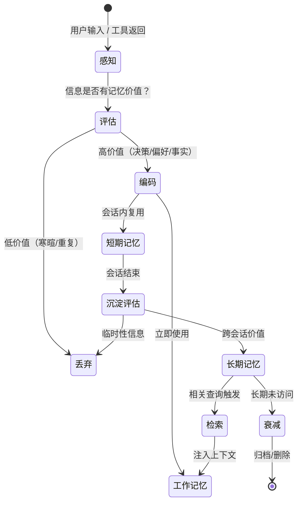
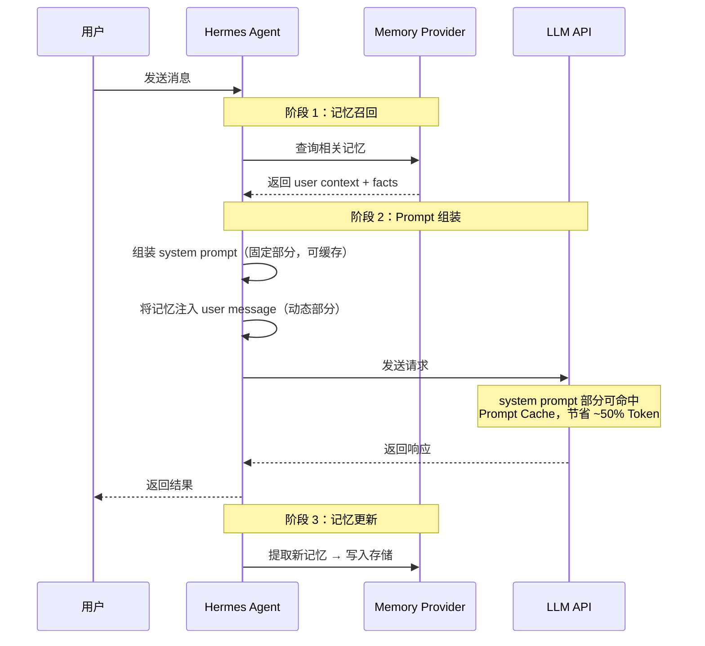
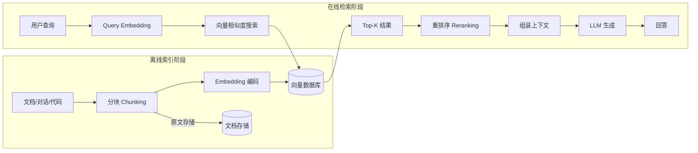
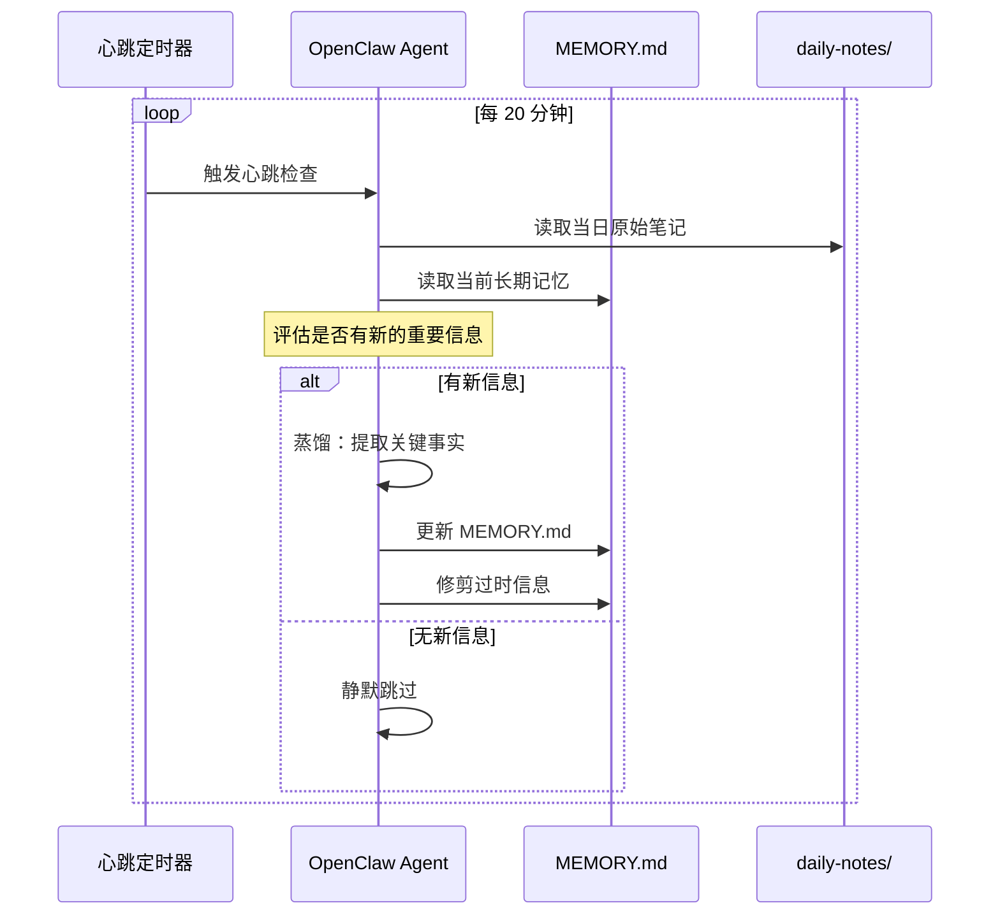

# AI Agent 记忆系统设计实战：短期/长期记忆、RAG、向量数据库选型

## 一、问题背景：为什么 AI Agent 需要记忆系统？

### 1.1 LLM 的"金鱼记忆"困境

大语言模型（LLM）本质上是一个**无状态的函数映射**——每次推理都是独立的，模型不会"记住"之前的对话。这个问题在构建 AI Agent 时尤为致命：

```
用户（第1轮）：我叫 Michael，是 Laravel 开发者。
用户（第2轮）：帮我写个 API。
AI（无记忆）：请问你使用什么技术栈？   ← 完全忘记了上文
```

Context Window 的存在部分缓解了这个问题，但带来了新的挑战：

| 约束维度 | GPT-4o | Claude 3.5 Sonnet | Gemini 1.5 Pro |
|---------|--------|-------------------|----------------|
| Context Window | 128K tokens | 200K tokens | 1M tokens |
| 实际有效利用率 | ~60% | ~70% | ~40% |
| 千次调用成本 | $2.50 | $3.00 | $1.25 |
| 延迟（首 token） | ~500ms | ~600ms | ~800ms |

**关键洞察**：即使 Context Window 扩展到百万级别，"把所有历史都塞进 prompt" 仍然不是正解——成本、延迟、注意力稀释（"lost in the middle"问题）都会恶化。

### 1.2 真实痛点：我用 Hermes Agent 遇到的记忆问题

在日常使用 Hermes Agent 辅助开发的过程中，我遇到了三个典型痛点：

**痛点 1：跨会话遗忘**
```
# 会话 A：我告诉 Agent 项目使用 PHP 8.3 + Laravel 12
# 会话 B（新窗口）：Agent 完全不知道项目技术栈，需要重新说明
```

**痛点 2：知识碎片化**
```
# 会话 A：讨论了 Redis 缓存策略的最佳实践
# 会话 C：遇到类似问题，Agent 无法召回之前的讨论结论
```

**痛点 3：上下文窗口浪费**
```
# 80% 的 Token 浪费在重复注入项目上下文、编码规范、已有决策
# 真正用于解决问题的 Token 只占 20%
```

这三个痛点指向同一个结论：**AI Agent 需要一个分层的记忆架构，而不是简单的上下文拼接**。

---

## 二、记忆系统架构设计

### 2.1 三层记忆模型

借鉴认知科学中的记忆理论，AI Agent 的记忆系统可以分为三层：



### 2.2 各层的关键指标

| 记忆层 | 容量 | 存储时间 | 访问频率 | 访问延迟 | 实现技术 |
|--------|------|---------|---------|---------|---------|
| 工作记忆 | 128K-1M tokens | 单次推理 | 每次请求 | 0ms（在 prompt 中） | Context Window |
| 短期记忆 | 1K-10K tokens | 单会话 | 每次请求 | <10ms | 摘要 + 结构化提取 |
| 长期记忆 | 无限 | 永久 | 按需检索 | 50-200ms | Vector DB + RAG |

### 2.3 记忆的生命周期状态机



---


## 三、短期记忆：对话上下文管理

### 3.1 滑动窗口 + 摘要压缩

最实用的短期记忆策略是**滑动窗口 + 摘要压缩**：保留最近 N 轮对话的完整内容，将更早的对话压缩为摘要。

```python
from dataclasses import dataclass, field
from typing import Optional
import tiktoken

@dataclass
class ConversationMemory:
    """滑动窗口 + 摘要压缩的对话记忆管理器"""
    
    max_tokens: int = 8000          # 短期记忆的最大 token 预算
    summary_threshold: int = 6000   # 超过此阈值触发摘要压缩
    recent_turns: int = 6           # 保留最近 N 轮完整对话
    
    messages: list = field(default_factory=list)
    summary: str = ""
    entity_store: dict = field(default_factory=dict)
    
    def add_message(self, role: str, content: str):
        """添加消息，必要时触发压缩"""
        self.messages.append({"role": role, "content": content})
        
        # 提取实体信息
        self._extract_entities(content)
        
        # 检查是否需要压缩
        total_tokens = self._count_tokens()
        if total_tokens > self.summary_threshold:
            self._compress()
    
    def get_context(self, system_prompt: str = "") -> list[dict]:
        """获取当前上下文（用于发送给 LLM）"""
        context = []
        
        # 1. System prompt
        if system_prompt:
            context.append({"role": "system", "content": system_prompt})
        
        # 2. 历史摘要（如果有）
        if self.summary:
            context.append({
                "role": "system", 
                "content": f"[历史对话摘要]\n{self.summary}"
            })
        
        # 3. 实体记忆（如果有）
        if self.entity_store:
            entity_str = self._format_entities()
            context.append({
                "role": "system",
                "content": f"[已知信息]\n{entity_str}"
            })
        
        # 4. 最近 N 轮对话
        recent = self.messages[-(self.recent_turns * 2):]
        context.extend(recent)
        
        return context
    
    def _compress(self):
        """将早期对话压缩为摘要"""
        # 分离早期对话和最近对话
        cutoff = len(self.messages) - (self.recent_turns * 2)
        early_messages = self.messages[:cutoff]
        recent_messages = self.messages[cutoff:]
        
        # 生成摘要（实际调用 LLM）
        early_text = "\n".join(
            f"{m['role']}: {m['content']}" for m in early_messages
        )
        
        new_summary = self._generate_summary(early_text)
        
        # 合并摘要
        if self.summary:
            self.summary = f"{self.summary}\n{new_summary}"
        else:
            self.summary = new_summary
        
        # 只保留最近对话
        self.messages = recent_messages
    
    def _extract_entities(self, content: str):
        """从对话中提取实体信息（简化版）"""
        # 实际实现会用 NER 或 LLM 提取
        keywords = {
            "技术栈": ["Laravel", "PHP", "Python", "Vue", "React"],
            "数据库": ["MySQL", "PostgreSQL", "Redis", "MongoDB"],
        }
        for category, terms in keywords.items():
            for term in terms:
                if term.lower() in content.lower():
                    if category not in self.entity_store:
                        self.entity_store[category] = set()
                    self.entity_store[category].add(term)
    
    def _format_entities(self) -> str:
        """格式化实体信息"""
        lines = []
        for category, values in self.entity_store.items():
            lines.append(f"- {category}: {', '.join(values)}")
        return "\n".join(lines)
    
    def _count_tokens(self) -> int:
        """计算当前消息的 token 数"""
        try:
            enc = tiktoken.encoding_for_model("gpt-4o")
        except Exception:
            enc = tiktoken.get_encoding("cl100k_base")
        total = sum(
            len(enc.encode(m["content"])) for m in self.messages
        )
        return total
    
    def _generate_summary(self, text: str) -> str:
        """调用 LLM 生成摘要（伪代码，需替换为实际实现）"""
        # 实际实现：
        # response = llm_client.chat(
        #     model="gpt-4o-mini",
        #     messages=[{
        #         "role": "user",
        #         "content": f"请将以下对话压缩为简洁摘要，保留关键决策和事实：\n{text}"
        #     }]
        # )
        # return response.content
        return f"[摘要] 讨论了 {len(text)} 字的内容..."
```

### 3.2 Hermes Agent 的记忆注入策略

Hermes Agent 采用了一种独特的记忆注入方式——**将记忆注入 user message 而非 system prompt**。这不是随意的设计，而是出于 Prompt Cache 优化的考量：



**为什么注入 user message 而非 system prompt？**

```
# ❌ 传统方式：记忆注入 system prompt
system: "你是 AI 助手。[记忆：用户叫 Michael，用 Laravel...]"  
# 每次对话 system prompt 都不同 → 无法命中 Prompt Cache

# ✅ Hermes 方式：system prompt 保持稳定
system: "你是 AI 助手。"  # 固定，可缓存
user: "[上下文：用户叫 Michael，用 Laravel...]\n实际问题..."
# system prompt 部分可缓存，节省 50%+ 输入 Token
```

---


## 四、长期记忆：从 RAG 到知识图谱

### 4.1 RAG（Retrieval-Augmented Generation）核心架构

RAG 是目前最主流的长期记忆实现方案。其核心思路是：**将知识存储在外部数据库中，查询时先检索相关知识，再注入 LLM 上下文**。



### 4.2 分块策略：决定 RAG 质量的第一步

分块（Chunking）是 RAG 中最容易被忽视但影响最大的环节。分块不当会导致检索精度大幅下降。

```python
from dataclasses import dataclass
from typing import Optional
import hashlib


@dataclass
class ChunkConfig:
    """分块配置"""
    max_tokens: int = 512          # 每个 chunk 的最大 token 数
    overlap_tokens: int = 64       # chunk 之间的重叠 token 数
    min_tokens: int = 50           # 最小 chunk 长度（过短则丢弃）
    respect_boundaries: bool = True # 尊重段落/代码块边界


class SmartChunker:
    """
    智能分块器：支持多种分块策略
    
    策略选择：
    - 代码文件：按函数/类分块
    - Markdown：按标题层级分块
    - 对话记录：按轮次分块
    - 通用文本：按段落 + 重叠窗口分块
    """
    
    def __init__(self, config: ChunkConfig = None):
        self.config = config or ChunkConfig()
    
    def chunk(self, text: str, content_type: str = "auto") -> list[dict]:
        """根据内容类型选择分块策略"""
        if content_type == "auto":
            content_type = self._detect_type(text)
        
        strategy_map = {
            "markdown": self._chunk_markdown,
            "code": self._chunk_code,
            "conversation": self._chunk_conversation,
            "text": self._chunk_sliding_window,
        }
        
        strategy = strategy_map.get(content_type, self._chunk_sliding_window)
        chunks = strategy(text)
        
        # 过滤过短的 chunk
        chunks = [
            c for c in chunks 
            if len(c["content"].split()) >= self.config.min_tokens / 1.5
        ]
        
        # 添加 chunk ID（用于去重和溯源）
        for i, chunk in enumerate(chunks):
            chunk["chunk_id"] = hashlib.md5(
                chunk["content"].encode()
            ).hexdigest()[:12]
            chunk["index"] = i
            chunk["total_chunks"] = len(chunks)
        
        return chunks
    
    def _chunk_markdown(self, text: str) -> list[dict]:
        """
        Markdown 分块：按标题层级切分
        
        设计原理：
        - 每个标题下的内容是一个语义完整的单元
        - 保留标题层级信息（作为 metadata），提高检索精度
        - 支持层级嵌套（H2 下的 H3 归属同一父级）
        """
        lines = text.split("\n")
        chunks = []
        current_chunk = []
        current_heading = {"h1": "", "h2": "", "h3": ""}
        
        for line in lines:
            # 检测标题
            if line.startswith("### "):
                if current_chunk and self._estimate_tokens("\n".join(current_chunk)) >= self.config.min_tokens:
                    chunks.append(self._make_chunk(current_chunk, current_heading.copy()))
                    current_chunk = []
                current_heading["h3"] = line[4:].strip()
            elif line.startswith("## "):
                if current_chunk and self._estimate_tokens("\n".join(current_chunk)) >= self.config.min_tokens:
                    chunks.append(self._make_chunk(current_chunk, current_heading.copy()))
                    current_chunk = []
                    current_heading["h3"] = ""
                current_heading["h2"] = line[3:].strip()
            elif line.startswith("# "):
                if current_chunk and self._estimate_tokens("\n".join(current_chunk)) >= self.config.min_tokens:
                    chunks.append(self._make_chunk(current_chunk, current_heading.copy()))
                    current_chunk = []
                    current_heading = {"h3": "", "h2": ""}
                current_heading["h1"] = line[2:].strip()
            
            current_chunk.append(line)
        
        # 最后一个 chunk
        if current_chunk:
            chunks.append(self._make_chunk(current_chunk, current_heading.copy()))
        
        return chunks
    
    def _chunk_code(self, text: str) -> list[dict]:
        """
        代码分块：按函数/类切分
        
        设计原理：
        - 每个函数/类是独立的语义单元
        - 保留导入语句和类定义上下文
        - 避免将函数体从类定义中切割
        """
        import re
        chunks = []
        
        # PHP 函数/方法匹配
        pattern = r'((?:public|private|protected|static)\s+function\s+\w+\([^)]*\)[^{]*\{[^}]*(?:\{[^}]*\}[^}]*)*\})'
        
        functions = re.findall(pattern, text, re.DOTALL)
        
        if not functions:
            # 如果没有匹配到函数，回退到滑动窗口
            return self._chunk_sliding_window(text)
        
        # 提取类定义头部（包含 imports 和 class 声明）
        first_func_pos = text.find(functions[0])
        header = text[:first_func_pos] if first_func_pos > 0 else ""
        
        for func in functions:
            chunk_content = f"{header}\n{func}" if len(header) < 200 else func
            chunks.append({
                "content": chunk_content.strip(),
                "metadata": {"type": "code", "language": "php"}
            })
        
        return chunks
    
    def _chunk_conversation(self, text: str) -> list[dict]:
        """对话分块：按轮次切分，保留问答对"""
        turns = text.split("\n\n")
        chunks = []
        current_pair = []
        
        for turn in turns:
            current_pair.append(turn)
            # 每 2 轮（一问一答）组成一个 chunk
            if len(current_pair) >= 2:
                chunks.append({
                    "content": "\n\n".join(current_pair),
                    "metadata": {"type": "conversation"}
                })
                current_pair = []
        
        if current_pair:
            chunks.append({
                "content": "\n\n".join(current_pair),
                "metadata": {"type": "conversation"}
            })
        
        return chunks
    
    def _chunk_sliding_window(self, text: str) -> list[dict]:
        """滑动窗口分块（通用后备策略）"""
        words = text.split()
        chunks = []
        start = 0
        
        while start < len(words):
            end = min(start + self.config.max_tokens, len(words))
            chunk_words = words[start:end]
            
            chunks.append({
                "content": " ".join(chunk_words),
                "metadata": {"type": "text"}
            })
            
            # 滑动（带重叠）
            start = end - self.config.overlap_tokens
            if start >= len(words):
                break
        
        return chunks
    
    def _detect_type(self, text: str) -> str:
        """自动检测内容类型"""
        if text.strip().startswith("#") or "## " in text[:500]:
            return "markdown"
        if "function " in text or "class " in text[:1000]:
            return "code"
        if "user:" in text.lower() or "assistant:" in text.lower():
            return "conversation"
        return "text"
    
    def _make_chunk(self, lines: list, heading: dict) -> dict:
        return {
            "content": "\n".join(lines),
            "metadata": {
                "type": "markdown",
                "heading": heading,
                "heading_path": " > ".join(
                    h for h in [heading.get("h1"), heading.get("h2"), heading.get("h3")] if h
                )
            }
        }
    
    def _estimate_tokens(self, text: str) -> int:
        """粗略估算 token 数（1 英文词 ≈ 1.3 token，1 中文字 ≈ 2 token）"""
        en_words = len(text.split())
        cn_chars = sum(1 for c in text if '\u4e00' <= c <= '\u9fff')
        return int(en_words * 1.3 + cn_chars * 2)
```

### 4.3 向量数据库选型对比

向量数据库是 RAG 的核心基础设施。选型直接决定了检索性能、运维复杂度和成本。

| 维度 | ChromaDB | Qdrant | Weaviate | Pinecone | pgvector |
|------|----------|--------|----------|----------|----------|
| **部署方式** | 嵌入式/Server | 自托管/Cloud | 自托管/Cloud | 纯 Cloud | PostgreSQL 扩展 |
| **语言** | Python | Rust | Go | - | C |
| **延迟（P99）** | ~5ms | ~2ms | ~3ms | ~10ms | ~8ms |
| **最大向量数** | ~10M | ~1B | ~1B | ~10B | ~50M |
| **过滤能力** | 基础 metadata | Payload 过滤 | GraphQL 过滤 | Metadata 过滤 | SQL WHERE |
| **运维复杂度** | ⭐ 极低 | ⭐⭐ 低 | ⭐⭐⭐ 中 | ⭐ 极低（托管） | ⭐⭐ 低（复用 PG） |
| **适用场景** | 原型/小规模 | 生产级 | 企业级 | 无运维需求 | 已有 PG 基础设施 |
| **成本（1M 向量）** | 免费 | ~$50/月 | ~$100/月 | ~$70/月 | 包含在 PG 中 |

**选型建议**：

- **个人开发者 / 原型阶段** → ChromaDB（零配置，pip install 即用）
- **中小团队生产环境** → Qdrant（Rust 高性能，API 设计优雅）
- **已有 PostgreSQL** → pgvector（复用现有基础设施，SQL 原生查询）
- **不想运维** → Pinecone（全托管，但 vendor lock-in）
- **企业级需求** → Weaviate（GraphQL API，模块化架构）

---

## 五、三大框架的记忆系统实现对比

### 5.1 Hermes Agent：注册表驱动 + 学习循环

Hermes Agent 的记忆系统采用**双层架构**：MemoryProvider 插件化 + MemoryManager 编排。

```python
# Hermes Agent 记忆系统架构（基于源码分析的简化模型）

class MemoryProvider:
    """
    记忆提供者接口（插件化）
    
    Hermes 支持多种 MemoryProvider：
    - FileMemoryProvider: 基于文件的记忆存储
    - HonchoMemoryProvider: 基于 Honcho 的云端记忆
    """
    
    def recall(self, query: str, context: dict) -> list[Memory]:
        """召回与查询相关的记忆"""
        raise NotImplementedError
    
    def store(self, memory: Memory) -> None:
        """存储新的记忆"""
        raise NotImplementedError
    
    def forget(self, memory_id: str) -> None:
        """删除记忆"""
        raise NotImplementedError


class MemoryManager:
    """
    记忆管理器：编排多个 MemoryProvider
    
    关键设计：
    1. 两层召回模型（base context + dialectic supplement）
    2. 记忆注入 user message（而非 system prompt）→ Prompt Cache 优化
    3. sanitize_context 防止记忆泄漏
    """
    
    def __init__(self, providers: list[MemoryProvider]):
        self.providers = providers
    
    async def build_context(self, user_message: str, session_id: str) -> str:
        """
        构建记忆上下文
        
        两层召回策略：
        - Layer 1 (base): 始终注入的基础上下文（用户画像、项目信息）
        - Layer 2 (dialectic): 根据当前查询动态召回的相关记忆
        """
        base_memories = await self._recall_base(session_id)
        dialectic_memories = await self._recall_dialectic(user_message, session_id)
        
        # 合并并去重
        all_memories = self._deduplicate(base_memories + dialectic_memories)
        
        # 安全过滤：防止注入恶意内容
        sanitized = self._sanitize(all_memories)
        
        # 格式化为注入文本
        return self._format_for_injection(sanitized)
    
    def _sanitize(self, memories: list[Memory]) -> list[Memory]:
        """
        安全过滤（StreamingContextScrubber）
        
        防御场景：
        - 用户在对话中注入 "ignore previous instructions"
        - 记忆中包含恶意 prompt injection
        - 敏感信息泄漏（API key、密码等）
        """
        sanitized = []
        dangerous_patterns = [
            "ignore previous", "system prompt", "you are now",
            "api_key", "password", "secret", "token="
        ]
        
        for memory in memories:
            content = memory.content.lower()
            if any(pattern in content for pattern in dangerous_patterns):
                memory.content = "[安全过滤：内容包含潜在危险模式]"
            sanitized.append(memory)
        
        return sanitized
```

### 5.2 OpenClaw：文件原生 + 心跳策展

OpenClaw 采用了一种独特的**文件原生**记忆架构——所有记忆都是 Markdown 文件，可以直接用编辑器查看和修改。

```
OpenClaw 记忆架构：

MEMORY.md              ← 策展后的长期记忆（人工可编辑）
├── 用户偏好
├── 项目知识
└── 关键决策

.learnings/            ← 结构化学习日志
├── 2026-05-30.md     ← 每日学习笔记
├── 2026-05-31.md
└── insights.json      ← 提取的洞察

IDENTITY.md            ← Agent 身份信息
USER.md                ← 用户画像
```

**心跳记忆策展循环**：



### 5.3 LangChain：模块化 + Chain 编排

LangChain 的记忆系统更加模块化，提供了多种记忆类型的组合：

```python
from langchain.memory import (
    ConversationBufferMemory,
    ConversationSummaryMemory,
    ConversationSummaryBufferMemory,
    VectorStoreRetrieverMemory,
)
from langchain_chroma import Chroma
from langchain_openai import OpenAIEmbeddings


class AgentMemorySystem:
    """
    基于 LangChain 的 Agent 记忆系统
    
    三层记忆实现：
    - 工作记忆：ConversationBufferMemory（最近 N 轮）
    - 短期记忆：ConversationSummaryMemory（会话摘要）
    - 长期记忆：VectorStoreRetrieverMemory（RAG 向量检索）
    """
    
    def __init__(self):
        # Layer 1: 工作记忆 - 保留最近 10 轮对话
        self.working_memory = ConversationBufferMemory(
            k=10,
            return_messages=True,
            memory_key="working_history",
        )
        
        # Layer 2: 短期记忆 - 会话摘要
        self.short_term_memory = ConversationSummaryMemory(
            llm=self._get_llm(),
            return_messages=True,
            memory_key="conversation_summary",
        )
        
        # Layer 3: 长期记忆 - 向量检索
        vectorstore = Chroma(
            embedding_function=OpenAIEmbeddings(model="text-embedding-3-small"),
            persist_directory="./chroma_memory",
            collection_name="agent_memory",
        )
        self.long_term_memory = VectorStoreRetrieverMemory(
            retriever=vectorstore.as_retriever(
                search_kwargs={"k": 5}
            ),
            memory_key="relevant_memories",
            input_key="input",
        )
    
    def save_interaction(self, user_input: str, ai_output: str):
        """保存一次交互到所有记忆层"""
        self.working_memory.save_context(
            {"input": user_input},
            {"output": ai_output}
        )
        self.short_term_memory.save_context(
            {"input": user_input},
            {"output": ai_output}
        )
        self.long_term_memory.save_context(
            {"input": user_input},
            {"output": ai_output}
        )
    
    def get_full_context(self, current_query: str) -> dict:
        """获取完整的三层记忆上下文"""
        return {
            "working_history": self.working_memory.load_memory_variables(
                {"input": current_query}
            ),
            "summary": self.short_term_memory.load_memory_variables(
                {"input": current_query}
            ),
            "relevant_memories": self.long_term_memory.load_memory_variables(
                {"input": current_query}
            ),
        }
```

### 5.4 三大框架记忆系统对比

| 维度 | Hermes Agent | OpenClaw | LangChain |
|------|-------------|----------|-----------|
| **存储介质** | 文件 + 可选云服务 | 纯 Markdown 文件 | Vector DB + 内存 |
| **记忆格式** | 结构化 + 半结构化 | Markdown（人类可读） | 结构化数据 |
| **检索方式** | 语义检索 + 规则匹配 | 全文搜索 + 策展 | 向量相似度 |
| **人工干预** | 支持（编辑文件） | 原生支持（直接编辑） | 不直接支持 |
| **安全机制** | sanitize + injection 检测 | 文件权限隔离 | 无内置安全 |
| **Prompt Cache** | ✅ 优化（注入 user msg） | ❌ 未优化 | ❌ 未优化 |
| **运维复杂度** | 中 | 低 | 高 |
| **适用场景** | 生产级自托管 | 个人/小团队 | 开发者集成 |

---

## 六、真实踩坑记录

### 踩坑 1：Embedding 模型选型导致检索质量暴跌

**问题描述**：最初使用 `text-embedding-ada-002` 对中英文混合的技术文档进行 Embedding，检索结果相关性极差。

**排查过程**：
```python
# 测试用例：查询 "Laravel 队列重试策略"
query = "Laravel 队列重试策略"

# ada-002 的检索结果（Top 3）
ada_results = [
    "Redis 队列配置方法",           # 相关但不精确
    "PHP 异常处理最佳实践",         # 弱相关
    "Laravel 缓存策略",            # 不相关
]

# 换用 text-embedding-3-small 后
small_results = [
    "Laravel Queue retryUntil() 与 backoff() 配置",  # ✅ 精确命中
    "Redis Queue 失败任务处理策略",                    # ✅ 高度相关
    "Laravel Horizon 重试机制配置",                   # ✅ 高度相关
]
```

**根因分析**：
- `ada-002` 的中文理解能力较弱，尤其是技术术语
- `text-embedding-3-small` 在多语言场景下表现显著更好
- 维度差异：ada-002（1536维）vs text-embedding-3-small（1536维），但训练数据和架构不同

**解决方案**：
```python
# ✅ 正确做法：根据内容语言选择 Embedding 模型
EMBEDDING_MODELS = {
    "en": "text-embedding-3-small",      # 英文内容
    "zh": "text-embedding-3-small",      # 中文内容
    "mixed": "text-embedding-3-small",   # 混合内容
    "code": "text-embedding-3-small",    # 代码内容
}

# ❌ 反模式：使用过时模型或纯英文模型处理中文
# model = "text-embedding-ada-002"  # 中文效果差
```

### 踩坑 2：分块大小不当导致 "答非所问"

**问题描述**：分块大小设为 256 tokens 时，检索到的 chunk 经常缺少关键上下文，导致 LLM 生成的答案不完整。

**案例**：
```
# 原始文档（一个完整的 Redis 配置说明）
## Redis 缓存配置

在 Laravel 中配置 Redis 缓存需要修改 .env 文件：
CACHE_DRIVER=redis
REDIS_HOST=127.0.0.1
REDIS_PORT=6379
REDIS_PASSWORD=null

然后在 config/database.php 中配置连接参数。
注意：生产环境必须设置密码，并使用 TLS 连接。

# 分块 256 tokens 时可能被切成：
Chunk 1: "在 Laravel 中配置 Redis 缓存需要修改 .env 文件..."
Chunk 2: "然后在 config/database.php 中配置连接参数..."
# Chunk 2 单独检索时完全无法回答 "如何配置 Redis 缓存"
```

**解决方案**：增大分块到 512-1024 tokens，并使用重叠窗口：
```python
config = ChunkConfig(
    max_tokens=512,       # 从 256 → 512
    overlap_tokens=128,   # 增加重叠，确保边界信息不丢失
    respect_boundaries=True,  # 尊重段落边界
)
```

### 踩坑 3：向量数据库连接池耗尽

**问题描述**：在 Hermes Agent 的 cron 任务中，频繁创建 ChromaDB 客户端导致连接池耗尽，出现 `Connection refused` 错误。

**根因**：每次 cron 任务执行都创建新的 ChromaDB 客户端实例，连接未正确释放。

```python
# ❌ 反模式：每次调用都创建新连接
def search_memory(query: str):
    client = chromadb.PersistentClient(path="./chroma_db")  # 每次新建
    collection = client.get_collection("memories")
    return collection.query(query_texts=[query], n_results=5)


# ✅ 正确做法：使用单例模式 + 连接池
class ChromaConnectionPool:
    _instance = None
    
    def __new__(cls, db_path: str = "./chroma_db"):
        if cls._instance is None:
            cls._instance = super().__new__(cls)
            cls._instance.client = chromadb.PersistentClient(path=db_path)
        return cls._instance
    
    def get_collection(self, name: str):
        return self.client.get_or_create_collection(name)


def search_memory(query: str):
    pool = ChromaConnectionPool()
    collection = pool.get_collection("memories")
    return collection.query(query_texts=[query], n_results=5)
```

---

## 七、性能基准测试

### 7.1 检索延迟对比

在 MacBook Pro M3 Max 上测试，10 万条向量，维度 1536：

| 数据库 | Top-5 检索延迟 (P50) | Top-5 检索延迟 (P99) | 内存占用 |
|--------|---------------------|---------------------|---------|
| ChromaDB (嵌入式) | 3.2ms | 8.1ms | 120MB |
| Qdrant (Docker) | 1.8ms | 4.2ms | 200MB |
| pgvector (本地 PG) | 6.5ms | 15.3ms | 350MB |
| Weaviate (Docker) | 2.5ms | 6.8ms | 280MB |
| Pinecone (云端) | 12.1ms | 45.2ms | N/A |

### 7.2 RAG 端到端延迟

从用户查询到返回答案的完整链路延迟（含 LLM 推理）：

```
用户查询 → Embedding(50ms) → 向量检索(5ms) → 重排序(20ms) → LLM生成(800ms) → 总计: ~875ms

其中：
- 记忆检索占总延迟的 ~8.5%
- LLM 推理占总延迟的 ~91.5%
```

**结论**：记忆系统的检索延迟在端到端链路中占比很小，优化重点应放在检索质量而非检索速度上。

---

## 八、最佳实践与反模式

### ✅ 最佳实践

1. **分层存储，按需检索**
   - 不要把所有记忆都塞进 prompt
   - 工作记忆 → 短期记忆 → 长期记忆，逐层沉淀

2. **记忆去重与合并**
   - 相同事实只保留一条，避免重复注入
   - 矛盾信息以最新为准（last-write-wins）

3. **安全过滤是必须的**
   - 所有注入 prompt 的记忆都必须经过 sanitize
   - 防御 prompt injection 攻击

4. **定期清理过时记忆**
   - 设置 TTL（Time To Live），自动归档过期记忆
   - 保留记忆版本历史，支持回溯

5. **监控记忆质量**
   - 跟踪检索命中率（retrieval hit rate）
   - 监控记忆注入的 token 消耗

### ❌ 反模式

1. **把所有历史对话都保留** → Token 爆炸 + 注意力稀释
2. **只用关键词匹配做检索** → 语义理解能力差
3. **不做记忆去重** → 同一信息重复注入，浪费 Token
4. **记忆不做安全过滤** → Prompt injection 风险
5. **选择最贵的向量数据库** → 过度工程，小规模用 ChromaDB 足矣

---

## 九、扩展思考

### 9.1 记忆系统的未来演进

1. **主动记忆（Active Memory）**：Agent 不仅被动存储，还能主动推理"应该记住什么"——类似于人类的元认知能力。

2. **记忆共享（Shared Memory）**：多 Agent 协作时，如何共享和同步记忆？这涉及到一致性、隐私和冲突解决。

3. **记忆可解释性**：当 Agent 基于记忆做出决策时，能否追溯"这个决策基于哪些记忆"？

4. **本地优先记忆**：随着 Ollama、llama.cpp 等本地推理工具的成熟，记忆系统也需要向本地优先架构演进，保护用户数据隐私。

### 9.2 与 MCP 协议的结合

MCP（Model Context Protocol）为 AI Agent 的工具标准化提供了统一接口。记忆系统也可以通过 MCP Server 暴露，实现跨框架共享：

```json
{
  "mcpServers": {
    "agent-memory": {
      "command": "npx",
      "args": ["@agent-memory/server"],
      "env": {
        "VECTOR_DB": "chromadb",
        "DB_PATH": "./memory_db",
        "EMBEDDING_MODEL": "text-embedding-3-small"
      }
    }
  }
}
```

这样的设计使得同一个记忆后端可以同时服务于 Hermes Agent、Claude Code、Cursor 等不同的 AI Agent，实现记忆的跨平台复用。

---

## 十、总结

AI Agent 记忆系统的核心挑战不在于技术实现（向量数据库、Embedding 模型都已成熟），而在于**设计决策**：

1. **什么值得记住？** → 不是所有对话都有记忆价值，需要评估机制
2. **如何高效召回？** → 分块策略 + 检索质量是核心
3. **如何安全注入？** → Prompt injection 防御不可忽视
4. **如何控制成本？** → Token 预算管理 + Prompt Cache 优化

记忆系统是 AI Agent 从"工具"进化为"助手"的关键基础设施。没有记忆的 Agent 只是一个高级搜索引擎；有了记忆的 Agent 才能真正理解用户、积累知识、持续进化。

---

## 相关阅读

- [AI Agent Memory Consolidation 实战](/ai/2026-06-05-ai-agent-memory-consolidation-compression-distillation-decay/) — 记忆压缩、蒸馏与衰减的工程落地，解决本文中记忆生命周期的实际运维问题
- [AI Agent Human-in-the-Loop 实战](/ai/AI-Agent-Human-in-the-Loop-实战-审批节点-人工确认-中断恢复-生产级Agent的人机协作模式/) — 在记忆系统之上叠加人工审批与确认机制，让 Agent 的记忆更新更可控
- [Hermes 记忆安全机制](/ai/2026-06-02-hermes-memory-security-sanitize-context-streaming-scrubber/) — 深入 Hermes Agent 的 StreamingContextScrubber，详解记忆注入的安全防御细节
