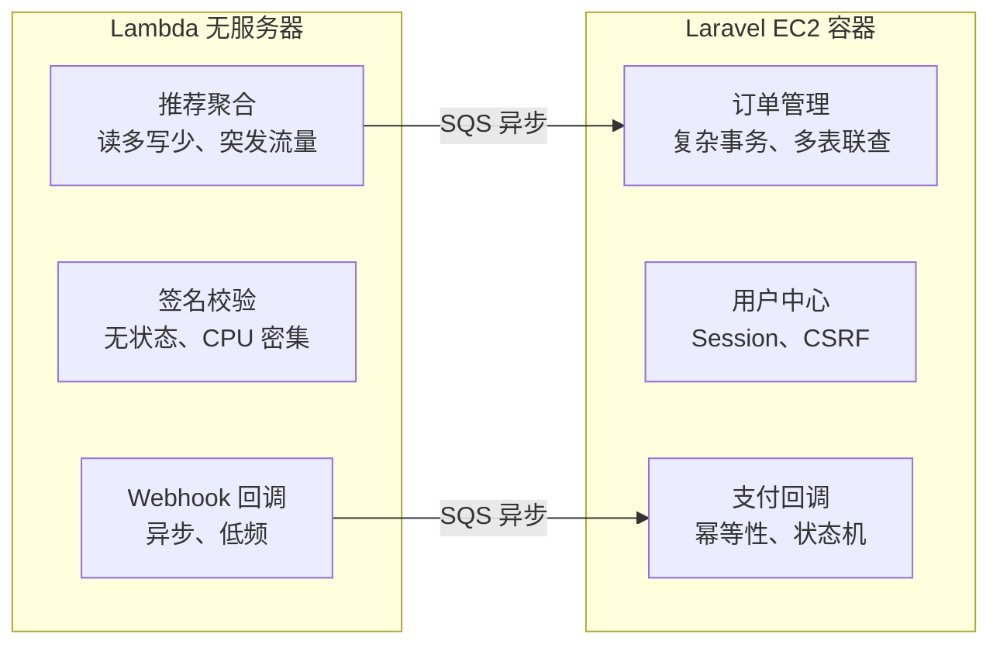

我在 KKday B2C Backend Team 工作期间，有一个需求是为 Affiliate 推荐系统搭建一套独立的轻量 API 层——不需要完整的 Laravel 应用栈，只做数据聚合和签名验证，流量有明显的峰谷特征（白天高、凌晨低），按量付费比常驻 EC2 更划算。最终方案选了 AWS API Gateway + Lambda，但中间踩了不少坑。

这篇文章不是 "Serverless 101 概念介绍"，而是我在真实项目中遇到的选型决策、架构设计和踩坑记录，同时记录了如何与现有 Laravel B2C API 体系共存。

## 架构总览

```mermaid
graph TD
    Client[客户端 / BFF] -->|HTTPS| APIGW[API Gateway<br/>HTTP API]
    APIGW -->|Lambda Proxy| Authorizer[Lambda Authorizer<br/>JWT 验证]
    APIGW -->|Lambda Proxy| Handler1[Lambda: 推荐聚合]
    APIGW -->|Lambda Proxy| Handler2[Lambda: 签名校验]
    APIGW -->|Lambda Proxy| Handler3[Lambda: 数据同步]
    Handler1 -->|查询| RDS[(Aurora MySQL)]
    Handler1 -->|缓存| Redis[(ElastiCache Redis)]
    Handler2 -->|读取| S3[(S3: 公钥文件)]
    Handler3 -->|写入| SQS[SQS 队列]
    SQS -->|消费者| Laravel[Laravel B2C API<br/>EC2 容器]

    style APIGW fill:#FF9900,stroke:#232F3E,color:#fff
    style Authorizer fill:#FF4F8B,stroke:#232F3E,color:#fff
    style Laravel fill:#FF2D20,stroke:#232F3E,color:#fff
```



核心思路：**API Gateway 做路由和鉴权，Lambda 做无状态计算，重度业务仍然走 Laravel**。两者通过 SQS 异步解耦。

## 一、HTTP API vs REST API：选哪个？

AWS 提供两种 API Gateway 类型，价差 70%，功能差很多：

| 维度 | HTTP API | REST API |
|------|----------|----------|
| 价格 | $1.00/百万请求 | $3.50/百万请求 |
| 延迟 | 更低（~10ms） | 较高（~30ms） |
| Lambda Proxy | 原生支持 | 需手动配置 |
| WAF 集成 | 不支持 | 支持 |
| 请求验证 | 不支持 | 内置 JSON Schema |
| Usage Plans | 不支持 | 支持（API Key 管理） |
| 自定义域名 | 支持 | 支持 |

**我的选择**：HTTP API。原因很简单——这个场景不需要 WAF 和 Usage Plans，低延迟和低成本是刚需。后来发现一个坑：HTTP API 不支持请求体验证，必须在 Lambda 里自己做。

```typescript
// Lambda Handler - 手动做请求验证（HTTP API 不支持 JSON Schema 验证）
import { APIGatewayProxyEvent, APIGatewayProxyResult } from 'aws-lambda';
import { z } from 'zod';

const RecommendRequestSchema = z.object({
  member_id: z.string().uuid(),
  category: z.enum(['tour', 'ticket', 'hotel']),
  limit: z.number().min(1).max(50).default(10),
});

export const handler = async (
  event: APIGatewayProxyEvent
): Promise<APIGatewayProxyResult> => {
  try {
    const body = JSON.parse(event.body || '{}');
    const validated = RecommendRequestSchema.parse(body);

    // 调用推荐服务
    const recommendations = await fetchRecommendations(validated);

    return {
      statusCode: 200,
      headers: {
        'Content-Type': 'application/json',
        'Cache-Control': 'public, max-age=300', // 5 分钟 CDN 缓存
      },
      body: JSON.stringify({
        data: recommendations,
        meta: { cached_at: new Date().toISOString() },
      }),
    };
  } catch (error) {
    if (error instanceof z.ZodError) {
      return {
        statusCode: 422,
        body: JSON.stringify({
          message: 'Validation failed',
          errors: error.errors,
        }),
      };
    }
    // 记录到 CloudWatch
    console.error('Lambda error:', error);
    return {
      statusCode: 500,
      body: JSON.stringify({ message: 'Internal server error' }),
    };
  }
};
```

## 二、Custom Authorizer：JWT 验证的正确姿势

API Gateway 支持两种鉴权方式：Cognito User Pools 和 Lambda Authorizer。由于我们的 JWT 是 Laravel Passport 签发的，只能用 Lambda Authorizer。

**踩坑 #1**：Authorizer 默认会缓存结果（TTL 300 秒），如果用户 Token 被撤销，缓存期内仍然放行。

```typescript
// Custom Authorizer Lambda
import { APIGatewayTokenAuthorizerEvent, APIGatewayAuthorizerResult } from 'aws-lambda';
import jwt from 'jsonwebtoken';
import jwksClient from 'jwks-rsa';

const client = jwksClient({
  jwksUri: process.env.PASSPORT_JWKS_URI!, // Laravel Passport 的 JWKS 端点
  cache: true,
  cacheMaxAge: 86400000, // 24 小时缓存公钥
  rateLimit: true,
  jwksRequestsPerMinute: 10,
});

function getKey(header: jwt.JwtHeader, callback: jwt.SigningKeyCallback) {
  client.getSigningKey(header.kid, (err, key) => {
    if (err) return callback(err);
    callback(null, key!.getPublicKey());
  });
}

export const handler = async (
  event: APIGatewayTokenAuthorizerEvent
): Promise<APIGatewayAuthorizerResult> => {
  const token = event.authorizationToken?.replace('Bearer ', '');

  try {
    const decoded = await new Promise<jwt.JwtPayload>((resolve, reject) => {
      jwt.verify(
        token,
        getKey,
        {
          issuer: process.env.JWT_ISSUER,
          audience: process.env.JWT_AUDIENCE,
          algorithms: ['RS256'],
        },
        (err, payload) => {
          if (err) reject(err);
          else resolve(payload as jwt.JwtPayload);
        }
      );
    });

    // 生成缓存 key：包含 token 前 32 字符 + 用户 ID
    // 这样同一用户换 token 时不会命中旧缓存
    const cacheKey = `${decoded.sub}-${token.substring(0, 32)}`;

    return generatePolicy('user', 'Allow', event.methodArn, {
      userId: decoded.sub!,
      scopes: decoded.scope || '',
      cacheKey,
    });
  } catch (error) {
    console.error('Auth failed:', error);
    return generatePolicy('user', 'Deny', event.methodArn);
  }
};

function generatePolicy(
  principalId: string,
  effect: 'Allow' | 'Deny',
  resource: string,
  context?: Record<string, string>
): APIGatewayAuthorizerResult {
  return {
    principalId,
    policyDocument: {
      Version: '2012-10-17',
      Statement: [
        {
          Action: 'execute-api:Invoke',
          Effect: effect,
          Resource: resource,
        },
      ],
    },
    context,
  };
}
```

**踩坑 #2**：Authorizer Lambda 的 `event.methodArn` 格式是 `arn:aws:execute-api:region:account:api-id/stage/method/resource`。如果返回 Deny 但 resource 写了 `*`，API Gateway 会报 500 而不是 403。

## 三、SAM 模板：Infrastructure as Code

```yaml
# template.yaml
AWSTemplateFormatVersion: '2010-09-09'
Transform: AWS::Serverless-2016-10-31
Description: Affiliate Recommendation API (Serverless)

Globals:
  Function:
    Runtime: nodejs20.x
    MemorySize: 256
    Timeout: 10
    Environment:
      Variables:
        NODE_ENV: production
        REDIS_URL: !Sub '{{resolve:ssm:/affiliate/redis-url}}'
        DB_HOST: !Sub '{{resolve:ssm:/affiliate/db-host}}'

Resources:
  # HTTP API Gateway
  AffiliateApi:
    Type: AWS::Serverless::HttpApi
    Properties:
      StageName: prod
      Domain:
        DomainName: api-affiliate.example.com
        CertificateArn: !Ref CertArn
      CorsConfiguration:
        AllowOrigins:
          - https://admin.example.com
        AllowMethods:
          - GET
          - POST
        AllowHeaders:
          - Authorization
          - Content-Type
      Auth:
        Authorizers:
          JwtAuthorizer:
            FunctionArn: !GetAtt AuthorizerFunction.Arn
            IdentitySource: $request.header.Authorization

  # 推荐聚合 Lambda
  RecommendFunction:
    Type: AWS::Serverless::Function
    Properties:
      Handler: dist/recommend.handler
      CodeUri: ./functions/recommend/
      Description: 聚合推荐数据
      AutoPublishAlias: live
      ProvisionedConcurrencyConfig:
        ProvisionedConcurrentExecutions: 2  # 保持 2 个预热实例
      Events:
        GetRecommendations:
          Type: HttpApi
          Properties:
            ApiId: !Ref AffiliateApi
            Path: /v1/recommendations
            Method: POST
            Auth:
              Authorizer: JwtAuthorizer
      Policies:
        - DynamoDBReadPolicy:
            TableName: !Ref RecommendationTable
        - Statement:
            - Effect: Allow
              Action:
                - elasticache:Connect
              Resource: !Sub 'arn:aws:elasticache:${AWS::Region}:${AWS::AccountId}:cluster:affiliate-*'

  # Authorizer Lambda
  AuthorizerFunction:
    Type: AWS::Serverless::Function
    Properties:
      Handler: dist/authorizer.handler
      CodeUri: ./functions/authorizer/
      Description: JWT Token 验证
      # 关键：缩短 Authorizer 缓存 TTL
      # 避免 Token 撤销后仍然放行
```

## 四、冷启动：最大的生产问题

Lambda 冷启动在 Node.js 20 下大约 200-400ms（取决于包大小），但如果加载了 `jsonwebtoken` + `jwks-rsa` + `mysql2` 等依赖，首次冷启动可以飙到 2-3 秒。

**优化策略**：

1. **Provisioned Concurrency**：在 SAM 模板中配置 `ProvisionedConcurrencyConfig`，保持 2 个预热实例。成本约 $15/月/实例，但消除了 99% 的冷启动。

2. **依赖裁剪**：用 `esbuild` 打包，只打包必要的依赖：

```javascript
// esbuild.config.mjs
import { build } from 'esbuild';

await build({
  entryPoints: ['src/recommend.ts', 'src/authorizer.ts'],
  bundle: true,
  minify: true,
  sourcemap: true,
  platform: 'node',
  target: 'node20',
  outdir: 'dist',
  external: ['@aws-sdk/*'], // AWS SDK v3 在 Lambda 运行时已内置
  metafile: true,
});
```

裁剪后包大小从 8MB 降到 1.2MB，冷启动从 2.8s 降到 400ms。

3. **连接复用**：数据库连接放在 handler 外部，利用 Lambda 执行上下文复用：

```typescript
// 在 handler 外部声明，Lambda 执行上下文会复用
import mysql from 'mysql2/promise';

let connection: mysql.Connection | null = null;

async function getConnection(): Promise<mysql.Connection> {
  if (connection) {
    try {
      // 验证连接是否存活
      await connection.ping();
      return connection;
    } catch {
      connection = null;
    }
  }
  connection = await mysql.createConnection({
    host: process.env.DB_HOST,
    user: process.env.DB_USER,
    password: process.env.DB_PASSWORD,
    database: process.env.DB_NAME,
    connectTimeout: 3000,
  });
  return connection;
}
```

**踩坑 #3**：Lambda 执行上下文复用不是无限的。如果 Lambda 实例空闲超过 15 分钟，底层容器会被回收，连接自然断开。所以 `getConnection()` 必须有重连逻辑。

## 五、与 Laravel 混合部署策略

不是所有 API 都适合放到 Lambda。我们的策略是：



**判断标准**：
- ✅ 放 Lambda：无状态、读多写少、流量有峰谷、延迟要求不高（<500ms）
- ❌ 留 Laravel：复杂事务、多表 JOIN、Session 状态、长事务（>30s）

**踩坑 #4**：Lambda 的执行时间硬限制是 15 分钟（API Gateway 是 29 秒）。如果你的 Lambda 通过 API Gateway 暴露，实际超时只有 29 秒。有一次数据导出接口超时，排查了半天才发现是 API Gateway 的限制。

## 六、错误处理与监控

```typescript
// 统一错误处理中间件
import { captureException } from '@sentry/aws-serverless';

type HandlerFn = (
  event: APIGatewayProxyEvent
) => Promise<APIGatewayProxyResult>;

export function withErrorHandling(handler: HandlerFn): HandlerFn {
  return async (event) => {
    const startTime = Date.now();
    try {
      const result = await handler(event);
      // 记录 Lambda 执行指标
      console.log(JSON.stringify({
        metric: 'lambda_execution',
        path: event.path,
        method: event.httpMethod,
        status: result.statusCode,
        duration_ms: Date.now() - startTime,
      }));
      return result;
    } catch (error) {
      captureException(error);
      console.error(JSON.stringify({
        metric: 'lambda_error',
        path: event.path,
        error: error instanceof Error ? error.message : String(error),
        stack: error instanceof Error ? error.stack : undefined,
      }));
      return {
        statusCode: 500,
        body: JSON.stringify({
          message: 'Internal server error',
          request_id: event.requestContext.requestId,
        }),
      };
    }
  };
}

// 使用
export const handler = withErrorHandling(async (event) => {
  // 业务逻辑...
});
```

配合 CloudWatch Alarms 监控 Lambda 错误率和 Duration P99：

```yaml
# SAM 模板中添加告警
  ErrorAlarm:
    Type: AWS::CloudWatch::Alarm
    Properties:
      AlarmName: affiliate-recommend-errors
      MetricName: Errors
      Namespace: AWS/Lambda
      Statistic: Sum
      Period: 60
      EvaluationPeriods: 2
      Threshold: 5
      ComparisonOperator: GreaterThanThreshold
      Dimensions:
        - Name: FunctionName
          Value: !Ref RecommendFunction
      AlarmActions:
        - !Ref SlackAlertTopic
```

## 七、成本对比

改造前（EC2 t3.medium 常驻）vs 改造后（Lambda + API Gateway）：

| 项目 | EC2 方案 | Lambda 方案 |
|------|---------|------------|
| 月请求量 | ~500 万 | ~500 万 |
| 计算成本 | $30/月 | $12/月 |
| API 层成本 | Nginx (含在 EC2) | $5/月 |
| 冷启动优化 | N/A | $15/月 (Provisioned) |
| **合计** | **$30/月** | **$32/月** |

成本几乎持平，但 Lambda 方案的优势在于：**自动扩缩容、零运维、按量付费**。凌晨流量低谷时 Lambda 实例为 0，不产生计算费用。如果流量翻倍，EC2 需要升级实例，Lambda 不需要任何改动。

## 总结

API Gateway + Lambda 不是银弹，但在特定场景（轻量 API、读多写少、流量有峰谷）下确实比常驻服务器更划算。关键踩坑回顾：

1. **HTTP API 不支持请求验证**，必须在 Lambda 里用 Zod/Joi 手动校验
2. **Authorizer 缓存 TTL** 要根据业务调整，默认 300 秒可能太长
3. **数据库连接池** 必须有重连逻辑，不能假设连接一直存活
4. **API Gateway 超时 29 秒** 是硬限制，长任务走 SQS 异步
5. **esbuild 裁剪依赖** 是冷启动优化的第一步，效果最明显

如果你的 Laravel B2C 项目也有类似的轻量 API 需求，不妨试试混合部署——重的留 Laravel，轻的上 Lambda。
