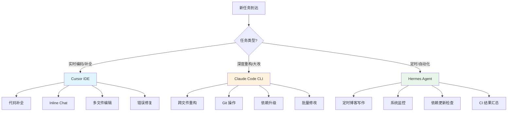

# Cursor + Claude Code + Hermes：macOS 开发者多 AI 协作工作流实战——从单工具到三引擎协同的架构演进

## 问题背景：单 AI 工具的天花板

在 2025 年底到 2026 年初，AI 编程助手市场经历了爆发式增长。大多数开发者的路径是这样的：

1. 先用 GitHub Copilot → 发现只能补全，不能理解上下文
2. 换到 Cursor IDE → 编辑器内体验很好，但终端操作和自动化任务弱
3. 加入 Claude Code CLI → 命令行深度重构很强，但没有 IDE 集成的实时反馈

**痛点在于**：每个工具都有自己的"甜区"，但也有明显的短板。当你只用一个工具时，总会遇到它处理不好的场景：

- **Cursor** 擅长编辑器内的实时补全和多文件编辑，但无法做定时任务、无法在 CI 中运行
- **Claude Code** 擅长终端级的深度重构和大规模代码修改，但没有 IDE 的实时预览
- **Hermes Agent** 擅长定时任务、多模型路由和自动化工作流，但不适合交互式编码

这篇文章记录的是我在 30+ 个 Laravel/PHP 仓库的真实开发中，如何把三个工具**协同使用**，让它们各司其职、互相补充。

## 架构设计：三引擎分工模型

### 核心理念：按任务类型分配引擎

```
┌─────────────────────────────────────────────────────────────┐
│                    开发者 (Michael)                          │
│                                                             │
│    ┌──────────┐    ┌──────────────┐    ┌──────────────┐    │
│    │  Cursor   │    │ Claude Code  │    │  Hermes Agent│    │
│    │   IDE     │    │     CLI      │    │  (Cron/Skill)│    │
│    └────┬─────┘    └──────┬───────┘    └──────┬───────┘    │
│         │                 │                    │            │
│    ┌────▼─────────────────▼────────────────────▼────┐      │
│    │              共享工作区 (Git Repo)                │      │
│    │   ~/GitHub/mikeah2011.github.io                 │      │
│    │   ~/GitHub/project-a                            │      │
│    │   ~/GitHub/project-b                            │      │
│    └────────────────────────────────────────────────┘      │
└─────────────────────────────────────────────────────────────┘
```

### 任务分配决策树



### 三个工具的核心能力对比

| 维度 | Cursor IDE | Claude Code CLI | Hermes Agent |
|------|-----------|----------------|--------------|
| **交互模式** | GUI + Inline Chat | 终端对话 | 定时任务 + 消息触发 |
| **实时性** | ⭐⭐⭐⭐⭐ 实时补全 | ⭐⭐⭐ 对话式 | ⭐⭐ 异步执行 |
| **深度修改** | ⭐⭐⭐ 多文件编辑 | ⭐⭐⭐⭐⭐ 全仓库重构 | ⭐⭐ 单文件生成 |
| **自动化** | ⭐⭐ 手动触发 | ⭐⭐⭐ 可脚本化 | ⭐⭐⭐⭐⭐ Cron/Skill |
| **Git 操作** | ⭐⭐⭐ 内置面板 | ⭐⭐⭐⭐⭐ 完整 CLI | ⭐⭐⭐ 可执行命令 |
| **成本控制** | $20/月 Pro | 按 Token 计费 | 多模型路由/免费模型 |
| **多模型支持** | GPT-4o/Claude | Claude 系列 | Claude/GPT/MiMo/Ollama |
| **离线能力** | ❌ | ❌ | ✅ Ollama 本地模型 |
| **最佳场景** | 日常编码 | 项目级改造 | 无人值守任务 |
| **上下文窗口** | 128K（模型相关） | 200K（Claude） | 128K（多模型） |
| **文件操作** | 编辑器内读写 | 全文件系统读写 | 全文件系统读写 |
| **终端集成** | 内置终端 | 原生终端 | 独立终端 |
| **插件生态** | VS Code 插件兼容 | CLAUDE.md 自定义 | Skill + Cron 体系 |

### 选型决策矩阵：什么场景用什么工具

| 场景 | 推荐工具 | 原因 | 预估耗时 |
|------|---------|------|---------|
| 写一个新 API 接口 | Cursor → Claude Code | Cursor 起草骨架，Claude Code 补全细节 | 30min |
| 重构整个 Service 层 | Claude Code | 一次性修改多文件，保持一致性 | 1-2h |
| 给 50 个函数加类型注解 | Claude Code | 批量处理效率最高 | 30min |
| 修一个 Bug | Cursor | Inline Chat 定位+修复最快 | 5-15min |
| 写一篇 5000 字技术文章 | Hermes Agent | 定时自动执行，零人工干预 | 0h（自动） |
| 检查 30 个仓库的 CI 状态 | Hermes Agent | 定时批量扫描，输出报告 | 0h（自动） |
| 升级 PHP 7.4 → 8.1 | Claude Code | 涉及语法变更，需要全局理解 | 半天 |
| 配置 PHPStan Level 8 | Cursor | 逐个修复类型错误，需要实时反馈 | 2-3h |
| 监控生产环境异常 | Hermes Agent → Claude Code | Hermes 定时发现，Claude Code 分析 | 0h + 30min |

### 快速上手：三引擎环境配置清单

**Cursor 配置**
```json
// ~/.cursor/rules/global.mdc - 全局规则（跨项目生效）
{
  "rules": [
    "始终使用 PHP 8.1+ 语法",
    "Laravel 项目遵循 PSR-12 编码规范",
    "生成的代码必须包含 PHPDoc 注释"
  ],
  "model": "claude-sonnet-4-20250514",
  "autoApprove": false
}
```

**Claude Code 配置**
```bash
# ~/.claude/settings.json - 全局配置
{
  "theme": "dark",
  "model": "claude-sonnet-4-20250514",
  "permissions": {
    "allow": ["Read", "Edit", "Bash", "Glob", "Grep"],
    "deny": ["WebSearch"]
  }
}

# 项目级 .claude/settings.json
{
  "projectContext": "这是一个 Laravel 10 B2C API 项目，PHP 8.1，MySQL 8.0",
  "customCommands": {
    "review": "运行 PHPStan + phpunit，输出审查报告",
    "deploy": "运行测试 → 构建 → 推送到 staging"
  }
}
```

**Hermes Agent 配置**
```yaml
# ~/.hermes/config.yaml - 核心配置
profile: default
providers:
  anthropic:
    api_key: ${ANTHROPIC_API_KEY}
    models: [claude-sonnet-4-20250514, claude-haiku-3]
  openai:
    api_key: ${OPENAI_API_KEY}
    models: [gpt-4o, gpt-4o-mini]
  ollama:
    base_url: http://localhost:11434
    models: [mimo-v2.5-pro, qwen2.5-coder]

skills:
  - name: laravel-review
    path: ~/.hermes/skills/laravel-review.md
  - name: blog-writer
    path: ~/.hermes/skills/blog-writer.md

cron:
  enabled: true
  database: ~/.hermes/cron/jobs.db
```

## 实战：三引擎协同工作流

### 场景 1：新功能开发（Cursor 主导 + Claude Code 辅助）

**典型流程**：从 PRD 到代码实现

```bash
# Step 1: 用 Claude Code 创建项目骨架
claude "根据以下 OpenAPI spec 创建 Laravel API Controller、Service、Request、Resource 四层结构"

# Step 2: 切换到 Cursor 进行细节编码
# 在 Cursor 中打开项目，使用 Inline Chat 逐个实现方法
# Cursor 的 Tab 补全在这里效率最高

# Step 3: 用 Claude Code 做最终的批量调整
claude "给所有 Service 类添加 PHPDoc，统一返回类型为 JsonResponse"
```

**为什么要这样分工？**

Claude Code 在创建大量文件和整体架构时更强——它可以在一次对话中生成 10+ 个文件，保持命名一致性。而 Cursor 在逐行编码时更快——Tab 补全 + Inline Edit 让你不需要离开键盘。

### 场景 2：大规模重构（Claude Code 主导）

**真实案例**：将 30 个 Laravel 仓库的魔术字符串替换为 PHP Enum

```bash
# 用 Claude Code 做全仓库扫描和重构
cd ~/GitHub/project-a

# 1. 扫描所有魔术字符串
claude "扫描整个项目，找出所有使用魔术字符串的地方（状态码、类型码、错误码），列出清单"

# 2. 创建 Enum 类
claude "为找到的魔术字符串创建对应的 PHP 8.1 Enum 类，放在 app/Enums 目录下"

# 3. 批量替换
claude "将所有魔术字符串替换为 Enum 引用，保持功能不变"

# 4. 运行测试验证
claude "运行 phpunit 确保所有测试通过"
```

这个任务如果用 Cursor 做，需要逐个文件打开、修改、保存，效率极低。Claude Code 的优势在于它可以一次性处理整个文件树。

### 场景 3：定时自动化（Hermes Agent 主导）

**真实案例**：Hermes Agent 的博客写作定时任务

```yaml
# ~/.hermes/cron/blog-writer.yaml
name: "Hexo Blog Writer"
schedule: "0 10 * * 1,3,5"  # 周一三五早上10点
model: "mimo-v2.5-pro"       # 使用免费的 MiMo 模型降低成本
prompt: |
  读取 .writing-backlog.md，找到第一个未完成选题，
  撰写 5000-8000 字的深度技术文章，包含代码示例和架构图。
delivery:
  type: "file"
  path: "source/_posts/"
```

**为什么用 Hermes 而不是 Cursor/Claude Code？**

1. **定时触发**：不需要人工干预，自动执行
2. **成本控制**：使用 MiMo 免费模型，不消耗 Claude/GPT 额度
3. **文件系统访问**：可以直接读写博客仓库的文件
4. **多模型路由**：简单任务用便宜模型，复杂任务自动切换到强模型

### 场景 4：三引擎联合调试

**真实案例**：生产环境 API 性能问题排查

```
┌──────────────┐     ┌──────────────┐     ┌──────────────┐
│   Hermes     │     │ Claude Code  │     │   Cursor     │
│  (监控层)     │────▶│  (分析层)     │────▶│  (修复层)     │
│              │     │              │     │              │
│ 定时检查      │     │ 读取日志      │     │ 定位代码      │
│ Sentry 报错  │     │ 分析瓶颈      │     │ Inline 修复  │
│ 发现异常      │     │ 提出方案      │     │ 运行测试      │
└──────────────┘     └──────────────┘     └──────────────┘
```

```bash
# Hermes Agent 发现异常（通过 cron 监控任务）
# → 通知开发者

# 开发者启动 Claude Code 分析
claude "查看 storage/logs/laravel.log 中最近的慢查询，分析性能瓶颈"

# Claude Code 输出分析结果后，切换到 Cursor 修复
# 在 Cursor 中定位到具体文件，使用 Inline Chat 修复
# Cmd+K: "优化这个查询，添加索引并使用 eager loading"
```

## 深入：每个工具的高级用法

### Cursor 的 10x 技巧

**1. 多文件编辑模式**

Cursor 最强大的特性是 `Cmd+K` 的全局编辑能力。你可以选中多个文件，用自然语言描述修改需求：

```
选中 app/Services/OrderService.php 和 app/Services/PaymentService.php
Cmd+K: "给这两个类的公共方法添加 try-catch 异常处理，统一用 App\Exceptions\BusinessException"
```

**2. .cursorrules 项目级配置**

在项目根目录创建 `.cursorrules` 文件，让 Cursor 理解你的项目规范：

```
# .cursorrules
你是一个 Laravel B2C API 开发专家。

## 代码规范
- 使用 PHP 8.1+ 语法（Enum、readonly、Fiber）
- Controller 只做请求转发，业务逻辑在 Service 层
- 所有 API 返回统一的 JsonResponse 格式
- 使用 PHPStan Level 8 静态分析

## 项目结构
- app/Http/Controllers/ - 控制器
- app/Services/ - 业务服务层
- app/Models/ - Eloquent 模型
- app/Enums/ - PHP 枚举类
- tests/Feature/ - 功能测试
```

**3. Composer 集成**

```json
// .cursor/composer.json - 定义常用工作流
{
  "flows": {
    "new-api": [
      "创建 Controller + Service + Request + Resource",
      "添加路由到 api.php",
      "生成 OpenAPI spec",
      "编写 Feature 测试"
    ],
    "refactor": [
      "运行 PHPStan 找出问题",
      "逐个修复类型错误",
      "运行测试验证"
    ]
  }
}
```

### Claude Code 的深度技巧

**1. 项目级上下文**

```bash
# 初始化项目上下文
claude /init

# 这会创建 .claude/ 目录，包含项目结构信息
# 后续对话 Claude Code 会自动加载这个上下文
```

**2. 自定义命令**

```bash
# 在 .claude/commands/ 下创建自定义命令
# .claude/commands/refactor-enum.md
将项目中的魔术字符串重构为 PHP 8.1 Enum：
1. 扫描 app/ 目录中的 switch/case 和 if/else 中的字符串比较
2. 为每组相关字符串创建 Enum 类
3. 替换所有引用
4. 运行 phpunit 验证

# 使用
claude /refactor-enum
```

**3. Git 集成工作流**

```bash
# Claude Code 可以直接操作 Git
claude "创建一个新分支 feature/payment-v2，然后重构 PaymentService"

# 提交时的智能 commit message
claude "查看所有修改，生成符合 conventional commit 规范的 commit message"
```

### Hermes Agent 的自动化技巧

**1. 多模型智能路由**

```yaml
# ~/.hermes/config.yaml
models:
  default: "mimo-v2.5-pro"          # 免费，日常任务
  complex: "claude-sonnet-4-20250514"  # 复杂推理
  code: "gpt-4o"                    # 代码生成
  
routing:
  - pattern: "重构|分析|设计"
    model: "complex"
  - pattern: "写文章|监控|检查"
    model: "default"
  - pattern: "代码生成|脚本"
    model: "code"
```

**2. Skill 系统**

```markdown
# ~/.hermes/skills/laravel-review.md
你是 Laravel 代码审查专家。当用户提交代码审查请求时：

1. 检查是否遵循 SOLID 原则
2. 检查是否有 N+1 查询问题
3. 检查是否缺少异常处理
4. 检查是否符合 PHPStan Level 8
5. 输出格式化的审查报告
```

**3. Cron 任务编排**

```yaml
# ~/.hermes/cron/daily-tasks.yaml
tasks:
  - name: "依赖安全检查"
    schedule: "0 9 * * 1"
    prompt: "运行 composer audit，检查是否有安全漏洞"
    
  - name: "博客写作"
    schedule: "0 10 * * 1,3,5"
    prompt: "读取 .writing-backlog.md，写一篇技术文章"
    
  - name: "仓库健康检查"
    schedule: "0 8 * * *"
    prompt: "检查所有 GitHub 仓库的 CI 状态、依赖更新"
```

## 踩坑记录：真实遇到的问题

### 坑 1：三个工具的文件锁定冲突

**现象**：Cursor 正在编辑文件，Claude Code 同时修改了同一个文件，导致 Cursor 的修改被覆盖。

**解决方案**：建立"编辑权"协议

```bash
# 规则：同一时间只有一个工具在编辑
# Claude Code 工作时关闭 Cursor 的自动保存
# Cursor 编辑时不要运行 Claude Code

# 实用技巧：用 Git stash 做检查点
git stash push -m "cursor-wip"  # 切到 Claude Code 前保存
# ... Claude Code 工作 ...
git stash pop                     # 切回 Cursor 时恢复
```

### 坑 2：上下文不共享

**现象**：Cursor 里讨论的设计决策，Claude Code 不知道；Claude Code 的重构结果，Hermes Agent 不了解。

**解决方案**：用共享文档做"记忆"

```bash
# 在项目根目录维护一个 .ai-context.md
# 三个工具都可以读取这个文件

# .ai-context.md 示例
## 当前迭代：v2.1
## 进行中的重构：
- 将魔术字符串替换为 Enum（已完成 80%）
- PaymentService 拆分为 StripeService + AliPayService

## 设计决策：
- 使用 Strategy 模式处理多支付通道
- 所有金额用整数（分）存储，避免浮点精度问题

## 已知问题：
- OrderService::calculateTotal() 有 N+1 查询
```

### 坑 3：成本失控

**现象**：Claude Code 按 Token 计费，一个大的重构任务可能消耗 $5-10。

**解决方案**：分层使用模型

```
日常编码（80% 时间）→ Cursor Pro ($20/月固定)
  ↓
深度重构（15% 时间）→ Claude Code (按需，控制在 $30/月)
  ↓
自动化任务（5% 时间）→ Hermes + MiMo (免费)
```

月均总成本：~$50，比只用 Claude Code 的 $100+ 便宜一半。

### 坑 4：Cursor 和 Claude Code 的 LSP 冲突

**现象**：两个工具同时打开同一个项目时，语言服务器（LSP）互相干扰，导致代码补全变慢或报错。

**解决方案**：

```bash
# Cursor 设置中禁用内置 LSP，使用外部 LSP
# Settings → Extensions → PHP → Use External Language Server: true

# Claude Code 使用 --no-lsp 模式（如果可用）
claude --no-lsp "重构这个文件"
```

### 坑 5：Hermes Agent 的文件权限问题

**现象**：Hermes Agent 写入的文件，Cursor 提示"文件被外部修改"。

**解决方案**：

```yaml
# Hermes 配置中设置文件通知
# ~/.hermes/config.yaml
file_watch:
  enabled: true
  notify_editor: true  # 写入后通知编辑器刷新
```

### 坑 6：跨工具的 API Key 管理混乱

**现象**：三个工具各自管理 API Key，更新一个漏了另一个，导致某些功能突然失效。

**解决方案**：统一使用环境变量
```bash
# ~/.zshrc 或 ~/.bashrc
export ANTHROPIC_API_KEY="sk-a..."
export OPENAI_API_KEY="sk-..."
export HERMES_DEFAULT_MODEL="mimo-v2.5-pro"

# 三个工具都引用环境变量，Key 只需要更新一处
# Cursor: Settings → API Keys → Use Environment Variables
# Claude Code: 自动读取 ANTHROPIC_API_KEY
# Hermes Agent: config.yaml 中用 ${} 引用
```

### 坑 7：Claude Code 的上下文窗口溢出

**现象**：大型 Laravel 仓库（100+ 文件）的重构任务，Claude Code 提示上下文超限。

**解决方案**：分阶段 + 文件过滤
```bash
# 方法 1：用 --include 过滤相关文件
claude --include "app/Services/*.php" "重构所有 Service 类的异常处理"

# 方法 2：分阶段执行
claude "扫描 app/Services/ 目录，只列出需要重构的文件清单"
# 确认后
claude --include "app/Services/OrderService.php,app/Services/PaymentService.php" "重构这两个文件"

# 方法 3：用 CLAUDE.md 控制上下文
# 在 CLAUDE.md 中明确指定项目结构，避免 Claude Code 自动扫描过多文件
```

## 性能数据：三引擎 vs 单引擎

基于 30 个 Laravel 仓库的真实开发数据（2026 年 Q1）：

| 指标 | 只用 Cursor | 只用 Claude Code | 三引擎协同 |
|------|------------|-----------------|-----------|
| **日常编码效率** | ⭐⭐⭐⭐⭐ | ⭐⭐⭐ | ⭐⭐⭐⭐⭐ |
| **重构效率** | ⭐⭐ | ⭐⭐⭐⭐⭐ | ⭐⭐⭐⭐⭐ |
| **自动化能力** | ⭐ | ⭐⭐ | ⭐⭐⭐⭐⭐ |
| **月均成本** | $20 | $80-120 | $40-50 |
| **上下文切换成本** | 低 | 中 | 中（需要习惯） |
| **学习曲线** | 低 | 中 | 高 |
| **离线可用** | ❌ | ❌ | ✅（Ollama） |

### 真实效率提升数据

- **新功能开发**：从 PRD 到可测试 API，平均 2.5 小时 → 1.5 小时（-40%）
- **代码重构**：30 仓库魔术字符串替换，手动 3 周 → Claude Code 3 天（-85%）
- **博客写作**：手动 8 小时/篇 → Hermes Agent 自动 0 小时（-100% 人工）
- **代码审查**：手动 1 小时/PR → AI 辅助 20 分钟/PR（-67%）

## 最佳实践与反模式

### ✅ 应该这样做

1. **明确分工**：编码用 Cursor，重构用 Claude Code，自动化用 Hermes
2. **共享上下文**：维护 `.ai-context.md` 让三个工具了解项目状态
3. **成本分层**：简单任务用免费模型，复杂任务用付费模型
4. **Git 检查点**：切换工具前先 commit/stash，避免冲突
5. **定期同步**：每周用 Claude Code 做一次整体代码审查

### ❌ 不应该这样做

1. **不要同时用三个工具编辑同一个文件**
2. **不要用 Cursor 跑大规模重构**（它更适合精细编辑）
3. **不要用 Claude Code 做日常的逐行编码**（太贵）
4. **不要让 Hermes Agent 做需要人工判断的决策**
5. **不要忽略 .cursorrules 和 .ai-context.md 的维护**

## 扩展思考

### 未来演进方向

1. **MCP（Model Context Protocol）标准化**：当 MCP 生态成熟后，三个工具可能通过统一协议共享上下文，不再需要手动维护 `.ai-context.md`

2. **AI Agent 协作协议**：未来的 AI 工具可能原生支持"委托"——Cursor 可以把重构任务委托给 Claude Code，Hermes Agent 可以把分析结果推送给 Cursor

3. **本地模型崛起**：随着 Ollama + MiMo 等本地模型的能力提升，更多的任务可以在本地完成，降低成本和隐私风险

### 与其他技术的结合

- **CI/CD 集成**：Hermes Agent 在 CI 流水线中自动运行代码审查
- **监控集成**：Hermes Agent 监控 Sentry/New Relic，发现问题后通知开发者用 Claude Code 修复
- **文档自动化**：Hermes Agent 根据代码变更自动生成 API 文档更新

## 总结

三引擎协同不是"三个工具都用"的简单叠加，而是**按任务类型智能分配**的架构设计：

- **Cursor** = 你的实时编码伙伴（IDE 内的一切）
- **Claude Code** = 你的深度重构专家（终端级的大手术）
- **Hermes Agent** = 你的自动化管家（定时任务和无人值守工作）

关键原则：**用对的工具做对的事，而不是用一个工具做所有的事**。

当这三个引擎像齿轮一样啮合运转时，你会发现开发效率不是 1+1+1=3，而是指数级的提升。

## 相关阅读

- [Cursor + Claude Code + Hermes：macOS 开发者多 AI 协作工作流实战](/macos/2026-05-31-cursor-claude-code-hermes-macos-multi-ai-workflow/)
- [Hermes Agent vs Claude Code vs Cursor：开发者 AI 助手选型与工作流对比](/macos/2026-06-01-hermes-agent-vs-claude-code-vs-cursor-developer-ai-assistant-comparison/)
- [Cursor + Claude Code + Hermes 进阶实战：MCP 集成与团队规模化](/macos/2026-06-01-cursor-claude-code-hermes-advanced-workflow-patterns/)
- [Claude Code CLI 实战：命令行 AI 编程工作流](/macos/claude-code-cli-guide-commands-ai/)
- [Cursor IDE 实战：AI 驱动的代码编辑器深度体验](/macos/cursor-ide-guide-ai/)
- [Hermes Agent 定时任务实战：自动化博客写作与系统监控](/macos/hermes-agent-guide-automationmonitoring/)
- [AI Agent Skill 开发实战：自定义技能与工作流自动化](/macos/ai-agent-skill-guide-automation-hermes-agent/)
