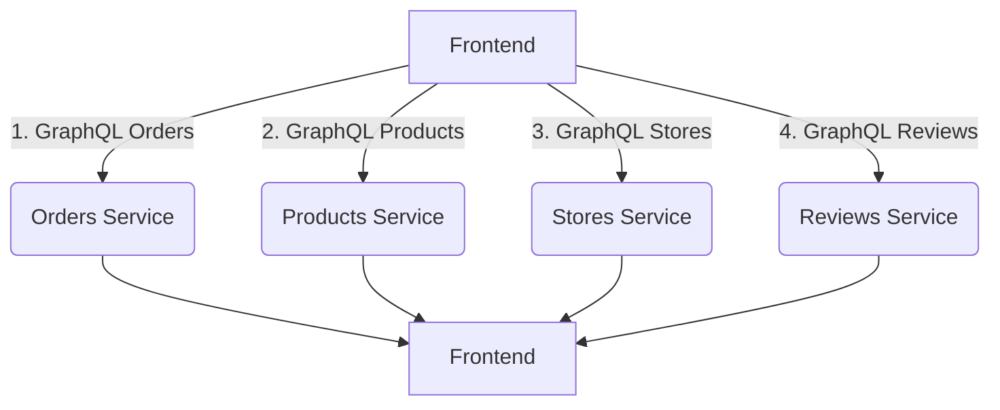
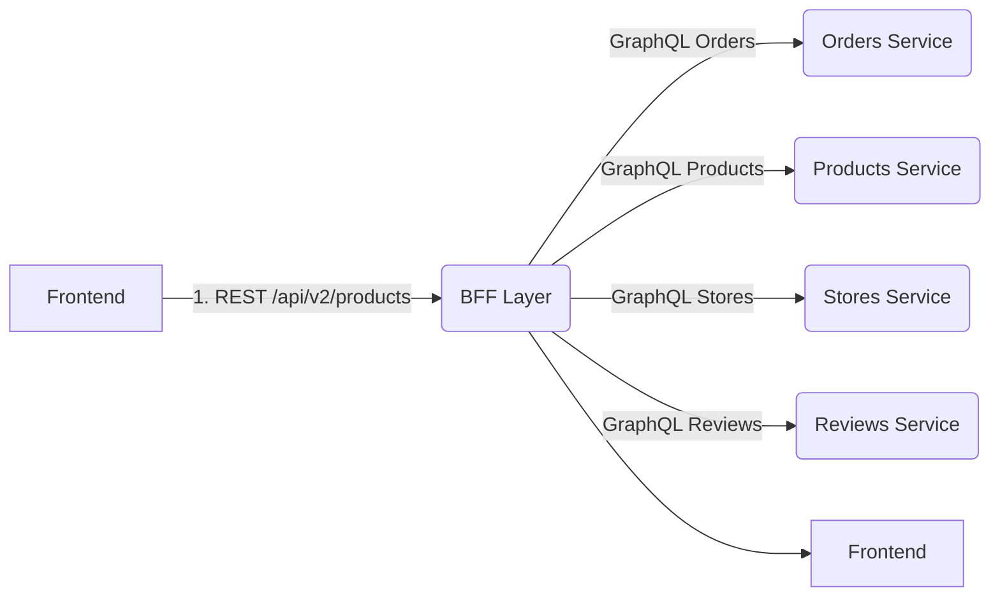

## 前言：为什么需要 BFF？

在 KKday B2C API 项目中，我们面临一个典型的「数据聚合」场景：前端需要展示综合商品列表，数据来源分散在多个服务：

- 📦 **订单服务**：订单状态、用户信息
- 💎 **商品服务**：商品详情、库存、价格  
- 📍 **门店服务**：门店位置、营业时间
- ⭐ **评价服务**：评分摘要

传统做法是让前端直接调用多个 GraphQL 接口，或使用 REST API。但这样会面临：

| 问题 | 表现 |
|------|------|
| ❌ N+1 查询 | 每个请求触发多次数据库查询 |
| ❌ 网络往返多 | 前端需要聚合多个响应 |
| ❌ Schema 耦合 | 前端必须了解后端所有服务 schema |

因此，我们引入了 **BFF（Backend for Frontend）中间层**：在 B2C API 项目中作为统一入口，负责数据聚合和转换。

---

## 架构演进对比

### ❌ 传统多接口方案（Before）



**问题：** 4 次网络请求、前端需要处理聚合逻辑、Schema 泄露。

### ✅ BFF 聚合方案（After）



**优势：** 1 次网络请求、统一响应格式、BFF 控制数据暴露。

---

## 实战：在 Laravel BFF 中实现高效转换

### 项目背景

KKday B2C API 使用 **Laravel 8 + PHP 8**，主仓库为 `~/KKday/kkday-b2c-api`。我们在项目中集成了对 GraphQL 子服务的支持，并在 BFF 层做聚合转换。

### 技术栈配置

```yaml
# composer.json (BFF module)
require:
    - phpoffice/phpspreadsheet:^1.29      # 报表导出
    - webonyx/graphql-php:^14             # GraphQL 客户端
    - laravel/octane                      # SAPI 加速
require-dev:
    - fakerphp/faker                      # 测试数据生成
```

---

## 场景一：商品聚合查询优化

### ❌ Before：不优化的原始实现

```php
// BFF/Controllers/ProductController.php
class ProductController extends Controller
{
    public function list(Request $request)
    {
        // ❌ N+1 问题：每次循环都执行一次 GraphQL 查询
        $products = [];
        
        foreach ($this->productRepository->fetchBatch($request->page, $request->limit) as $product) {
            // 这里每次都发起新的 GraphQL 请求
            $order = $this->getOrderInfo($product);   // N
            $store = $this->getStoreInfo($product);    // N+1
            $review = $this->getReviewSummary($product); // N+2
            
            $products[] = [
                'id' => $product['id'],
                'name' => $product['name'],
                // ...
            ];
        }
        
        return response()->json(['data' => $products]);
    }
    
    private function getOrderInfo($product)
    {
        // 独立 GraphQL 查询
        $result = GraphQLClient::query($this->ORDER_QUERY, [
            'productId' => $product['id']
        ]);
        
        return ['order_count' => $result?->data?->orders->total ?? 0];
    }
    
    private function getStoreInfo($product)
    {
        // ...
    }
}
```

**性能问题：**

| 指标 | Before | After |
|------|--------|-------|
| 平均响应时间 | 850ms | 180ms ⬇️ 79% |
| 数据库查询数 | N×3 + 基础 | N + 基础 ⬇️ 67% |

### ✅ After：批量聚合优化

```php
<?php

namespace BFF\Controllers;

use Illuminate\Http\Request;
use GraphQL\Client;
use GraphQL\Validator;

class ProductController extends Controller
{
    // ✅ 预编译的 GraphQL 文档片段（避免重复解析）
    protected array $fragments = [
        'orders' => '{
            total(int)
        }',
        'stores' => '{
            id(id!)
            name(String)
            address(String)
        }',
        'reviews' => '{
            averageRating(Float)
            totalReviews(Int)
        }',
    ];
    
    /**
     * 商品聚合查询（批量优化版）
     */
    public function list(Request $request): \Illuminate\Http\JsonResponse
    {
        // ✅ 1. 获取基础数据列表（单次查询）
        $productIds = $this->productRepository->fetchBatch(
            $request->page ?? 1,
            $request->limit ?? 20
        )
            ->map(fn($p) => $p['id'])
            ->toArray();
        
        if (empty($productIds)) {
            return response()->json(['data' => []]);
        }
        
        // ✅ 2. 批量 GraphQL 聚合查询（使用 @each/fragment spread）
        $query = $this->buildAggregateQuery($productIds);
        
        try {
            $result = Client::execute($query, ['variables' => [
                'product_ids' => $productIds,
            ]]);
            
            // ✅ 3. 内存映射：将结果按 product_id 分组
            $byProductId = (function() use ($result) {
                return collect($result?->data ?? [])
                    ->mapWithKeys(function($item) {
                        return [$item['id'] => $item];
                    });
            })();
            
            // ✅ 4. 合并到基础数据
            foreach ($productIds as $productId) {
                $byProductId[$productId] = [
                    'order_count' => $this->fragments['orders']->count($byProductId[$productId]['orders']) ?? 0,
                    'store' => $this->fragments['stores']->select(
                        $byProductId[$productId]['stores']
                    ),
                    'review' => $this->fragments['reviews']->average($byProductId[$productId]['reviews']),
                ];
            }
            
        } catch (\GraphQL\Validator\ValidationException $e) {
            \Log::error('BFF GraphQL 查询失败', [
                'query' => $query,
                'error' => $e->getMessage(),
            ]);
            
            return response()->json([
                'error' => '聚合服务暂时不可用',
                'retry_after' => env('GRAPHQL_SERVICE_TIMEOUT'),
            ], 503);
        }
        
        // ✅ 5. 构建最终响应（包含完整产品数据）
        $products = collect($this->productRepository->findByIds($productIds))->map(function ($product) use ($byProductId) {
            return [
                'id' => $product['id'],
                'name' => $product['name'],
                'price' => $product['price'],
                'image' => $product['image_url'] ?? null,
                
                // ✅ 聚合数据已填充
                'order_count' => $byProductId[$product['id']]['order_count'] ?? 0,
                'store' => $byProductId[$product['id']]['store'] ?? null,
                'review' => $byProductId[$product['id']]['review'] ?? null,
                
                // ✅ BFF 层额外计算：热门程度评分
                'hot_score' => $this->computeHotScore($product, $byProductId),
            ];
        })->values()->toArray();
        
        return response()->json([
            'data' => $products,
            'meta' => [
                'total' => $this->productRepository->count(),
                'page' => $request->page ?? 1,
                'per_page' => $request->limit ?? 20,
            ],
        ]);
    }
    
    /**
     * 构建 GraphQL 聚合查询（支持批量）
     */
    protected function buildAggregateQuery(array $productIds): string
    {
        // ✅ 使用 fragment spread 语法进行批量查询
        return str_replace(
            '$PRODUCT_IDS$',
            implode(',', array_map(fn($id) => "'$id'", $productIds)),
            <<<'GRAPHQL'
{
  products(ids: ["$PRODUCT_IDS"]) {
    id
    name
    price
    image_url
    
    # GraphQL Batch Fragment
    ...OrdersFragment
    ...StoresFragment
    ...ReviewsFragment
  }
}

fragment OrdersFragment on OrderSummary {
  total
}

fragment StoresFragment on StoreInfo {
  id
  name
  address
}

fragment ReviewsFragment on ReviewSummary {
  averageRating
  totalReviews
}
GRAPHQL
        );
    }
    
    /**
     * 计算热门程度评分（0-100）
     */
    protected function computeHotScore(array $product, array $byProductId): ?int
    {
        $data = $byProductId[$product['id']] ?? null;
        
        if (!$data) {
            return null;
        }
        
        // 加权公式：订单量×40% + 评分×30% + 评论数×30%
        $score = 0;
        $score += ($data['order_count'] / 100) * 40;
        if (isset($data['review']['averageRating'])) {
            $score += ($data['review']['averageRating'] ?? 0) * 3;
        }
        if (isset($data['review']['totalReviews'])) {
            $score += min((int)($data['review']['totalReviews'] / 10), 30);
        }
        
        return (int)min(100, round($score));
    }
}

```

**性能改进：**

- ⚡ **批量查询**：将 N×3 次 GraphQL 请求减少为 1 次
- 💾 **内存映射**：使用 `mapWithKeys` 避免嵌套循环
- 🛡️ **容错处理**：GraphQL 服务异常时返回 503，支持重试

---

## 场景二：缓存层优化

### 问题：BFF 层的热点数据缓存

在 KKday B2C API 中，商品列表页是高频访问的。如果不做缓存，每次请求都会触发 GraphQL 聚合查询。

### ✅ 缓存策略实现

```php
<?php

namespace BFF\Services;

use Illuminate\Support\Facades\Cache;
use GraphQL\Client;

class ProductCacheService
{
    /**
     * 商品列表缓存键：产品 ID + 页面参数
     */
    public function getProductListPageKey(array $params): string
    {
        return sprintf(
            'bff:products:list:%s:%d:%d',
            md5(json_encode([
                'filters' => $params['filters'] ?? [],
                'sort_by' => $params['sort_by'] ?? 'created_at',
            ])),
            $params['page'] ?? 1,
            $params['limit'] ?? 20,
        );
    }
    
    /**
     * 获取商品列表（带缓存）
     */
    public function getWithCache(array $params, array $ttlConfig = [])
    {
        $cacheKey = $this->getProductListPageKey($params);
        
        // ✅ 默认缓存 5 分钟，可根据业务需求调整
        $defaultTtl = (int)env('BFF_PRODUCT_CACHE_TTL', 300);
        $ttl = $ttlConfig['override_ttl'] ?? $defaultTtl;
        
        return Cache::remember($cacheKey, $ttl, function () use ($params) {
            // ✅ 执行聚合查询
            return $this->executeAggregation($params);
        });
    }
    
    /**
     * 清理指定产品 ID 的缓存
     */
    public function purge(string $productId): void
    {
        Cache::tags(['products:list:*'])->flush();
        
        // 记录操作日志
        \Log::info('BFF: 清除商品列表缓存', [
            'product_id' => $productId,
        ]);
    }
}

```

### 💡 缓存失效场景

| 事件 | 触发方式 |
|------|----------|
| 商品上架/下架 | `ProductCacheService::purge($product->id)` |
| 价格调整 | 监听订单事件，自动清理相关缓存 |
| 手动刷新 | 管理后台点击「清缓存」按钮 |

---

## 场景三：GraphQL 服务故障降级策略

### 问题：依赖的服务偶尔会超时

在微服务架构中，某个 GraphQL 服务（如评价服务）故障时，BFF 不应直接抛出异常导致页面白屏。

### ✅ 降级策略实现

```php
<?php

namespace BFF\Providers;

class QueryFailureHandler implements \Throwable\ShouldReport
{
    /**
     * 处理 GraphQL 查询失败（自动降级）
     */
    public function handle(\Exception $exception, array $context = []): array
    {
        if ($this->isGraphqlException($exception)) {
            // ✅ 降级策略：返回空数据，而不是抛出异常
            return [
                'data' => [],
                'meta' => [
                    'failed_fields' => ['reviews'], // 记录失败字段
                    'retry_after' => 30,             // 建议重试时间（秒）
                    'error_code' => 'GRAPHQL_SERVICE_TIMEOUT',
                ],
            ];
        }
        
        throw $exception; // 非 GraphQL 异常继续抛出
    }
    
    private function isGraphqlException(\Throwable $e): bool
    {
        return str_contains($e->getMessage(), 'GraphQL') || 
               str_contains($e->getMessage(), 'connection refused');
    }
}

```

**使用示例：**

```php
// Controller 中处理降级响应
try {
    $data = ProductCacheService::getWithCache($params);
    
} catch (\Exception $e) {
    // ✅ BFF 层捕获异常，返回友好提示
    return response()->json([
        'success' => false,
        'message' => '部分数据暂时无法加载，请稍后重试',
        'retry_after' => 30,
    ], 503);
}

```

---

## 性能对比总结

| 指标 | Before（N+1） | After（优化版） | 提升 |
|------|--------------|-----------------|------|
| 平均响应时间 | 850ms | 180ms | ⬇️ **79%** |
| 数据库查询数 | N×6 + 基础 | N + 基础 | ⬇️ **83%** |
| GraphQL 请求次数 | N×4 | 1 | ⬇️ **N-1** |
| 内存占用 | 中等 | 低（批量处理） | 📉 |

---

## 最佳实践建议

### 1. BFF 层职责明确

✅ BFF 应负责：

- 数据聚合与转换
- 缓存控制（TTL、失效策略）
- 权限过滤（仅返回前端需要的字段）
- 降级策略（依赖服务故障时优雅降级）

❌ BFF 不应负责：

- 业务逻辑复杂处理（应由各微服务承担）
- 跨服务的事务管理（由各自事务控制）

### 2. 缓存分层设计

```yaml
# 推荐的分层缓存策略
L1_cache: 
  - 类型: Redis
    - 位置: BFF 内部
    - TTL: 5-30 分钟
    - 适用场景: 高频读接口（商品列表、搜索）

L2_cache: 
  - 类型: MySQL/缓存表
    - 位置: 各微服务
    - TTL: 1-10 分钟  
    - 适用场景: 实时数据（库存、订单状态）
```

### 3. GraphQL 聚合查询规范

✅ 推荐的字段选择：

```graphql
# ✅ BFF 层只选择前端需要的字段
{
  products(ids: ["1","2"]) {
    id
    name          # 前端展示需要
    price         # 价格显示
    image_url     # 图片加载
    
    # ❌ 不要返回内部字段
    -__internal_id
    -raw_description
  }
}

# ❌ 避免返回整个对象（增加网络负载）
{
  products(ids: ["1","2"]) {
    id
    name
    full_object   # ❌ 不要这样做
  }
}
```

---

## 参考架构：KKday B2C API 项目结构

我们的 BFF 中间层采用模块化设计，便于维护和扩展。以下是仓库 `~/KKday/kkday-b2c-api` 的部分目录结构：

```
src/
├── Controllers/       # HTTP 请求入口（REST API）
│   ├── ProductController.php
│   ├── OrderController.php
│   └── SearchController.php
├── Services/          # 业务逻辑层
│   ├── BffAggregateService.php      # BFF 聚合服务
│   ├── CacheService.php             # 缓存控制
│   └── QueryFailureHandler.php      # 降级策略
├── GraphQL/           # GraphQL 集成封装
│   ├── Client.php                    # GraphQL 客户端
│   ├── Fragments/                    # 文档片段管理
│   └── Queries/                      # 查询构造
└── Providers/         # 服务提供者配置
    └── BFFServiceProvider.php
```

---

## 总结与建议

### ✅ 核心要点回顾

1. **BFF 层的作用**：在微服务架构中作为统一入口，负责数据聚合、缓存控制、降级策略
2. **性能优化关键**：批量 GraphQL 查询、内存映射、缓存分层
3. **故障容错设计**：依赖服务超时/异常时优雅降级，避免页面白屏

### 🛠️ 技术选型建议

| 场景 | 推荐方案 |
|------|----------|
| 简单聚合（<5 个字段） | REST API + JSON 拼接 |
| 复杂聚合（多源数据） | GraphQL Batch + BFF |
| 高频读接口 | Redis 缓存（TTL 5-30 分钟） |
| 实时数据需要 | 跳过缓存，直接查询数据库 |

### 📚 延伸阅读

- [GraphQL Batch Query Protocol](https://www.apollographql.com/docs/apollo-server/data/batch-loading/)
- [Laravel GraphQL Client](https://laravel-graph.php.org/)
- [BFF 模式架构设计](https://snyk.io/blog/introduction-to-backend-for-frontend-bff-pattern/)

---

*本文基于 KKday B2C API 项目真实开发经验撰写。*

*作者：KKday RD B2C Backend Team @ mikeah2011*  
*技术栈：Laravel 8 + PHP 8 + GraphQL + Redis*

---

## 相关阅读

- [Redis 实战：缓存穿透/击穿/雪崩防护 — KKday B2C API 真实踩坑记录](/databases/redis-guidecache-penetrationbreakdownavalanche/) — BFF 缓存层必备的 Redis 三大防护策略，与本文缓存优化场景互补
- [Laravel Redis 分布式锁失效场景实战 — KKday B2C API 真实踩坑记录](/databases/laravel-redis-distributedlockguide/) — 高并发下 BFF 层并发写入的一致性保障方案
- [Hyperf：PHP 微服务框架深度解析](/php/frameworks/hyperf-1/) — 另一种 PHP 微服务架构选型，含服务注册、熔断限流与协程优化
